# Codex 对接飞书设计说明

本文说明现有 PicoClaw 如何对接飞书，以及在 CSGClaw 中为 Codex runtime 增加飞书通道时推荐的模块边界、消息流和接口映射。

## 背景

CSGClaw 目前同时支持 PicoClaw runtime 和 Codex runtime。PicoClaw 已经可以接入飞书群聊，但它的飞书连接发生在 PicoClaw runtime 内部；Codex runtime 目前通过 ACP 与 CSGClaw 交互，并不直接连接飞书。

推荐方案是：由 CSGClaw server 作为 Codex 与飞书之间的适配层，一边连接飞书 WebSocket/REST API，一边通过现有 `codexbridge` 将消息转换为 Codex ACP prompt。

## 现有 PicoClaw 飞书接入

PicoClaw 的飞书接入是 runtime 自己完成的：

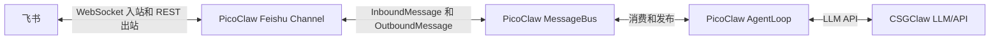

### 入站消息流

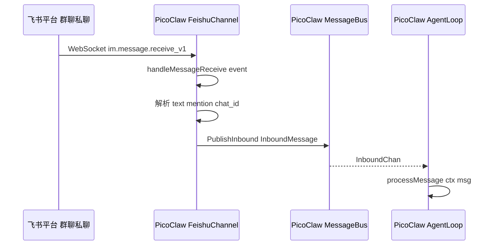

关键模块：

| 职责 | 模块 |
| --- | --- |
| 飞书通道实现 | `picoclaw/pkg/channels/feishu/feishu_64.go` |
| 建立飞书 WebSocket | `FeishuChannel.Start` |
| 注册飞书消息事件 | `OnP2MessageReceiveV1(c.handleMessageReceive)` |
| 通道通用接口 | `picoclaw/pkg/channels/base.go` |
| 消息总线 | `picoclaw/pkg/bus/bus.go` |
| Agent 主循环 | `picoclaw/pkg/agent/loop.go` |

### 出站消息流

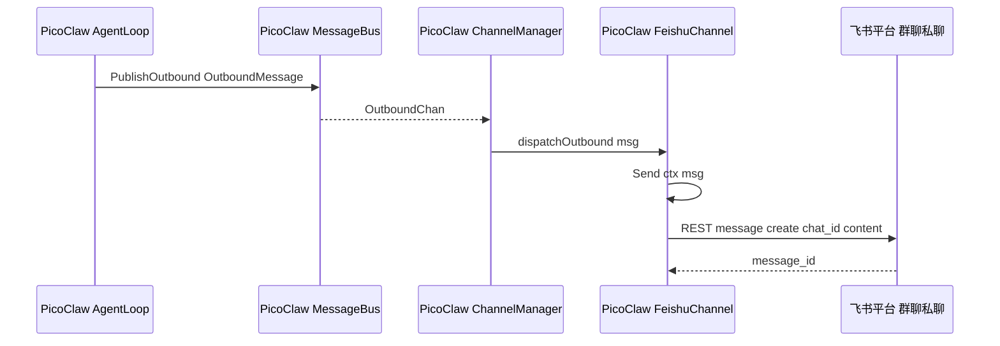

PicoClaw 的 `FeishuChannel.Send` 会优先发送 interactive card，失败时回退为文本消息。

### 配置流

飞书凭证由 CSGClaw 管理，然后在启动 PicoClaw sandbox runtime 时注入环境变量：


注入的关键环境变量：

```text
PICOCLAW_CHANNELS_FEISHU_APP_ID
PICOCLAW_CHANNELS_FEISHU_APP_SECRET
```

PicoClaw 读取这些环境变量后，自己创建飞书 SDK client 和 WebSocket client。因此，PicoClaw 并不是通过 CSGClaw server 的 HTTP/SSE 接口来收发飞书群聊消息。

## CSGClaw 当前飞书能力

CSGClaw server 目前已有飞书 REST 能力，主要用于配置和管理操作：

```text
CSGClaw server
  -> 飞书 REST API
```

已有能力包括：

- 保存和加载飞书 bot 配置
- 获取 bot 信息
- 创建群聊
- 添加群成员
- 拉取群成员和群消息
- 发送管理类消息

主要模块：

| 职责 | 模块 |
| --- | --- |
| 飞书配置文件 | `internal/channel/feishu/store.go` |
| 飞书配置 provider | `internal/channel/feishu/provider.go` |
| 飞书 REST service | `internal/channel/feishu/service.go` |
| 飞书 API handler | `internal/api/feishu.go` |
| 飞书配置 API handler | `internal/api/feishu_config.go` |

当前缺少的是：

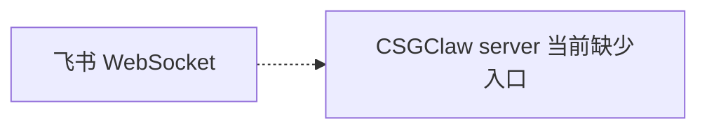

也就是说，CSGClaw server 当前不是飞书实时群聊消息入口。

## Codex 对接飞书推荐方案

Codex 不直接连接飞书，`codexbridge` 也不直接持有飞书 SDK client。飞书协议连接由 `internal/channel/feishu` 统一持有；Codex 只通过一个 Feishu-to-Codex bridge client 消费抽象事件并发送抽象回复。

```mermaid
flowchart LR
    Feishu[飞书]
    FeishuService[CSGClaw internal channel feishu]
    FeishuAdapter[CSGClaw feishu codexbridgeclient]
    CodexBridge[CSGClaw codexbridge]
    CodexRuntime[Codex ACP runtime]

    Feishu <-->|WebSocket 入站和 REST 出站| FeishuService
    FeishuService <-->|MessageEvent 和 SendMessage| FeishuAdapter
    FeishuAdapter <-->|BotEvent 和 SendMessageRequest| CodexBridge
    CodexBridge <-->|ACP Prompt 和 session events| CodexRuntime
```

### 入站消息流

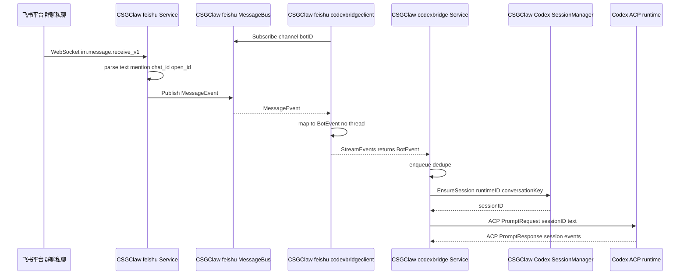

### 出站消息流

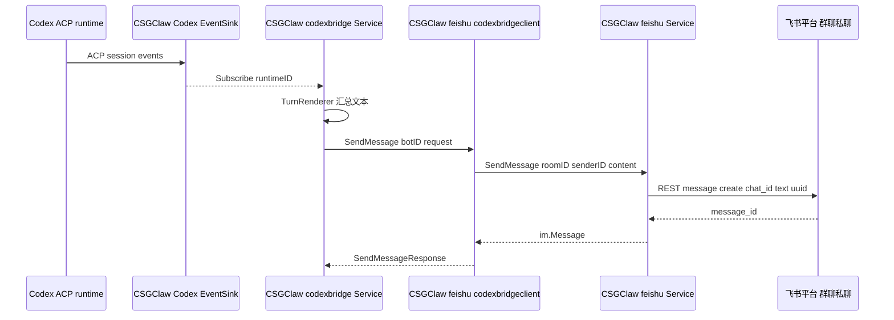

### 新增和调整模块

`internal/channel/feishu` 继续作为飞书 channel 的协议所有者：

- 持有 `feishu.Provider` 和 `channels/feishu.toml` 中的 `app_id`、`app_secret`。
- 持有飞书 WebSocket listener、REST sender、bot open_id cache。
- 处理配置 reload、WebSocket 重连、消息去重、自触发规避。
- 对外提供事件订阅和发送能力，例如 `MessageBus()`、`SendMessage(req im.CreateMessageRequest)`、`ResolveBotOpenID(ctx, botID)`。

新增：

```text
internal/channel/feishu/codexbridgeclient
```

该模块实现现有的 `codexbridge.BotClient` 接口，但不直接创建飞书 WebSocket client，也不直接调用飞书 REST API：

```go
type FeishuChannel interface {
    MessageBus() *feishu.MessageBus
    SendMessage(req im.CreateMessageRequest) (im.Message, error)
    ResolveBotOpenID(ctx context.Context, botID string) (string, string, error)
}

type Client struct {
    Feishu     FeishuChannel
    MentionOnly bool
    QueueSize   int
}

func (c *Client) StreamEvents(ctx context.Context, botID, lastEventID string) (<-chan codexbridge.BotEvent, <-chan error)
func (c *Client) SendMessage(ctx context.Context, botID string, req codexbridge.SendMessageRequest) (codexbridge.SendMessageResponse, error)
```

`StreamEvents` 只订阅 Feishu channel 事件并做模型转换：

```text
feishu.MessageEvent
  -> codexbridge.BotEvent
```

`SendMessage` 只把 Codex 回复转换为 Feishu channel 的发送请求：

```text
codexbridge.SendMessageRequest
  -> im.CreateMessageRequest
  -> feishu.Service.SendMessage
```

### Channel 路由

路由依据是 bot 记录上的 `Channel`，不是 `feishu.Provider.BotConfig(botID)` 是否存在。`app_id`、`app_secret` 只能说明某个 bot 有飞书凭证，不能说明某个 Codex bridge worker 应该消费哪个 channel。

CSGClaw 已有 channel-scoped bot 模型：

```go
type Bot struct {
    ID      string
    Channel string
    AgentID string
}
```

Codex bridge manager 启动 worker 时应解析对应 bot record，并把 channel 写入 binding：

```go
type Binding struct {
    Channel   string
    BotID     string
    RuntimeID string
    SessionID string
    PromptMeta map[string]any
}
```

worker key 使用 `channel + "\x00" + botID`，避免同一个 bot ID 同时绑定 `csgclaw` 和 `feishu` 时互相覆盖。`PromptMeta.channel` 使用真实 channel，例如 `feishu` 或 `csgclaw`。

### 核心字段模型

当前 `channels/feishu.toml` 中与飞书 channel 相关的字段是：

```toml
[global]
admin_open_id = "ou_xxx"

[bots.u-dev]
app_id = "cli_xxx"
app_secret = "xxx"
```

`app_id` 和 `app_secret` 由 `internal/channel/feishu` 使用，用于创建飞书 SDK client、WebSocket listener 和 REST sender。`codexbridgeclient` 不直接读取配置文件，也不直接持有 app 凭证。

Codex bridge 的入站事件模型保持不变：

```go
type BotEvent struct {
    MessageID     string
    RoomID        string
    ChatType      string
    Text          string
    Mentions      []string
    ThreadRootID  string
    ThreadContext *BotThreadContext
}
```

Feishu 路径的字段使用：

| 字段 | Feishu 路径含义 |
| --- | --- |
| `MessageID` | 飞书 `message_id`，用于本地去重 |
| `RoomID` | 飞书 `chat_id` |
| `ChatType` | 飞书 chat type，映射为 `p2p` 或 `group` |
| `Text` | 送给 Codex 的文本，群聊中去掉 bot mention |
| `Mentions` | 飞书 mentions |
| `ThreadRootID` | 不映射，保持空值 |
| `ThreadContext` | 不映射，保持 nil |

Codex bridge 的出站模型保持不变：

```go
type SendMessageRequest struct {
    RoomID       string
    Text         string
    MessageID    string
    ThreadRootID string
}
```

Feishu 路径的出站字段使用：

| Codex bridge 字段 | Feishu channel 字段 |
| --- | --- |
| `RoomID` | `im.CreateMessageRequest.RoomID`，对应飞书 `chat_id` |
| `Text` | `im.CreateMessageRequest.Content` |
| `MessageID` | 不映射 |
| `ThreadRootID` | 不映射 |

Feishu 路径不支持 thread/reply 映射，和 PicoClaw 当前行为保持一致：回复统一作为普通 `chat_id` 消息发送，不调用飞书 reply/thread API，也不注入 `ThreadContext`。

### 函数流程设计

Server 启动流程：

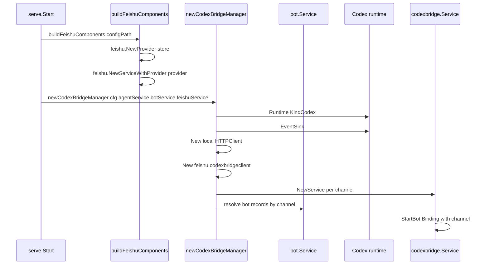

入站函数调用链：

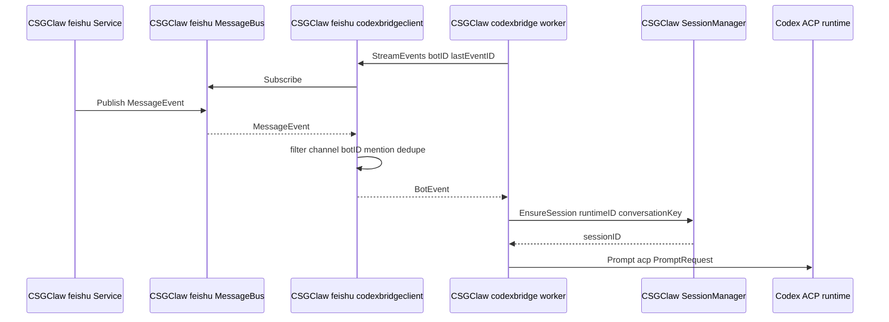

出站函数调用链：

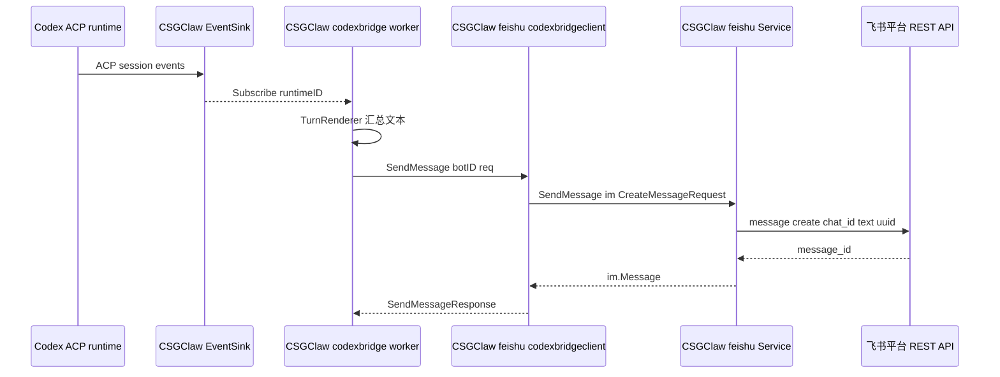

### Feishu 入站和出站参数

飞书 WebSocket 和 REST 参数由 `internal/channel/feishu` 处理：

| 参数 | 来源 | 用途 |
| --- | --- | --- |
| `app_id` | `feishu.AppConfig.AppID` | 创建飞书 SDK client 和 WebSocket listener |
| `app_secret` | `feishu.AppConfig.AppSecret` | 创建飞书 SDK client 和 WebSocket listener |
| `chat_id` | 飞书消息事件或 `RoomID` | 入站会话和出站目标 |
| `message_id` | 飞书消息事件或发送结果 | 本地去重和返回值 |
| `uuid` | Feishu service 生成或传入 | 发送幂等 |

`lastEventID` 在 Feishu 路径中只作为本地去重参考，不表示可以从飞书 WebSocket 按 message id 恢复历史事件。

## 与 PicoClaw 方案的对齐关系

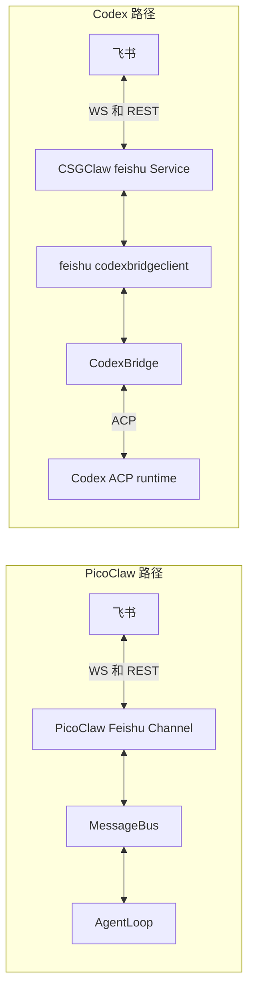

| 层面 | PicoClaw | Codex 推荐方案 |
| --- | --- | --- |
| 飞书入站 | PicoClaw runtime 的 FeishuChannel 连接 WebSocket | CSGClaw 的 `internal/channel/feishu` 连接 WebSocket |
| 飞书出站 | PicoClaw runtime 的 FeishuChannel 调 REST | CSGClaw 的 `internal/channel/feishu` 调 REST |
| 消息抽象 | `bus.InboundMessage` | `codexbridge.BotEvent` |
| 回复抽象 | `bus.OutboundMessage` | `codexbridge.SendMessageRequest` |
| Agent 执行 | PicoClaw `AgentLoop` | Codex ACP runtime |
| 配置来源 | CSGClaw `channels/feishu.toml` | CSGClaw `channels/feishu.toml` |
| 凭证使用方 | PicoClaw runtime | CSGClaw `internal/channel/feishu` |
| Thread 支持 | 暂不支持，普通 `chat_id` 发送 | 暂不支持，普通 `chat_id` 发送 |

两套方案在飞书协议层面对齐：都是 WebSocket 入站、REST 出站；也都暂不支持飞书 thread/reply。差异在 runtime 边界：PicoClaw 自己持有飞书连接；Codex 由 CSGClaw 的 Feishu channel 持有飞书连接，`codexbridge` 只消费抽象事件。

## 为什么不放到 Codex 插件里

Codex 插件或 MCP server 更适合作为会话内工具，例如查询飞书消息、发送飞书消息、查询用户信息等。它们不适合作为飞书 WebSocket 的常驻入站网关，因为飞书事件到达时仍然需要有一个外部进程接住事件并触发 Codex turn。

因此，设计为：

```text
飞书入站和出站适配：放在 CSGClaw server
Codex 推理和执行：继续走 ACP
```

## 实施步骤

1. 扩展 `internal/channel/feishu`，让它持有飞书 WebSocket listener，并把入站消息发布到现有或扩展后的 Feishu `MessageBus`。
2. 复用 `internal/channel/feishu/service.go` 的发送能力，保持 REST 出站、JSON content、`uuid`、bot info 和错误处理在 Feishu channel 内部。
3. 新增 `internal/channel/feishu/codexbridgeclient`，实现 `codexbridge.BotClient`，只负责订阅 Feishu channel 事件和做模型转换。
4. 修改 Codex bridge manager，按 bot record 的 `Channel` 选择本地 IM client 或 Feishu bridge client，不用 `BotConfig(botID)` 存在性做路由。
5. 扩展 `codexbridge.Binding` 和 worker key，携带 `Channel`，避免同一个 bot ID 在 `csgclaw` 与 `feishu` 下冲突。
6. 将飞书入站事件转换为 `codexbridge.BotEvent`，其中 `ThreadRootID` 保持空值，`ThreadContext` 保持 nil。
7. 将 `codexbridge.SendMessageRequest` 转换为 `im.CreateMessageRequest`，通过 Feishu service 发送普通 `chat_id` 文本消息，忽略 `ThreadRootID`。
8. 增加测试覆盖 channel 路由、重复 bot ID、WebSocket 生命周期、群聊 mention 过滤、`lastEventID` 本地去重，以及 thread 字段不映射。

## 最终结论

PicoClaw 飞书接入是 runtime 自己连飞书；Codex 飞书接入由 CSGClaw 的 Feishu channel 代 Codex 连飞书。

这样可以复用现有 Codex ACP bridge，不需要修改 Codex runtime，也不需要新增一套 Codex 专用 HTTP API。CSGClaw server 内部新增的是 Feishu-backed `BotClient` 适配器，不是新的飞书协议所有者；thread/reply 暂不进入本期范围，和 PicoClaw 当前行为保持一致。
