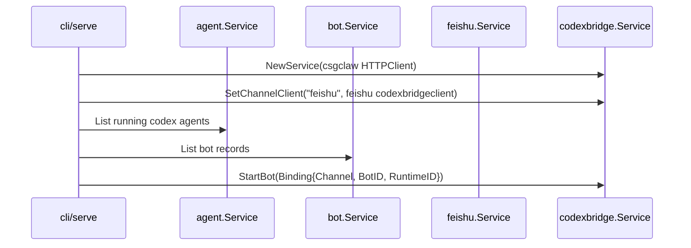
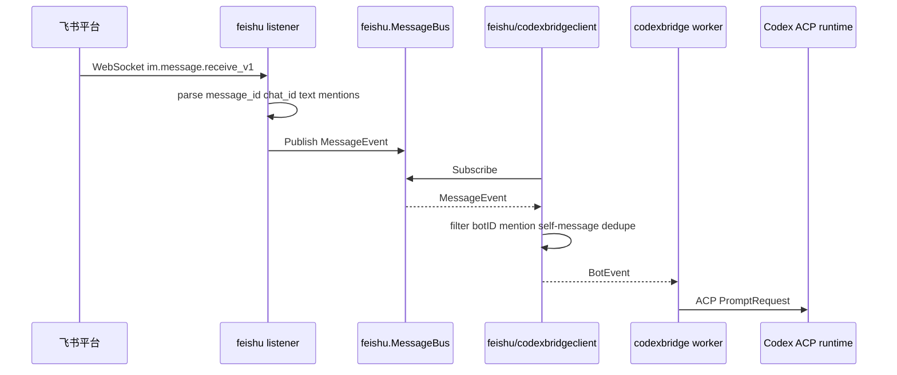
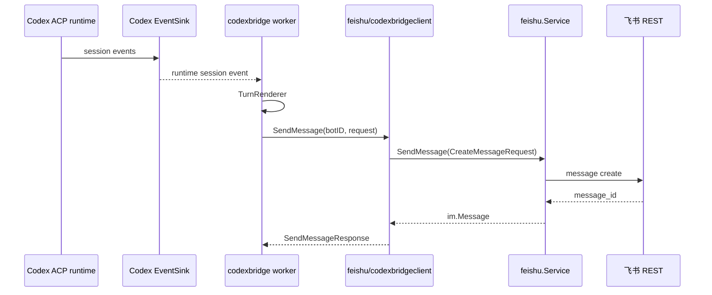
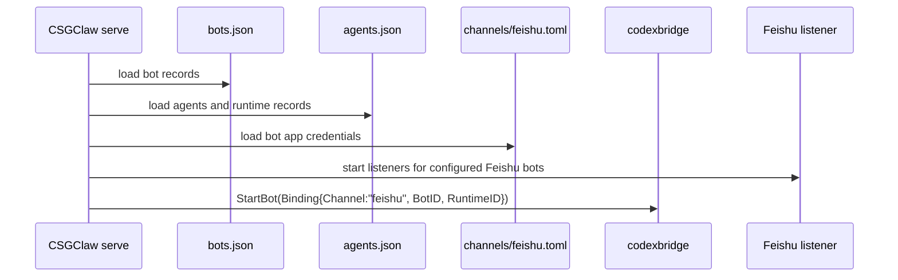

# Codex 对接飞书实现设计

本文梳理在 CSGClaw 中为 Codex runtime 增加飞书 channel 的实现方案。重点是：不破坏现有 Web UI、本地 IM、PicoClaw sandbox 和 Codex ACP 架构；飞书协议仍归 `internal/channel/feishu`，Codex 只通过 `codexbridge.BotClient` 抽象收发消息。

## 结论

推荐方案是：CSGClaw server 作为 Codex 与飞书之间的 channel adapter。


关键原则：

- Codex runtime 不直接连接飞书。
- `codexbridge` 不直接持有飞书 SDK client。
- 飞书 WebSocket、REST、凭证、open_id 缓存和重连都放在 `internal/channel/feishu`。
- `internal/channel/feishu/codexbridgeclient` 只做模型转换，不读配置文件，不创建飞书 SDK client。
- Channel 路由是 CSGClaw server 内部路由，不是新增 HTTP URL。

## 当前状态

CSGClaw 当前已有三块相关能力：

| 能力 | 当前模块 | 说明 |
| --- | --- | --- |
| Codex ACP runtime | `internal/runtime/codex` | 管理 Codex ACP session 和 session event sink |
| Codex bridge | `internal/channel/codexbridge` | 把 bot event 转为 ACP prompt，把 Codex session event 渲染为 bot message |
| 飞书 REST 管理能力 | `internal/channel/feishu` | 配置、bot info、建群、加人、拉消息、发送消息 |

当前缺口：

- CSGClaw server 还没有飞书 WebSocket 入站 listener。
- `codexbridge.Service` 目前只有一个 `BotClient`，默认是本地 IM 的 HTTP SSE client。
- `codexbridge.Binding` 目前没有 `Channel` 字段，worker key 也只按 `BotID` 区分。
- Codex bridge manager 当前按 running Codex agent 启动本地 bridge worker，还没有按 bot record 的 channel 启动不同 channel worker。

## HTTP 接口边界

### 是否新增 HTTP

本期 Codex 对接飞书**不新增 Codex 专用 HTTP API**。

新增 HTTP 汇总：

| URL | 方法 | 请求参数 | 响应 | 说明 |
| --- | --- | --- | --- | --- |
| 无 | 无 | 无 | 无 | Codex-Feishu runtime path 全部走进程内接口、飞书 WebSocket 和飞书 REST |

不新增：

```text
POST /api/v1/codex/feishu/...
GET  /api/v1/codex/feishu/...
POST /api/v1/channels/feishu/codex/...
```

原因：

- 飞书实时入站使用飞书 WebSocket，由 CSGClaw server 主动连接飞书平台。
- 飞书出站使用飞书 REST，由 `internal/channel/feishu.Service.SendMessage` 调用。
- Codex bridge 和 Feishu adapter 都在 CSGClaw server 进程内，二者之间不需要 HTTP。

### 现有本地 bot HTTP 保持不变

本地 `csgclaw` channel 继续使用现有 PicoClaw 兼容接口。这些接口不为飞书新增，也不改变 URL。

#### `GET /api/bots/{bot_id}/events`

用途：本地 `csgclaw` channel 的 bot event SSE。

调用方：

- 当前 `codexbridge.HTTPClient`
- PicoClaw 兼容客户端

请求：

```http
GET /api/bots/u-dev/events HTTP/1.1
Authorization: Bearer <access_token>
Last-Event-ID: msg-xxx
Accept: text/event-stream
```

响应：

```text
id: msg-xxx
event: message
data: {"message_id":"msg-xxx","room_id":"room-1","chat_type":"group","text":"hello","mentions":["u-dev"]}
```

说明：

- 只用于本地 `csgclaw` channel。
- Feishu channel 不通过这个接口接收飞书消息。

#### `POST /api/bots/{bot_id}/messages/send`

用途：本地 `csgclaw` channel 的 bot 回复发送。

请求：

```http
POST /api/bots/u-dev/messages/send HTTP/1.1
Authorization: Bearer <access_token>
Content-Type: application/json

{
  "room_id": "room-1",
  "text": "收到，我来处理。",
  "message_id": "activity-xxx",
  "thread_root_id": "msg-root"
}
```

响应：

```json
{
  "message_id": "msg-created"
}
```

说明：

- 只用于本地 `csgclaw` channel。
- Feishu channel 的发送走 `feishu.Service.SendMessage`，不经过该 HTTP URL。

### 现有 Feishu 管理 HTTP 保持不变

现有 `/api/v1/channels/feishu/...` 管理接口继续保留，用于配置、建群、加成员、拉消息、发送管理类消息。Codex 飞书运行时不依赖新增管理 URL。

示例：

```text
GET  /api/v1/channels/feishu/users
POST /api/v1/channels/feishu/rooms
POST /api/v1/channels/feishu/rooms/{room_id}/members
GET  /api/v1/channels/feishu/messages?room_id={chat_id}
POST /api/v1/channels/feishu/messages
```

这些接口面向 CLI/Web 管理操作，不是 Codex bridge 内部事件通道。

### 飞书平台接口

Feishu channel 使用的是飞书平台接口，不是 CSGClaw 新增 HTTP。

| 方向 | 协议 | 飞书能力 | CSGClaw 模块 |
| --- | --- | --- | --- |
| 入站 | WebSocket | `im.message.receive_v1` | `internal/channel/feishu` |
| 出站 | REST | message create | `internal/channel/feishu.Service.SendMessage` |

如果未来改成飞书 HTTP callback 模式，才需要新增对外 callback URL，例如：

```text
POST /api/v1/channels/feishu/events
```

该 callback 不属于本期方案。

## Channel 路由

Channel 路由不是 HTTP 路由。它是 CSGClaw server 内部把一个 Codex worker bot 绑定到具体 channel client 的过程。

路由依据：

```go
bot.Bot{
    ID:        "u-dev",
    Channel:   "feishu",
    AgentID:   "u-dev",
    RuntimeKind: "codex",
}
```

规则：

- `Channel == "csgclaw"`：使用现有 `codexbridge.HTTPClient`，走 `/api/bots/{id}/events` 和 `/api/bots/{id}/messages/send`。
- `Channel == "feishu"`：使用新增 `feishu/codexbridgeclient.Client`，订阅 `feishu.MessageBus()` 并调用 `feishu.Service.SendMessage`。
- 不用 `feishu.Provider.BotConfig(botID)` 决定路由。飞书 app 凭证只能说明这个 bot 可以连接飞书，不能说明某个 Codex worker 当前应该消费哪个 channel。

兼容策略：

- 对已经存在但没有 bot record 的本地 Codex worker，可继续按 `agent.ID` 启动 `csgclaw` channel bridge。
- 对 Feishu channel，建议要求存在明确 bot record，避免 app config 和 worker 绑定关系不清晰。

## 新增接口汇总

| 接口 | 所在模块 | 用途 |
| --- | --- | --- |
| `FeishuChannel` | `internal/channel/feishu/codexbridgeclient` | 隔离 Feishu adapter 与 Feishu service 的依赖边界 |
| `ClientForChannel` 或 `SetChannelClient` | `internal/channel/codexbridge` | 让 bridge 按 binding channel 选择不同 `BotClient` |
| `Binding.Channel` | `internal/channel/codexbridge` | 把 channel 作为 worker 身份和 prompt meta 的一部分 |

## 新增和调整模块

### `internal/channel/feishu`

继续作为飞书协议所有者。

新增职责：

- 管理每个 configured bot 的飞书 WebSocket listener。
- 处理 WebSocket 生命周期：启动、停止、配置 reload、断线重连。
- 解析 `im.message.receive_v1`：`message_id`、`chat_id`、chat type、sender open_id、mentions、text。
- 过滤 bot 自己发送的消息，避免自触发。
- 将入站消息发布为 `MessageEvent`。

建议新增文件：

```text
internal/channel/feishu/listener.go
internal/channel/feishu/listener_supervisor.go
internal/channel/feishu/message_event.go
internal/channel/feishu/message_parser.go
```

建议扩展事件模型：

```go
type MessageEvent struct {
    Type         string
    BotID        string
    RoomID       string
    ChatType     string
    MessageID    string
    Text         string
    SenderOpenID string
    Mentions     []Mention
    Message      *im.Message
}

type Mention struct {
    ID     string
    Name   string
    OpenID string
}
```

`Message.Message.SenderID` 可以继续按当前 Feishu service 使用 open_id；`BotID` 字段用于告诉 adapter 这是哪个飞书 bot listener 收到的事件。

### `internal/channel/feishu/codexbridgeclient`

新增模块，实现 `codexbridge.BotClient`。

建议文件：

```text
internal/channel/feishu/codexbridgeclient/client.go
internal/channel/feishu/codexbridgeclient/client_test.go
```

接口形态：

```go
type FeishuChannel interface {
    MessageBus() *feishu.MessageBus
    SendMessage(req im.CreateMessageRequest) (im.Message, error)
    ResolveBotOpenID(ctx context.Context, botID string) (string, string, error)
}

type Client struct {
    Feishu     FeishuChannel
    MentionOnly bool
    QueueSize   int
}

func (c *Client) StreamEvents(ctx context.Context, botID, lastEventID string) (<-chan codexbridge.BotEvent, <-chan error)
func (c *Client) SendMessage(ctx context.Context, botID string, req codexbridge.SendMessageRequest) (codexbridge.SendMessageResponse, error)
```

`StreamEvents` 行为：

- 订阅 `Feishu.MessageBus().Subscribe()`。
- 只接受 `evt.BotID == botID` 的事件。
- 群聊中 `MentionOnly == true` 时，只接受 mention 当前 bot 的消息。
- 将飞书 mention 文本清理后写入 `codexbridge.BotEvent.Text`。
- `ThreadRootID` 保持空，`ThreadContext` 保持 nil。
- `lastEventID` 只作为本地去重参考，不表示可以从飞书恢复历史消息。

转换结果：

```go
codexbridge.BotEvent{
    MessageID: evt.MessageID,
    RoomID:    evt.RoomID,
    ChatType:  evt.ChatType,
    Text:      cleanedText,
    Mentions:  mentionBotIDs,
}
```

`SendMessage` 行为：

```go
message, err := c.Feishu.SendMessage(im.CreateMessageRequest{
    RoomID:   req.RoomID,
    SenderID: botID,
    Content:  req.Text,
})
```

返回：

```go
codexbridge.SendMessageResponse{
    MessageID: message.ID,
}
```

说明：

- `req.MessageID` 不映射到飞书。
- `req.ThreadRootID` 不映射到飞书。
- Feishu 回复统一发送为普通 `chat_id` 文本消息。

### `internal/channel/codexbridge`

需要保持现有接口兼容，同时增加 channel-aware worker。

调整 `Binding`：

```go
type Binding struct {
    Channel    string
    BotID      string
    RuntimeID  string
    SessionID  string
    PromptMeta map[string]any
}
```

新增 client registry：

```go
type ClientRegistry interface {
    ClientForChannel(channel string) (BotClient, bool)
}
```

一种低侵入实现：

```go
type Service struct {
    clients map[string]BotClient
    // existing fields...
}

func NewService(defaultClient BotClient, prompter SessionPrompter, events runtimecodex.SessionEventSubscriber) *Service
func (s *Service) SetChannelClient(channel string, client BotClient)
```

默认行为：

- `NewService(defaultClient, ...)` 把 default client 注册到 `csgclaw`。
- 未设置 `Binding.Channel` 时默认 `csgclaw`，兼容现有测试和调用方。

worker key：

```go
func workerKey(channel, botID string) string {
    return strings.TrimSpace(channel) + "\x00" + strings.TrimSpace(botID)
}
```

需要同步调整：

- `StartBot`
- `StopBot`
- `sameBinding`
- worker 内部调用 `StreamEvents` 和 `SendMessage` 时使用当前 binding 的 channel client

### `cli/serve`

调整 Codex bridge manager 的依赖。

当前：

```go
newCodexBridgeManager(cfg config.Config, svc *agent.Service)
```

建议：

```go
newCodexBridgeManager(
    cfg config.Config,
    agentSvc *agent.Service,
    botSvc *bot.Service,
    feishuSvc *feishu.Service,
)
```

职责：

- 创建 `codexbridge.Service`。
- 注册 `csgclaw` channel client。
- 如果 `feishuSvc != nil`，注册 `feishu` channel client。
- 启动 bridge worker 时读取 bot record，按 `bot.Channel` 选择 channel。
- 对旧本地 Codex worker 保留 fallback。

启动流程：



## 入站流程



`BotEvent` 字段映射：

| 字段 | Feishu 来源 |
| --- | --- |
| `MessageID` | 飞书 `message_id` |
| `RoomID` | 飞书 `chat_id` |
| `ChatType` | 飞书 chat type，映射为 `p2p` 或 `group` |
| `Text` | 飞书文本内容，群聊中去掉当前 bot mention |
| `Mentions` | mention 到的 CSGClaw bot IDs |
| `ThreadRootID` | 空 |
| `ThreadContext` | nil |

## 出站流程



`SendMessageRequest` 字段映射：

| Codex bridge 字段 | Feishu 发送字段 |
| --- | --- |
| `RoomID` | `im.CreateMessageRequest.RoomID`，对应飞书 `chat_id` |
| `Text` | `im.CreateMessageRequest.Content` |
| `MessageID` | 不映射 |
| `ThreadRootID` | 不映射 |

## 配置和凭证

配置文件保持现有结构：

```toml
[global]
admin_open_id = "ou_xxx"

[bots.u-dev]
app_id = "cli_xxx"
app_secret = "xxx"
```

使用方：

| 字段 | 使用方 |
| --- | --- |
| `app_id` | `internal/channel/feishu` 创建 REST/WebSocket client |
| `app_secret` | `internal/channel/feishu` 创建 REST/WebSocket client |
| `admin_open_id` | 现有 Feishu 管理能力 |

`codexbridgeclient` 不读取该文件，只依赖注入进来的 `FeishuChannel`。

## 映射持久化和重启恢复

Codex-Feishu 不需要新增一份单独的映射文件。映射由已有持久化状态组合出来，server 启动时重建运行时 binding。

持久化来源：

| 映射内容 | 持久化位置 | 说明 |
| --- | --- | --- |
| bot 属于哪个 channel | `bots.json` | `bot.ID`、`bot.Channel`、`bot.AgentID` 持久化在 bot store |
| bot 绑定哪个 agent/runtime | `agents.json` | `agent.ID`、`agent.RuntimeID`、`agent.RuntimeKind` 持久化在 agent store |
| 飞书 bot 凭证 | `channels/feishu.toml` | `botID -> app_id/app_secret` |
| 飞书群聊 ID | 飞书平台 | `chat_id` 由飞书事件带入，也可通过现有 room/message API 查询 |
| Codex conversation session | 进程内 | `conversationKey -> ACP session_id` 当前由 Codex runtime live session 维护 |

启动恢复流程：



重启后不会丢失：

- `botID -> channel -> agentID` 的绑定。
- `agentID -> runtimeID -> runtimeKind` 的绑定。
- `botID -> feishu app_id/app_secret` 的凭证绑定。
- 已存在飞书群聊本身，因为群聊在飞书平台。

重启后会重建或变化：

- Feishu WebSocket 连接会重新建立。
- `codexbridge` worker 会重新启动。
- `conversationKey(chat_id) -> ACP session_id` 当前是进程内关系，server 重启后会重新创建 Codex ACP session。

因此，首期语义是：

```text
持久化稳定关系：bot/channel/agent/runtime/config
运行时临时关系：WebSocket connection、bridge worker、ACP session_id
```

这意味着重启后仍然知道哪个飞书 bot 对应哪个 Codex worker；但某个飞书 `chat_id` 对应的 Codex ACP session 会重新建立，不保证继续复用重启前同一个 ACP `session_id`。

如需后续增强连续会话，可新增持久化索引：

```text
channel + bot_id + room_id + thread_root_id -> codex conversation/session metadata
```

但这不是打通 Codex-Feishu 首期的必需项。

### 与 PicoClaw 的一致性

PicoClaw 路径也不是由 CSGClaw 保存一份 `chat_id -> agent session` 映射。当前 PicoClaw 的飞书凭证由 CSGClaw 从 `channels/feishu.toml` 读取，并在启动 sandbox runtime 时注入：

```text
PICOCLAW_CHANNELS_FEISHU_APP_ID
PICOCLAW_CHANNELS_FEISHU_APP_SECRET
```

然后 PicoClaw runtime 自己建立飞书 WebSocket、处理消息和维护它自己的运行时状态。

一致点：

- 飞书凭证都来自 `channels/feishu.toml`。
- bot 与 worker 的稳定关系都来自 CSGClaw 的 bot/agent 状态。
- 飞书 `chat_id` 都来自飞书事件，不需要 CSGClaw 预先保存才能收到消息。

差异点：

- PicoClaw 的飞书连接和消息循环在 PicoClaw runtime 内部。
- Codex 的飞书连接和消息转换在 CSGClaw server 内部，再通过 ACP 调 Codex runtime。
- Codex 的 `conversationKey -> ACP session_id` 是 CSGClaw server 内部运行时关系，首期不单独持久化。

## 可靠性和去重

本地 `csgclaw` channel 继续使用现有 HTTP SSE 的 ack/requeue/replay。

Feishu channel 本期建议采用进程内 best-effort：

- WebSocket listener 收到事件后发布到 `MessageBus`。
- `codexbridge` worker 使用 `MessageID + RoomID` 做本地去重。
- `lastEventID` 只用于 adapter/worker 本地去重。
- 进程重启后不从飞书历史消息自动 replay。

如果需要更强可靠性，后续可扩展 `feishu.MessageBus`：

```go
Subscribe(botID string, lastEventID string) (<-chan MessageEvent, func())
Ack(botID, messageID string)
Requeue(botID string, evt MessageEvent)
```

该增强不是 Codex-Feishu 打通的首期必需条件。

## 实施步骤

1. 扩展 `internal/channel/feishu.MessageEvent`，补齐 `BotID`、`MessageID`、`ChatType`、`Text`、`SenderOpenID`、`Mentions`。
2. 在 `internal/channel/feishu` 新增 WebSocket listener 和 supervisor，按 configured bot 启动、停止和 reload。
3. 新增 `internal/channel/feishu/codexbridgeclient`，实现 `codexbridge.BotClient`。
4. 扩展 `codexbridge.Binding.Channel`，并将 worker key 改为 `channel + "\x00" + botID`。
5. 为 `codexbridge.Service` 增加 channel client registry，默认兼容 `csgclaw`。
6. 调整 `cli/serve.newCodexBridgeManager`，注入 `bot.Service` 和 `feishu.Service`。
7. Codex bridge manager 启动时按 bot record 的 `Channel` 创建 binding；本地旧 agent 保留 fallback。
8. 为 Feishu path 增加 mention-only、自触发过滤、去重和普通文本发送测试。

## 测试清单

需要覆盖：

- `codexbridge` 未设置 `Binding.Channel` 时仍默认使用 `csgclaw`。
- 同一个 `BotID` 分别绑定 `csgclaw` 和 `feishu` 时 worker 不互相覆盖。
- `StopBot(channel, botID)` 或兼容 wrapper 能正确停止指定 channel worker。
- Feishu adapter 只消费匹配 `BotID` 的 `MessageEvent`。
- 群聊 `MentionOnly` 开启时，未 mention 当前 bot 的消息不会触发 Codex。
- Feishu adapter 发送消息时使用 botID 作为 `SenderID` 调用 `feishu.Service.SendMessage`。
- `ThreadRootID` 和 `ThreadContext` 在 Feishu path 不映射。
- Feishu listener 不把 bot 自己发送的消息重新投递给 Codex。

## 与 PicoClaw 的关系

PicoClaw 飞书路径保持不变：

```text
Feishu -> PicoClaw runtime FeishuChannel -> PicoClaw MessageBus -> PicoClaw AgentLoop
```

Codex 飞书路径新增在 CSGClaw server 内：

```text
Feishu -> CSGClaw feishu channel -> feishu codexbridgeclient -> codexbridge -> Codex ACP runtime
```

两条路径共享 `channels/feishu.toml` 的凭证来源，但飞书连接所有者不同：

| Runtime | 飞书连接所有者 |
| --- | --- |
| PicoClaw sandbox | PicoClaw runtime 内部 |
| Codex ACP | CSGClaw server 的 `internal/channel/feishu` |

这样能复用现有 Codex ACP bridge，不新增 Codex 专用 HTTP API，也不把飞书协议细节泄漏到 Codex runtime。
