# Codex 对接飞书设计说明

本文说明现有 PicoClaw 如何对接飞书，以及在 CSGClaw 中为 Codex runtime 增加飞书通道时推荐的模块边界、消息流和接口映射。

## 背景

CSGClaw 目前同时支持 PicoClaw runtime 和 Codex runtime。PicoClaw 已经可以接入飞书群聊，但它的飞书连接发生在 PicoClaw runtime 内部；Codex runtime 目前通过 ACP 与 CSGClaw 交互，并不直接连接飞书。

推荐方案是：由 CSGClaw server 作为 Codex 与飞书之间的适配层，一边连接飞书 WebSocket/REST API，一边通过现有 `codexbridge` 将消息转换为 Codex ACP prompt。

## 现有 PicoClaw 飞书接入

PicoClaw 的飞书接入是 runtime 自己完成的：

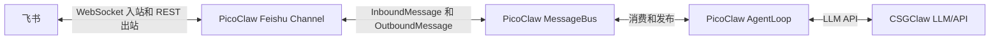

### 入站消息流

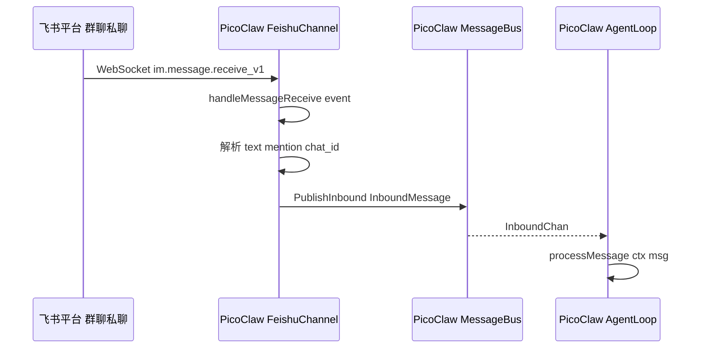

关键模块：

| 职责 | 模块 |
| --- | --- |
| 飞书通道实现 | `picoclaw/pkg/channels/feishu/feishu_64.go` |
| 建立飞书 WebSocket | `FeishuChannel.Start` |
| 注册飞书消息事件 | `OnP2MessageReceiveV1(c.handleMessageReceive)` |
| 通道通用接口 | `picoclaw/pkg/channels/base.go` |
| 消息总线 | `picoclaw/pkg/bus/bus.go` |
| Agent 主循环 | `picoclaw/pkg/agent/loop.go` |

### 出站消息流

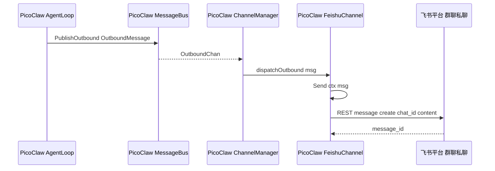

PicoClaw 的 `FeishuChannel.Send` 会优先发送 interactive card，失败时回退为文本消息。

### 配置流

飞书凭证由 CSGClaw 管理，然后在启动 PicoClaw sandbox runtime 时注入环境变量：


注入的关键环境变量：

```text
PICOCLAW_CHANNELS_FEISHU_APP_ID
PICOCLAW_CHANNELS_FEISHU_APP_SECRET
```

PicoClaw 读取这些环境变量后，自己创建飞书 SDK client 和 WebSocket client。因此，PicoClaw 并不是通过 CSGClaw server 的 HTTP/SSE 接口来收发飞书群聊消息。

## CSGClaw 当前飞书能力

CSGClaw server 目前已有飞书 REST 能力，主要用于配置和管理操作：

```text
CSGClaw server
  -> 飞书 REST API
```

已有能力包括：

- 保存和加载飞书 bot 配置
- 获取 bot 信息
- 创建群聊
- 添加群成员
- 拉取群成员和群消息
- 发送管理类消息

主要模块：

| 职责 | 模块 |
| --- | --- |
| 飞书配置文件 | `internal/channel/feishu/store.go` |
| 飞书配置 provider | `internal/channel/feishu/provider.go` |
| 飞书 REST service | `internal/channel/feishu/service.go` |
| 飞书 API handler | `internal/api/feishu.go` |
| 飞书配置 API handler | `internal/api/feishu_config.go` |

当前缺少的是：

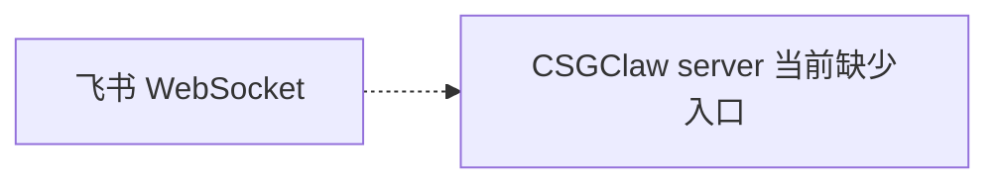

也就是说，CSGClaw server 当前不是飞书实时群聊消息入口。

## Codex 对接飞书推荐方案

Codex 不直接连接飞书。推荐由 CSGClaw server 代表 Codex 连接飞书：

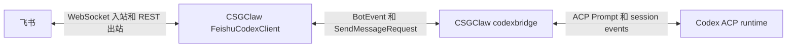

### 入站消息流

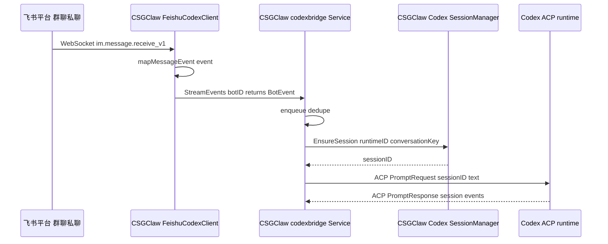

### 出站消息流

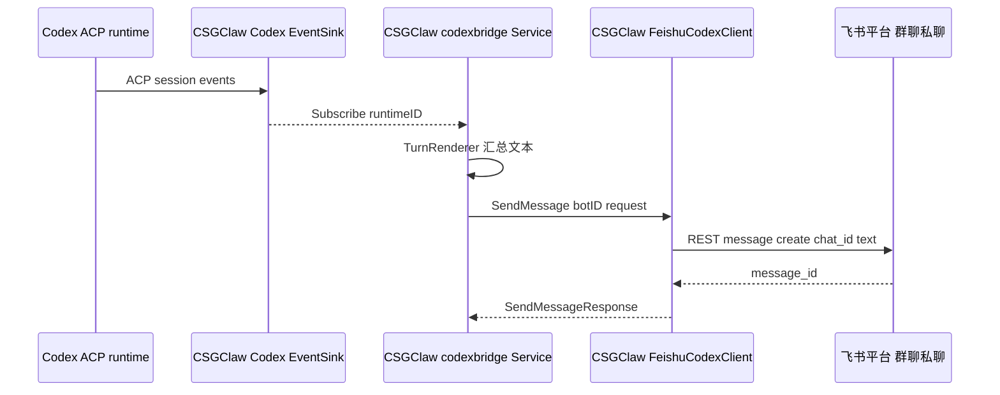

### 新增模块

新增：

```text
internal/channel/feishu/codexclient
```

该模块实现现有的 `codexbridge.BotClient` 接口：

```go
type BotClient interface {
    StreamEvents(ctx context.Context, botID, lastEventID string) (<-chan BotEvent, <-chan error)
    SendMessage(ctx context.Context, botID string, req SendMessageRequest) (SendMessageResponse, error)
}
```

其中：

```text
StreamEvents
  = 飞书 WebSocket 入站
  = 飞书 message event -> codexbridge.BotEvent

SendMessage
  = 飞书 REST 出站
  = codexbridge.SendMessageRequest -> 飞书 message create
```

为同时支持 CSGClaw 本地 IM 和 Feishu 两种 Codex bot，增加一个轻量路由 client：

```text
internal/channel/codexbridge/routing_client.go
```

它仍然实现 `codexbridge.BotClient`，按 `botID` 选择真实 client：

```go
type RoutingClient struct {
    Local  codexbridge.BotClient
    Feishu codexbridge.BotClient
    Route  func(botID string) string
}

func (c *RoutingClient) StreamEvents(ctx context.Context, botID, lastEventID string) (<-chan codexbridge.BotEvent, <-chan error)
func (c *RoutingClient) SendMessage(ctx context.Context, botID string, req codexbridge.SendMessageRequest) (codexbridge.SendMessageResponse, error)
```

路由规则：

```text
如果 feishu.Provider.BotConfig(botID) 存在 -> 使用 FeishuCodexClient
否则 -> 使用现有 codexbridge.HTTPClient
```

这样 `codexbridge.Service` 仍然只依赖一个 `BotClient`，不用改动 Codex ACP 主流程。

## 核心字段模型

### 现有 Feishu 配置模型

CSGClaw 已有飞书配置 provider：

```go
type BotCredentialProvider interface {
    BotConfig(botID string) (AppConfig, bool)
}

type AppConfig struct {
    AppID       string
    AppSecret   string
    AdminOpenID string
}
```

`FeishuCodexClient` 通过 `BotConfig(botID)` 获取该 bot 对应的飞书凭证。

当前 `channels/feishu.toml` 中与 Codex 飞书桥接相关的字段是：

```toml
[global]
admin_open_id = "ou_xxx"

[bots.u-dev]
app_id = "cli_xxx"
app_secret = "xxx"
```

`app_id` 和 `app_secret` 用于创建飞书 SDK client、WebSocket client，以及调用飞书 REST API。`admin_open_id` 保持现有管理语义，Codex 飞书消息桥接不依赖该字段处理普通群聊收发。

### 现有 Codex bridge 入站模型

Codex bridge 已经定义了入站事件：

```go
type BotEvent struct {
    MessageID     string
    RoomID        string
    ChatType      string
    Text          string
    Mentions      []string
    ThreadRootID  string
    ThreadContext *BotThreadContext
}
```

字段含义：

| 字段 | 含义 |
| --- | --- |
| `MessageID` | 外部平台消息 ID，用于去重和 `Last-Event-ID` |
| `RoomID` | 会话 ID；飞书中对应 `chat_id` |
| `ChatType` | `p2p` 或 `group` |
| `Text` | 送给 Codex 的用户文本，群聊中应去掉 bot mention |
| `Mentions` | 被 mention 的用户或 bot ID 列表 |
| `ThreadRootID` | thread/reply 根消息 ID |
| `ThreadContext` | 首次进入 thread 时注入给 Codex 的上下文 |

### 现有 Codex bridge 出站模型

```go
type SendMessageRequest struct {
    RoomID       string
    Text         string
    MessageID    string
    ThreadRootID string
}

type SendMessageResponse struct {
    MessageID string
}
```

字段含义：

| 字段 | 含义 |
| --- | --- |
| `RoomID` | 目标会话；飞书中对应 `chat_id` |
| `Text` | Codex 要发送的内容 |
| `MessageID` | activity/update 场景中的消息 ID |
| `ThreadRootID` | thread/reply 目标 |

### 新增 FeishuCodexClient 模型

模型：

```go
type Options struct {
    Provider    feishu.BotCredentialProvider
    MentionOnly bool
    QueueSize   int
    Logger      *slog.Logger
}

type Client struct {
    provider    feishu.BotCredentialProvider
    mentionOnly bool
    queueSize   int
    logger      *slog.Logger
}

func New(options Options) *Client
```

`Client` 实现：

```go
func (c *Client) StreamEvents(ctx context.Context, botID, lastEventID string) (<-chan codexbridge.BotEvent, <-chan error)

func (c *Client) SendMessage(ctx context.Context, botID string, req codexbridge.SendMessageRequest) (codexbridge.SendMessageResponse, error)
```

内部可以拆成几个小函数，便于测试：

```go
func (c *Client) appConfig(botID string) (feishu.AppConfig, error)
func (c *Client) resolveBotOpenID(ctx context.Context, app feishu.AppConfig) (string, error)
func (c *Client) startWebSocket(ctx context.Context, botID string, app feishu.AppConfig, events chan<- codexbridge.BotEvent) error
func (c *Client) handleMessageReceive(botID string, botOpenID string, events chan<- codexbridge.BotEvent) func(context.Context, *larkim.P2MessageReceiveV1) error
func (c *Client) mapMessageEvent(botID string, botOpenID string, event *larkim.P2MessageReceiveV1) (codexbridge.BotEvent, bool)
func (c *Client) shouldAccept(event codexbridge.BotEvent, botOpenID string) bool
func (c *Client) stripBotMention(text string, botOpenID string) string
```

## 函数流程设计

### Server 启动流程

当前 Codex bridge manager 在 `newCodexBridgeManager` 中创建 `codexbridge.Service`。接入飞书后，推荐流程如下：

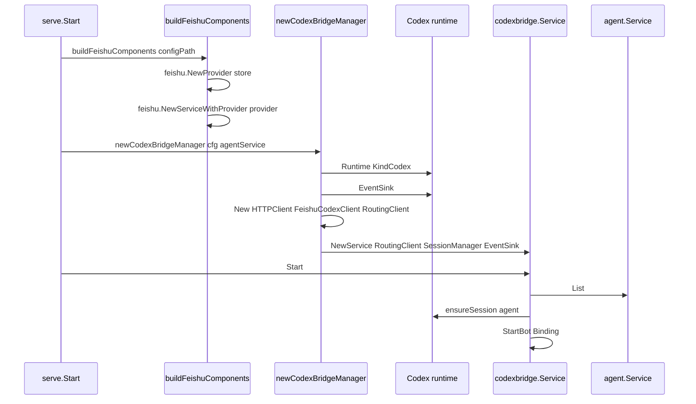

`Binding` 参数：

```go
codexbridge.Binding{
    BotID:     a.ID,
    RuntimeID: strings.TrimSpace(a.RuntimeID),
    SessionID: session.SessionID,
    PromptMeta: map[string]any{
        "channel": "feishu",
    },
}
```

`PromptMeta` 用于给 Codex prompt 附加来源信息。Feishu 路径可以注入 `channel=feishu`，并在需要时加入 `chat_type`、`bot_id` 等元信息。

### 入站函数调用链

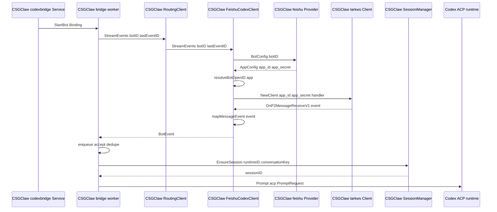

`acp.PromptRequest` 的关键参数：

```go
acp.PromptRequest{
    SessionId: acp.SessionId(sessionID),
    Prompt: []acp.ContentBlock{
        acp.TextBlock(event.Text),
    },
    Meta: binding.PromptMeta,
}
```

### 飞书入站接口参数

飞书 WebSocket client 参数：

| 参数 | 来源 | 用途 |
| --- | --- | --- |
| `app_id` | `feishu.AppConfig.AppID` | 创建飞书 WS client |
| `app_secret` | `feishu.AppConfig.AppSecret` | 创建飞书 WS client |

启动 WebSocket 前调用 bot info API 获取当前 bot 的 `open_id`，并在内存中缓存：

```text
resolveBotOpenID(app)
  -> 飞书 bot info API
  -> botOpenID
```

`botOpenID` 用于两件事：

- 群聊 mention 判断
- 忽略 bot 自己发送的消息，避免自触发循环

飞书消息事件中需要读取的字段：

| Feishu 事件字段 | 用途 |
| --- | --- |
| `event.message.message_id` | 映射为 `BotEvent.MessageID` |
| `event.message.chat_id` | 映射为 `BotEvent.RoomID` |
| `event.message.chat_type` | 映射为 `BotEvent.ChatType` |
| `event.message.message_type` | 判断消息类型 |
| `event.message.content` | 解析文本内容 |
| `event.message.mentions` | mention 判断和 `BotEvent.Mentions` |
| `event.sender.sender_id.open_id` | 忽略 bot 自己发出的消息，记录用户来源 |

群聊过滤：

```text
如果 chat_type != group -> 接收
如果 MentionOnly=false -> 接收
如果 mentions 包含 bot open_id -> 接收
否则忽略
```

### 出站函数调用链

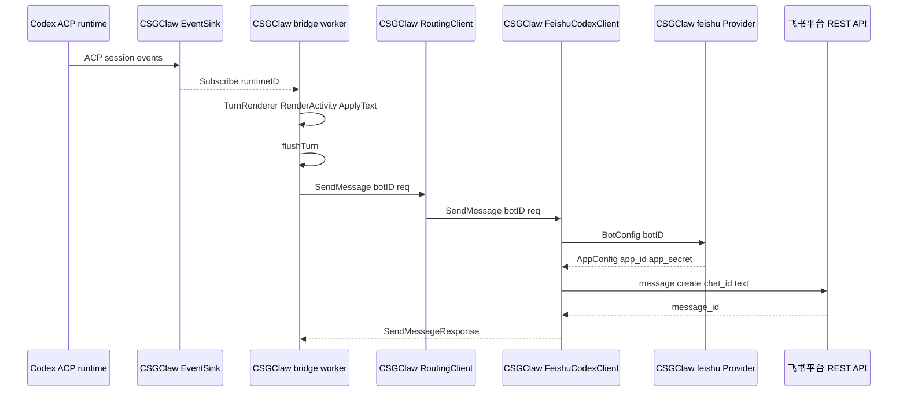

飞书 REST 发送参数：

| 参数 | 值 |
| --- | --- |
| `receive_id_type` | `chat_id` |
| `receive_id` | `req.RoomID` |
| `msg_type` | `text` |
| `content` | `{"text": req.Text}` |
| `uuid` | 使用稳定请求 ID 做幂等 |

`SendMessage` 示例：

```go
req := larkim.NewCreateMessageReqBuilder().
    ReceiveIdType(larkim.ReceiveIdTypeChatId).
    Body(larkim.NewCreateMessageReqBodyBuilder().
        ReceiveId(sendReq.RoomID).
        MsgType(larkim.MsgTypeText).
        Content(`{"text": "...escaped text..."}`).
        Build()).
    Build()
```

返回值：

```go
codexbridge.SendMessageResponse{
    MessageID: feishuMessageID,
}
```

### 事件映射

飞书事件应映射为 `codexbridge.BotEvent`：

| Feishu 字段 | Codex bridge 字段 |
| --- | --- |
| `message_id` | `MessageID` |
| `chat_id` | `RoomID` |
| chat type | `ChatType` |
| text content | `Text` |
| mentions | `Mentions` |
| thread/root message | `ThreadRootID` / `ThreadContext` |

群聊中沿用 PicoClaw 的处理语义：

- 支持只响应 @bot 的消息
- 收到消息后去除 bot mention
- 使用 bot open_id 做可靠 mention 判断
- 对重复事件做去重

### 出站映射

`codexbridge.SendMessageRequest` 应映射到飞书消息发送：

| Codex bridge 字段 | Feishu 字段 |
| --- | --- |
| `RoomID` | `receive_id`，类型为 `chat_id` |
| `Text` | message content |
| `ThreadRootID` | thread/reply 目标 |
| `MessageID` | activity/update 场景中的消息 ID |

## 与 PicoClaw 方案的对齐关系

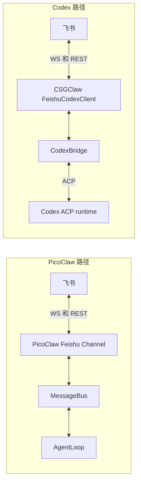

| 层面 | PicoClaw | Codex 推荐方案 |
| --- | --- | --- |
| 飞书入站 | PicoClaw runtime 连接 WebSocket | CSGClaw server 连接 WebSocket |
| 飞书出站 | PicoClaw runtime 调 REST | CSGClaw server 调 REST |
| 消息抽象 | `bus.InboundMessage` | `codexbridge.BotEvent` |
| 回复抽象 | `bus.OutboundMessage` | `codexbridge.SendMessageRequest` |
| Agent 执行 | PicoClaw `AgentLoop` | Codex ACP runtime |
| 配置来源 | CSGClaw `channels/feishu.toml` | CSGClaw `channels/feishu.toml` |
| 凭证使用方 | PicoClaw runtime | CSGClaw server |

两套方案在飞书协议层面对齐：都是 WebSocket 入站、REST 出站。差异在 runtime 边界：PicoClaw 自己持有飞书连接；Codex 由 CSGClaw server 持有飞书连接。

## 为什么不放到 Codex 插件里

Codex 插件或 MCP server 更适合作为会话内工具，例如查询飞书消息、发送飞书消息、查询用户信息等。它们不适合作为飞书 WebSocket 的常驻入站网关，因为飞书事件到达时仍然需要有一个外部进程接住事件并触发 Codex turn。

因此，设计为：

```text
飞书入站和出站适配：放在 CSGClaw server
Codex 推理和执行：继续走 ACP
```

## 实施步骤

1. 新增 `internal/channel/feishu/codexclient`，实现 `codexbridge.BotClient`。
2. 复用 `feishu.Provider.BotConfig(botID)` 获取 `app_id` 和 `app_secret`。
3. 在 `StreamEvents` 中为 bot 启动飞书 WebSocket client。
4. 将飞书消息事件转换为 `codexbridge.BotEvent`。
5. 在 `SendMessage` 中调用飞书 REST message create API。
6. 修改 Codex bridge manager，根据 agent/channel 选择 bot client。
7. 为配置 reload、WebSocket 重连、消息去重和群聊 mention 过滤增加测试。

## 最终结论

PicoClaw 飞书接入是 runtime 自己连飞书；Codex 飞书接入由 CSGClaw server 代 Codex 连飞书。

这样可以复用现有 Codex ACP bridge，不需要修改 Codex runtime，也不需要新增一套 Codex 专用 HTTP API。CSGClaw server 内部新增 Feishu-backed `BotClient` 即可完成协议适配。
