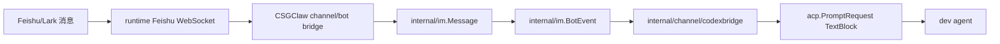
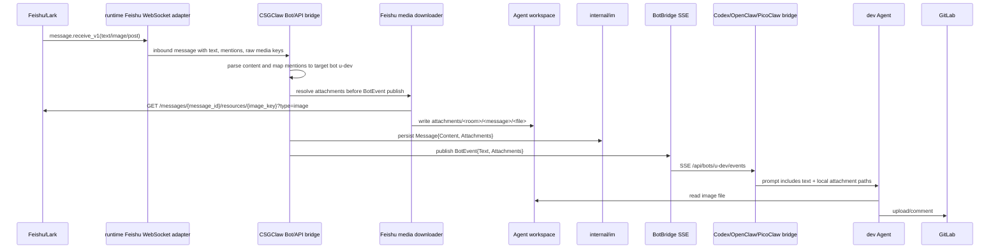

# 飞书消息附件传递到 Agent 工作区方案

## 背景与目标

Issue 2408 的场景是：用户在飞书群里给 Git 助手 `dev` 发送图片，希望 Agent 把图片评论到 GitLab Issue。当前 Agent 只能看到飞书图片的 `image_key`，例如：

```text
img_v3_0212f_73498d91-ebe2-46af-8d22-f2da12fdcbag
```

Agent 在自己的沙箱/工作区中找不到本地图片文件，也拿不到可下载 URL，因此不能把图片上传到 GitLab。

本方案目标：

- 飞书入站图片能够被 CSGClaw 下载成真实文件。
- 文件落在目标 Agent 可访问的工作区内。
- IM 消息、BotEvent、runtime prompt 都携带附件元数据。
- Agent 能稳定拿到本地文件路径，用 GitLab API 上传或生成 Markdown 图片链接。

非目标：

- 不把飞书接入改成公网 webhook；当前架构中飞书真实入站由 runtime 侧 Feishu/Lark WebSocket 模式处理。
- 不把飞书的 `image_key` 当成长期可公开访问 URL。
- 不在日志或 prompt 中打印 app secret、tenant access token 等敏感信息。
- 第一阶段不实现飞书出站发送图片；只解决“用户从飞书发图片给 Agent”。

## 当前代码判断

当前代码里与本问题相关的链路如下：



关键现状：

1. `internal/channel/feishu/service.go` 的 `feishuSDKMessageToIMMessage` 只把飞书消息转成 `im.Message{Content, Mentions}`。
2. `feishuMessageContentText` 只解析 `{ "text": "..." }`，否则把原始 content 字符串直接作为文本返回。
3. `internal/apitypes.Message` 没有附件字段。
4. `internal/im.BotEvent` 和 `internal/channel/codexbridge.BotEvent` 都没有附件字段。
5. `internal/channel/codexbridge.worker.handleEvent` 构造 prompt 时只发送 `acp.TextBlock(w.promptText(evt))`。
6. 飞书 SDK 已有下载能力：
   - 图片上传接口对应的 `image_key`：`client.Im.V1.Image.Get(...)`，底层路径是 `/open-apis/im/v1/images/:image_key`，但 SDK 注释说明它只适合下载当前应用自己上传的 message 图片。
   - 用户消息中的图片/文件资源：`client.Im.V1.MessageResource.Get(...)`，底层路径是 `/open-apis/im/v1/messages/:message_id/resources/:file_key`，支持下载消息里的音频、视频、图片和文件。

因此问题根因不是 GitLab comment 工具缺失，而是飞书媒体资源没有在 CSGClaw 中被解析、下载、落盘并传给 Agent。

## Hermes-Agent 参考结论

`~/my/hermes-agent` 的飞书图片处理链路可以作为本方案的实现参照：

1. Feishu adapter 先解析消息 content，把 `image` 消息、富文本 `post` 中的图片元素、文件元素提取成结构化 media ref，而不是把 `image_key` 当普通文本交给 Agent。
2. 对用户从飞书发来的图片，Hermes 使用消息资源接口下载：`message_resource.get(message_id, file_key=image_key, type="image")`。这与本方案要求的下载方式一致。
3. Hermes 下载到图片字节后，会校验内容确实像图片，再写入本地 cache，并在事件中通过 `media_urls` / `media_types` 继续传递本地路径和类型。
4. Hermes 后续有两种 Agent 输入方式：把本地图片路径交给 vision 工具预分析，或把本地图片读成 base64/data URL 作为原生多模态消息发送。

与 Hermes 保持一致的点：

- 飞书媒体资源必须先下载到本地文件。
- 传给 Agent 的核心信息必须包含 Agent 可访问的本地路径。
- base64/native image input 只能作为模型视觉输入增强，不能替代本地文件路径。
- 下载失败要在事件中可见，不能只剩 `image_key` 让 Agent 猜。

需要按 CSGClaw 架构调整的点：

- Hermes 使用全局 cache 目录和 `media_urls/media_types`；CSGClaw 应落到目标 Agent workspace。因为 GitLab 上传动作发生在 Agent/runtime 内，传 host 侧全局 cache 路径可能在 sandbox 中不可读。
- Hermes 的 media 字段较轻量；CSGClaw 需要 `MessageAttachment` / `BotEventAttachment` 保留 `Status`、`RuntimePath`、`WorkspacePath`、飞书 key、失败原因等元数据，方便 IM 存储、SSE 投递和排障。
- Hermes 会做图片字节校验；CSGClaw 实现时也应增加 magic bytes / `http.DetectContentType` 校验，避免把非图片内容写入图片附件。

## 架构原则

### 1. 附件是 IM 消息能力，不是 Feishu 专属文本

附件字段应加在 `internal/apitypes.Message`，再由 `internal/im`、`BotBridge`、各 channel adapter 复用。飞书只是第一种来源。

### 2. 文件必须落在目标 Agent 可访问路径

GitLab 上传需要真实文件。仅把图片作为 `acp.ImageBlock` 给模型看，不能保证 Agent 可以用 shell 或 GitLab API 读取文件。

推荐落盘位置：

```text
<agent workspace>/attachments/<roomID>/<messageID>/<safe-file-name>
```

不同 runtime 的 workspace root 由现有 `agent.Service.WorkspaceRoot(agentName)` 获取：

| runtime | host workspace | agent 内可见路径 |
|---|---|---|
| Codex | `~/.csgclaw/agents/<agent>/.codex/workspace` | Codex session cwd/workspace |
| OpenClaw sandbox | `~/.csgclaw/agents/<agent>/.openclaw/workspace` | `/home/node/.openclaw/workspace` |
| PicoClaw sandbox | `~/.csgclaw/agents/<agent>/.picoclaw/workspace` | `/home/picoclaw/.picoclaw/workspace` |

附件元数据同时保存 host path 和 workspace-relative path。对 Agent 暴露时优先给 workspace-relative path 和 runtime 内可见 path，避免把 host-only 路径当成可用路径。

### 3. 下载动作应在投递给目标 Agent 前完成

如果消息 `@dev`，附件应在投递到 `u-dev` 的 BotEvent 前下载到 `dev` 的 workspace。这样 Agent 第一次处理消息时就能读到文件。

如果同一条飞书消息同时 @ 多个 Agent，则每个目标 Agent 各自获得自己 workspace 下的附件副本，避免不同 runtime workspace 互相耦合。

### 4. 失败必须可见

下载失败时不能只传 `image_key` 后让 Agent 猜。BotEvent 需要带 `attachments[].status = "failed"` 和错误摘要，prompt 中也要明确说明“附件下载失败，无法读取本地文件”。

## 触发时机与责任边界

下载动作由 CSGClaw 服务端触发，不由 Agent 触发，也不由 `codexbridge` 触发。

准确时机是：飞书消息已经解析完成、mentions 已经映射到 CSGClaw bot ID、并且即将给某个目标 bot 发布 `BotEvent` 之前。

推荐触发点：

```text
Feishu inbound message
-> parseFeishuMessageContent 得到 text + pending attachments
-> mentionsToBotMentions 映射飞书 open_id 到 CSGClaw bot id
-> 判断本消息要投递给哪些 bot
-> 对每个目标 bot 执行 resolveAttachmentsForBot
-> Persist Message{Attachments}
-> BotBridge.PublishMessageEvent / enqueue BotEvent{Attachments}
```

责任边界：

| 阶段 | 责任方 | 说明 |
|---|---|---|
| 解析飞书消息 | `internal/channel/feishu` | 从飞书 `msg_type` 和 `content` 中提取 `image_key`、`file_key`、文本和 mentions |
| 判断目标 Agent | `internal/channel/feishu` + `internal/im` | 根据 mentions 映射得到 `u-dev` 等 bot ID |
| 下载飞书资源 | `internal/channel/feishu` 下载器 | 使用飞书 app config 和消息资源 key 调飞书 OpenAPI |
| 选择落盘位置 | `internal/im/attachments` 或附件 resolver | 根据目标 bot/agent 的 workspace root 生成 host path、workspace path、runtime path |
| 投递给 Agent | `internal/im.BotBridge` | 发布带 `attachments` 的 `BotEvent` |
| Agent 消费 | `codexbridge` / OpenClaw / PicoClaw bridge | 只读取 `runtime_path` 并注入 prompt 或 metadata，不再调用飞书接口 |

为什么不让 Agent 下载：

- Agent 没有也不应该持有飞书 app secret、tenant token。
- 飞书消息资源不是公开 URL，只有 `message_id + image_key/file_key + type` 不足以让 Agent 直接下载。
- Agent 所在 sandbox 可能无法访问 CSGClaw host 侧 cache；必须由 CSGClaw 先写入目标 Agent 可见 workspace。
- GitLab 上传需要真实本地文件路径，单纯 `acp.ImageBlock` 或飞书 `image_key` 都不能完成上传。

### 下载资源来源

飞书入站消息不会给 Agent 一个可公开下载的图片 URL。CSGClaw 下载所需的信息来自飞书消息本身和本地飞书配置：

| 数据 | 来源 | 用途 |
|---|---|---|
| `message_id` | 飞书 `larkim.Message.MessageId` / 入站事件消息 ID | 构造 message resource 下载路径 |
| `image_key` | `msg_type=image` 的 content 或 `post` 富文本图片元素 | 图片资源 key，下载时作为 SDK `FileKey` 参数传入 |
| `file_key` | `file/audio/media` content 或 `post` 文件元素 | 文件资源 key |
| `type` | 由附件 `Kind` 推导 | 图片传 `image`，文件传 `file` |
| `AppConfig` | `~/.csgclaw/channels/feishu.toml` 中对应应用配置 | 创建飞书 client，获取访问飞书 OpenAPI 的 token |
| 目标 workspace | 目标 bot 对应 Agent 配置 | 决定文件落盘位置和 `runtime_path` |

因此所谓“下载地址”是 CSGClaw 内部用 SDK/OpenAPI 拼出的接口请求，不暴露给 Agent：

```text
GET /open-apis/im/v1/messages/{message_id}/resources/{file_key}?type=image
```

图片场景中，SDK path 参数名叫 `file_key`，实际传入的是飞书 content 里的 `image_key`，并设置 `type=image`。

## 数据链路

目标链路：



## 核心结构体

### MessageAttachment

在 `internal/apitypes/types.go` 增加：

```go
type MessageAttachment struct {
    ID              string            `json:"id"`
    Kind            string            `json:"kind"`
    Source          string            `json:"source"`
    SourceID        string            `json:"source_id,omitempty"`
    MessageID       string            `json:"message_id,omitempty"`
    FileKey         string            `json:"file_key,omitempty"`
    ImageKey        string            `json:"image_key,omitempty"`
    Name            string            `json:"name"`
    MimeType        string            `json:"mime_type,omitempty"`
    Size            int64             `json:"size,omitempty"`
    WorkspacePath   string            `json:"workspace_path,omitempty"`
    RuntimePath     string            `json:"runtime_path,omitempty"`
    HostPath        string            `json:"host_path,omitempty"`
    Status          string            `json:"status"`
    Error           string            `json:"error,omitempty"`
    Metadata        map[string]string `json:"metadata,omitempty"`
}
```

字段说明：

| 字段 | 含义 |
|---|---|
| `ID` | CSGClaw 内部附件 ID，建议格式 `att_<messageID>_<index>` |
| `Kind` | `image`、`file`、`audio`、`video` |
| `Source` | 当前为 `feishu` |
| `SourceID` | 飞书 `message_id` 或事件 ID |
| `MessageID` | CSGClaw/飞书消息 ID |
| `FileKey` | 飞书消息资源 `file_key` |
| `ImageKey` | 飞书图片 `image_key` |
| `Name` | 安全文件名 |
| `MimeType` | 探测后的 MIME，如 `image/png` |
| `Size` | 文件字节数 |
| `WorkspacePath` | 相对 agent workspace 的路径，如 `attachments/oc_x/om_y/image.png` |
| `RuntimePath` | agent 内可见路径，如 `/home/node/.openclaw/workspace/attachments/...` |
| `HostPath` | CSGClaw host 侧真实路径；不建议直接暴露给外部用户 |
| `Status` | `available`、`failed`、`pending` |
| `Error` | 下载失败摘要，不含 token |
| `Metadata` | 原始 `msg_type`、`tenant_key` 等非敏感调试信息 |

扩展 `Message`：

```go
type Message struct {
    ID          string              `json:"id"`
    SenderID    string              `json:"sender_id"`
    Kind        string              `json:"kind,omitempty"`
    Content     string              `json:"content"`
    Event       *EventPayload       `json:"event,omitempty"`
    CreatedAt   time.Time           `json:"created_at"`
    Mentions    []Mention           `json:"mentions"`
    Attachments []MessageAttachment `json:"attachments,omitempty"`
    RelatesTo   *MessageRelation    `json:"relates_to,omitempty"`
    Thread      *ThreadSummary      `json:"thread,omitempty"`
}
```

`internal/im/service.go` 里 `type Message = apitypes.Message`，因此 IM 存储、JSONL、blob 会自然保存附件字段。需要补测试确认旧 JSON 无附件时能兼容读取。

### BotEventAttachment

在 `internal/im/bot_bridge.go` 增加：

```go
type BotEventAttachment struct {
    ID            string `json:"id"`
    Kind          string `json:"kind"`
    Name          string `json:"name"`
    MimeType      string `json:"mime_type,omitempty"`
    Size          int64  `json:"size,omitempty"`
    WorkspacePath string `json:"workspace_path,omitempty"`
    RuntimePath   string `json:"runtime_path,omitempty"`
    Status        string `json:"status"`
    Error         string `json:"error,omitempty"`
}
```

扩展 `BotEvent`：

```go
type BotEvent struct {
    MessageID     string               `json:"message_id"`
    RoomID        string               `json:"room_id"`
    Channel       string               `json:"channel,omitempty"`
    ChatID        string               `json:"chat_id,omitempty"`
    ChatType      string               `json:"chat_type"`
    Sender        BotSender            `json:"sender"`
    SenderID      string               `json:"sender_id,omitempty"`
    Text          string               `json:"text"`
    Timestamp     string               `json:"timestamp"`
    Mentions      []string             `json:"mentions,omitempty"`
    Attachments   []BotEventAttachment `json:"attachments,omitempty"`
    ThreadRootID  string               `json:"thread_root_id,omitempty"`
    ThreadContext *BotThreadContext    `json:"thread_context,omitempty"`
    Context       BotMessageContext    `json:"context,omitempty"`
}
```

`internal/channel/codexbridge/sse_client.go` 的 `BotEvent` 同步增加 `Attachments []BotEventAttachment`。外部 PicoClaw/OpenClaw bridge 若只解析已知字段，新增字段向后兼容；如果它们有严格结构，也需要同步。

这相当于 Hermes `MessageEvent.media_urls/media_types` 在 CSGClaw 中的结构化版本：

| Hermes 字段 | CSGClaw 字段 | 说明 |
|---|---|---|
| `media_urls[]` | `RuntimePath` / `WorkspacePath` | Hermes 传本地 cache 路径；CSGClaw 传 Agent runtime 可见路径和 workspace 相对路径 |
| `media_types[]` | `Kind` / `MimeType` | Hermes 用列表并行保存类型；CSGClaw 将类型放入每个附件对象 |
| 无 | `Status` / `Error` | CSGClaw 明确记录下载成功或失败，避免 Agent 只能看到平台 key |
| 无 | `ImageKey` / `FileKey` | 保留平台资源 key，便于调试和补偿下载 |

### FeishuRawAttachment

在 `internal/channel/feishu` 增加解析飞书 content 的中间结构：

```go
type RawAttachment struct {
    Kind      string
    MessageID string
    ImageKey  string
    FileKey   string
    Name      string
    MimeType  string
    Size      int64
    SourceRaw map[string]string
}
```

该结构只存在于 Feishu adapter 内部，不进入公共 API。

## 飞书内容解析

### 支持的消息类型

第一阶段支持：

| 飞书 `msg_type` | content 示例字段 | 处理 |
|---|---|---|
| `text` | `text` | 保持现有文本 |
| `image` | `image_key` | 下载图片 |
| `post` | `content` 或富文本元素中的 `image_key` / `image_keys` | 提取文本和图片 |
| `file` | `file_key`、`file_name` | 可先记录，下载可作为第二阶段 |

`internal/channel/feishu/service.go` 当前 `feishuMessageContentText(content string)` 不知道 `msg_type`。需要改成基于 `larkim.Message.MsgType` 和 `Message.Body.Content` 的解析函数：

```go
type ParsedMessageContent struct {
    Text        string
    Attachments []RawAttachment
}

func parseFeishuMessageContent(messageID, msgType, content string) ParsedMessageContent
```

`feishuSDKMessageToIMMessage` 调整为：

```go
func feishuSDKMessageToIMMessage(item *larkim.Message) (im.Message, bool) {
    parsed := parseFeishuMessageContent(
        messageID,
        larkcore.StringValue(item.MsgType),
        larkcore.StringValue(item.Body.Content),
    )
    return im.Message{
        ID:          messageID,
        SenderID:    senderID,
        Kind:        im.MessageKindMessage,
        Content:     parsed.Text,
        CreatedAt:   feishuMessageCreatedAt(...),
        Mentions:    feishuMessageMentions(item.Mentions),
        Attachments: rawAttachmentsToPendingMessageAttachments(parsed.Attachments),
    }, true
}
```

其中 `rawAttachmentsToPendingMessageAttachments` 只生成 `Status="pending"`、`ImageKey/FileKey` 等元数据；真正下载由投递目标 Agent 的链路完成。

## 附件下载服务

新增包建议：

```text
internal/im/attachments/
```

或者如果希望先保持更窄作用域，可放在：

```text
internal/channel/feishu/media.go
```

推荐拆成两个层次：

1. `internal/channel/feishu` 负责 Feishu API 下载。
2. `internal/im/attachments` 负责安全文件名、路径规划、落盘、大小限制。

### Feishu 下载接口

在 `internal/channel/feishu/service.go` 增加依赖注入类型，便于测试：

```go
type DownloadMediaRequest struct {
    MessageID string
    ImageKey  string
    FileKey   string
}

type DownloadMediaResponse struct {
    FileName string
    MimeType string
    Data     []byte
}

type DownloadMediaFunc func(context.Context, AppConfig, DownloadMediaRequest) (DownloadMediaResponse, error)
```

默认实现：

```go
func defaultDownloadMedia(ctx context.Context, app AppConfig, req DownloadMediaRequest) (DownloadMediaResponse, error)
```

`DownloadMediaRequest` 不接收外部下载 URL。飞书图片下载只依赖 `MessageID + ImageKey + type=image`；文件下载只依赖 `MessageID + FileKey + type=file`。如果上游消息里只有 `image_key` 而没有 `message_id`，普通用户入站图片无法稳定下载，应标记失败并把原因写入附件状态。

下载策略：

1. 如果 `req.ImageKey != ""`，调用 `client.Im.V1.MessageResource.Get(ctx, larkim.NewGetMessageResourceReqBuilder().MessageId(req.MessageID).FileKey(req.ImageKey).Type("image").Build())`。飞书 SDK 的 path 参数叫 `file_key`，但 query `type=image` 时对应消息或富文本图片资源。
2. 如果 `req.FileKey != ""`，调用 `client.Im.V1.MessageResource.Get(ctx, larkim.NewGetMessageResourceReqBuilder().MessageId(req.MessageID).FileKey(req.FileKey).Type("file").Build())`。
3. 只有在处理“当前应用自己上传的 message 图片”且没有 `message_id` 上下文时，才尝试 `client.Im.V1.Image.Get(...)`。SDK 注释说明 `Image.Get` 不适合下载普通用户发送到消息里的资源。
4. MIME 用响应头、文件头 `http.DetectContentType`、扩展名三者综合判断。
5. 单个附件限制默认 100 MB，与飞书 message resource 接口一致；图片可单独限制 20 MB。

图片校验要求：

- 下载得到的 `Data` 必须先做大小判断，空文件或超过限制直接标记失败。
- 当附件 `Kind == "image"` 时，必须校验 magic bytes。可接受 `png`、`jpeg`、`gif`、`webp` 等常见图片头；也可以先用 `http.DetectContentType` 判断，再补充文件头白名单。
- 如果飞书响应头声明是图片，但文件头不是图片，应标记 `Status="failed"`，错误摘要如 `invalid image content`。
- 文件扩展名应以探测后的 MIME 为准，飞书原始文件名只作为首选名称，不作为信任来源。

错误处理：

- API error 写入 `MessageAttachment.Error`，例如 `download feishu image: code=... msg=...`。
- 不记录 token、app secret、完整 Authorization header。
- 不因为一个附件失败而丢弃整条消息。

### 落盘接口

新增：

```go
type AttachmentWriteRequest struct {
    AgentID       string
    AgentName     string
    RuntimeKind   string
    RoomID        string
    MessageID     string
    AttachmentID  string
    PreferredName string
    MimeType      string
    Data          []byte
}

type AttachmentWriteResult struct {
    HostPath      string
    WorkspacePath string
    RuntimePath   string
    Name          string
    Size          int64
}
```

写入规则：

- `WorkspacePath` 固定在 `attachments/<safe-room-id>/<safe-message-id>/` 下。
- 文件名从飞书文件名或 MIME 推导，必须经过安全化：
  - 去掉路径分隔符。
  - 空文件名使用 `attachment-<n>.<ext>`。
  - 同名冲突追加 `-2`、`-3`。
- `HostPath` 必须通过 `filepath.Join(workspaceRoot, workspacePath)` 得到，并验证不能逃出 workspace root。
- 写入权限建议 `0600`，目录 `0755`。

与 Hermes 全局 cache 的区别：

- 不建议直接把 host 侧全局 cache 路径作为 BotEvent 路径，除非当前 runtime 已经明确把该 cache mount 到 Agent 内，并且能完成 host path 到 runtime path 的转换。
- CSGClaw 主链路应把附件写入目标 Agent workspace；如果未来为了去重引入全局 cache，也只能作为内部原始字节缓存，投递前仍要复制或映射到目标 Agent 可见路径。
- 如果同一条飞书消息同时 @ 多个 Agent，每个目标 Agent 都应得到自己 workspace 下的附件副本，避免不同 runtime workspace 互相耦合。

## 新增/调整接口

### 1. Bot compatibility SSE

现有接口：

```http
GET /api/bots/{id}/events
```

响应 SSE `data` 需要增加 `attachments`：

```json
{
  "message_id": "om_xxx",
  "room_id": "oc_xxx",
  "chat_type": "group",
  "sender_id": "ou_user",
  "text": "把图片评论到 GitLab Issue #2408",
  "mentions": ["u-dev"],
  "attachments": [
    {
      "id": "att_om_xxx_1",
      "kind": "image",
      "name": "feishu-image.png",
      "mime_type": "image/png",
      "size": 34567,
      "workspace_path": "attachments/oc_xxx/om_xxx/feishu-image.png",
      "runtime_path": "/home/node/.openclaw/workspace/attachments/oc_xxx/om_xxx/feishu-image.png",
      "status": "available"
    }
  ]
}
```

这是向后兼容扩展；旧 worker 忽略 `attachments` 仍可处理文本。

### 2. CSGClaw IM REST 消息

现有接口：

```http
GET /api/v1/messages?room_id=<room>
POST /api/v1/messages
```

`GET` 返回的 `Message` 增加 `attachments` 字段。第一阶段不建议让普通 `POST /api/v1/messages` 接收任意本地文件上传，避免扩大安全面。需要本地 Web UI 上传附件时另开方案。

### 3. Feishu channel 消息查询

现有接口：

```http
GET /api/v1/channels/feishu/messages?room_id=<chat>
```

返回 `Message.Attachments`，但在只做历史查询时可以是 `Status="pending"`，不强制立即下载到某个 Agent workspace，因为没有明确目标 Agent。

若需要手动补下载，可增加调试接口：

```http
POST /api/v1/channels/feishu/messages/{message_id}:resolveAttachments
```

请求：

```json
{
  "room_id": "oc_xxx",
  "target_bot_id": "u-dev"
}
```

响应：

```json
{
  "message_id": "om_xxx",
  "attachments": [
    {
      "id": "att_om_xxx_1",
      "status": "available",
      "workspace_path": "attachments/oc_xxx/om_xxx/feishu-image.png",
      "runtime_path": "/home/node/.openclaw/workspace/attachments/oc_xxx/om_xxx/feishu-image.png"
    }
  ]
}
```

该接口是可选调试/补偿接口，不作为主链路依赖。

## Runtime prompt 组装

### Codex bridge

`internal/channel/codexbridge.worker.handleEvent` 当前构造：

```go
req := acp.PromptRequest{
    SessionId: acp.SessionId(sessionID),
    Prompt:    []acp.ContentBlock{acp.TextBlock(w.promptText(evt))},
    Meta:      cloneMeta(w.binding.PromptMeta),
}
```

第一阶段建议仍以文本 prompt 为主，但把可读附件路径追加到用户消息：

```text
把图片评论到 GitLab Issue #2408

Attachments:
- image feishu-image.png: /home/node/.openclaw/workspace/attachments/oc_xxx/om_xxx/feishu-image.png
```

同时在 `PromptRequest.Meta` 中加入结构化附件，便于以后 runtime 使用：

```go
req.Meta["csgclaw.attachments"] = evt.Attachments
```

后续如果确认 Codex ACP client 和模型链路支持图片输入，可在有 `image` capability 时额外追加 `acp.ImageBlock(base64, mimeType)`。这与 Hermes 的 native image routing 类似：runtime 可以把本地图片读成 base64 后作为多模态内容发给模型。但这不能替代落盘文件路径，因为 GitLab 上传步骤仍需要 Agent 能读取真实文件。

### OpenClaw/PicoClaw bridge

外部 runtime 通过 `/api/bots/{id}/events` 获取 BotEvent。只要 SSE event 带 `attachments`，runtime adapter 可以：

1. 优先把 `attachments[].runtime_path` 拼到用户消息或 runtime message metadata。
2. 保留原始 `attachments` 结构，供工具或 skill 读取。

若对应 runtime 暂不支持结构化附件，至少 prompt 文本要包含本地路径。

## 实现步骤

### 阶段 1：数据结构与 BotEvent 透传

1. 在 `internal/apitypes.Message` 增加 `Attachments []MessageAttachment`。
2. 在 `internal/im.BotEvent` 增加 `Attachments []BotEventAttachment`。
3. `messageEventForBot` 从 `message.Attachments` 投影到 `BotEvent.Attachments`。
4. `internal/channel/codexbridge/sse_client.go` 同步结构体。
5. 增加测试：
   - `internal/im` 旧消息 JSON 无附件可读。
   - `BotBridge` 发送 BotEvent 时附件字段存在。
   - Codex SSE client 能 decode `attachments`。

### 阶段 2：飞书消息解析

1. 增加 `parseFeishuMessageContent(messageID, msgType, content)`。
2. 支持 `text`、`image`、`post` 中的文本和 `image_key`。
3. `feishuSDKMessageToIMMessage` 填充 `Message.Attachments`，状态先为 `pending`。
4. 增加飞书 content fixture 测试，覆盖：
   - 纯文本。
   - 单图片消息。
   - 富文本中一段文字加一张图片。
   - 缺失 key 时不 panic。

### 阶段 3：下载与落盘

1. 在 Feishu service 加 `downloadMedia` 依赖及默认实现。
2. 增加附件写入 helper，使用 `agent.Service.WorkspaceRoot` 获取目标 workspace。
3. 在消息投递给 bot 前，对命中目标 bot 的 pending 附件执行下载。
4. 下载成功更新 `Status="available"`、`WorkspacePath`、`RuntimePath`、`HostPath`、`Size`、`MimeType`。
5. 下载失败保留附件并写 `Status="failed"`、`Error`。
6. 增加测试：
   - 下载成功写入 workspace。
   - 文件名安全化阻止 `../`。
   - 下载失败不阻断消息投递。
   - 多 bot 命中时写入各自 workspace。

### 阶段 4：Prompt 注入

1. `codexbridge.promptText` 或新 helper `promptBlocks(evt)` 把附件摘要加入 prompt。
2. `PromptRequest.Meta` 加 `csgclaw.attachments`。
3. 增加测试：带附件的 BotEvent 最终 prompt 包含 runtime path。

### 阶段 5：文档和运维

1. 更新 `docs/channel/feishu.zh.md` 和 `docs/channel/feishu.md`，说明需要飞书资源下载权限。
2. 更新 Feishu skill 文档，提示用户发送图片后 Agent 应看到 `Attachments:` 本地路径。
3. 如果飞书下载需要额外 scope，`finalize` 输出中补充权限 URL 和缺失 scope 提示。

## 权限与配置

飞书应用必须满足：

- 启用机器人能力。
- 机器人在目标群聊内。
- 具备读取消息和下载消息资源所需权限。建议在文档中列出：
  - `im:message`
  - `im:message:readonly`
  - `im:resource`
  - 实际 scope 名称以飞书开放平台当前权限项为准，接入脚本应从错误码/权限 URL 中给出提示。

CSGClaw 侧不新增明文 secret 配置。继续使用现有：

```text
~/.csgclaw/channels/feishu.toml
```

## 安全策略

- `HostPath` 只用于服务端和调试，不在飞书回消息中主动展示。
- prompt 和 BotEvent 可展示 `RuntimePath`，因为它是目标 Agent 的工作区路径。
- 文件名必须安全化，禁止路径穿越。
- 默认限制下载大小，超限则 `Status="failed"`。
- 不下载表情包、合并转发子消息等飞书接口不支持的资源。
- 附件保存到 agent workspace 后，遵循现有 workspace 生命周期；清空 IM 聊天记录不删除 agent workspace 附件。

## 与现有架构的契合点

- 不改变 `cmd/`；核心行为放在 `internal/channel/feishu`、`internal/im`、`internal/channel/codexbridge`。
- IM 消息仍由 `internal/im.Service` 保存，附件只是 `Message` 的扩展字段。
- Bot 投递仍复用 `/api/bots/{id}/events` 和 `BotBridge`，不新增 agent RPC。
- Feishu channel 仍只负责飞书平台适配，不持有 runtime 命令映射。
- Agent workspace root 仍由 `internal/agent.Service` 和 runtime adapter 决定，不硬编码 OpenClaw/PicoClaw/Codex 路径。

## 验收标准

1. 在飞书群里发送图片并 @ `dev`，Agent prompt 中出现：

```text
Attachments:
- image ...: <runtime-visible-path>
```

2. `dev` 在自己的 shell 中可以 `ls` 和读取该路径。
3. Agent 能把该图片上传到 GitLab Issue #2408，并生成评论 Markdown。
4. 飞书图片下载失败时，Agent 收到明确失败原因，不再只看到 `image_key`。
5. `go test ./internal/channel/feishu ./internal/im ./internal/channel/codexbridge ./internal/api` 通过。
