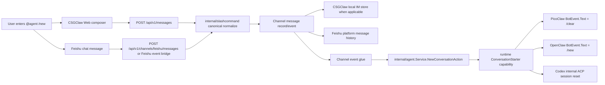
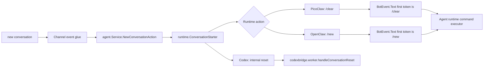
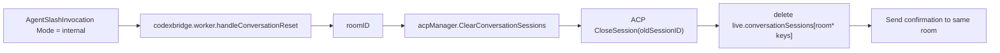
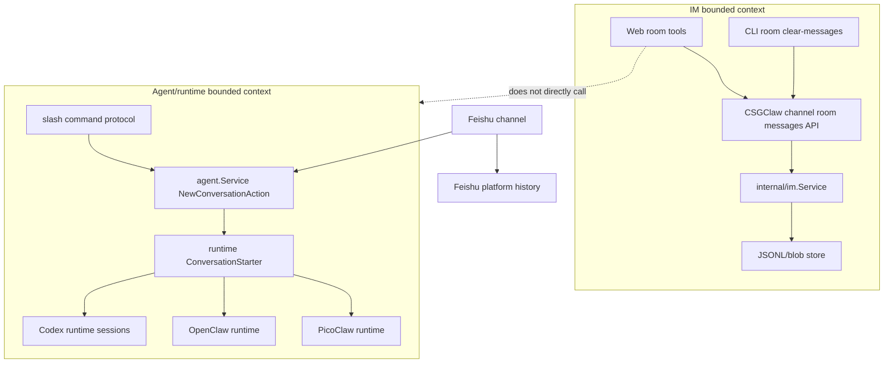

# CSGClaw IM Agent History Cleanup Plan

## Chapter 2: Slash Cleanup Design for Agents, and PicoClaw, OpenClaw, and Codex Integration

### 2.1 Slash Cleanup Boundary

An Agent's context history is private runtime/agent state. It is not part of the message persistence owned by `internal/im`. The current code already has several layers of state:

- IM room messages: managed by `internal/im.Service` and stored under `~/.csgclaw/im/sessions`.
- Codex conversation sessions: `internal/channel/codexbridge` creates a conversation key by room, then `internal/runtime/codex` creates an ACP session.
- PicoClaw/OpenClaw sandbox: CSGClaw starts an external runtime through the sandbox gateway and injects CSGClaw channel environment variables. Runtime history is owned by that runtime.

Slash cleanup must satisfy:

- The command enters the target Agent through an IM message, preserving auditable user intent.
- The cleanup scope is determined by the current room and target Agent, not by thread.
- CSGClaw does not delete internal sandbox files across module boundaries.
- Codex is an in-process CSGClaw runtime, so it can reset sessions precisely at the bridge/session-manager layer.
- `new` only resets the Agent conversation context (runtime session). It does not clear IM platform message storage, such as Feishu or customer-service chat history.

### 2.2 Unified Slash Command Protocol

Add a built-in slash command whose user-facing meaning is "reset the current conversation context":

```text
/new
/new conversation
```

This is the unified command exposed by CSGClaw. Internally, CSGClaw keeps a canonical form:

```xml
<slash-command name="new" arg="conversation"></slash-command>
```

With an optional note:

```xml
<slash-command name="new" arg="conversation"></slash-command> reset before rebuild
```

Command fields:

| Field | Meaning |
|---|---|
| `name` | Fixed to `new` |
| `arg` | Cleanup scope. The current implementation supports `conversation` |
| `body` | Optional reason or note. It is not used for permission checks |

Notes:

- `/new` resets Agent conversation context. It does not mean "delete Feishu/IM history".
- The only externally exposed command is `/new`.
- `/new` maps to runtime-native reset commands. PicoClaw uses `/clear`, and OpenClaw uses `/new`. Those native commands are not exposed directly to end users.

The current implementation supports only `conversation`, and it no longer distinguishes between root messages and threads. In other words, the scope is the whole current room:

- In the current room: clear the mentioned Agent's full conversation history in that room, including root-room messages and all threads under that room.
- In a group chat, when an Agent is hit by `@mention`: only that mentioned Agent is affected. If no Agent is mentioned, the cleanup action is not broadcast to multiple Agents.

Currently unsupported:

- `agent`: clear one Agent's history across multiple rooms.
- `all`: clear all Agent histories.

These scopes are more dangerous and should be designed later with permissions and confirmation.

Runtime adaptation:

| Runtime | CSGClaw canonical command | Runtime-native command/handling |
|---|---|---|
| PicoClaw sandbox | `new conversation` | Map to PicoClaw native command `/clear` (clears context for current `opts.SessionKey`) |
| OpenClaw sandbox | `new conversation` | Map to OpenClaw native command `/new` (resets current `session`) |
| Codex | `new conversation` | CSGClaw bridge clears the session for the corresponding `conversationKey` internally. An external Codex CLI harness may map this to `/clear` later |

CSGClaw does not expose runtime-native commands such as PicoClaw `/clear` or Codex CLI `/clear` as the unified user protocol. Native commands are used only inside runtime adapters. Users only see `/new`.

Command basis:

- PicoClaw already implements `/clear`, which resets the conversation context and summary for the current `opts.SessionKey`. It does not touch IM platform chat records.
- OpenClaw official slash command docs define `/new` for in-place session reset. The current implementation uses `/new`. Reference: https://docs.openclaw.ai/tools/slash-commands
- Codex CLI official slash command docs define `/clear`. The built-in CSGClaw Codex runtime does not send text to the CLI TUI, so it clears the internal ACP session directly. If an external Codex CLI harness is added later, the adapter can map to `/clear`. Reference: https://developers.openai.com/codex/cli/slash-commands

### 2.3 Frontend Slash Normalization Design

Current state:

- `internal/slashcommand` can parse `<slash-command ...>`.
- The Web composer currently normalizes `/xxx` shorthand into `use-skill`.
- `MessageContent` mainly renders `use-skill` as a slash command card/text.

Add a built-in command registry on the frontend:

```ts
type SlashCommandDefinition = {
  name: string;
  defaultArg?: string;
};

const builtinSlashCommands = [
  { name: "new", defaultArg: "conversation" },
];
```

Normalization rules:

1. User enters `/new`:
   - Output `<slash-command name="new" arg="conversation"></slash-command>`.
2. User enters `/skill-name ...`:
   - Continue outputting `<slash-command name="use-skill" arg="skill-name"></slash-command> ...`.
3. Invalid slash commands remain normal text or use the existing malformed-slash error path. Do not introduce new ambiguous behavior.

UI hints:

- The slash picker should distinguish built-in commands from skill candidates.
- `new` does not depend on the Agent workspace skill list. It can be shown even before skills are loaded.

### 2.4 Backend Slash Parser Design

Add constants in `internal/slashcommand/command.go`:

```go
const (
    UseSkillCommandName        = "use-skill"
    NewConversationCommandName = "new"
)
```

Add helpers:

```go
func IsNewConversationCommand(cmd Command) bool {
    return strings.EqualFold(strings.TrimSpace(cmd.Name), NewConversationCommandName)
}

func NormalizeNewConversationArg(arg string) (string, error) {
    switch strings.ToLower(strings.TrimSpace(arg)) {
    case "", "conversation":
        return "conversation", nil
    default:
        return "", fmt.Errorf("unsupported new scope %q", arg)
    }
}
```

`validate(cmd)` already permits different command names. `new` does not need to masquerade as `use-skill`.

### 2.5 Module Flow from IM Channel to Runtimes



Shared CSGClaw responsibilities:

- Preserve the original slash command intent.
- Pass the canonical slash command as user intent to the Agent dispatcher. Audit/history persistence depends on channel: CSGClaw local channel stores it in `internal/im`; Feishu channel uses Feishu platform chat history as the source of truth.
- Do not treat `new` as a normal skill in the IM layer.
- CSGClaw and Feishu channels only normalize user input into canonical slash form and send messages through their existing channel/event flows.
- Channel event glue recognizes canonical `/new` and calls `internal/agent.Service.NewConversationAction` to get the target runtime action.
- For Codex, the runtime outputs an internal conversation-reset invocation, which is executed inside the CSGClaw bridge.
- For PicoClaw/OpenClaw, the runtime outputs a BotEvent invocation, which is delivered through the existing BotEvent protocol.

Add the Agent service use-case data structures:

```go
type NewConversationRequest struct {
    Channel      string
    BotID        string
    RoomID       string
    ThreadRootID string
    Reason       string
}

type NewConversationAction struct {
    Mode         NewConversationActionMode
    BotEventText string
    AckText      string
}

type NewConversationActionMode string

const (
    NewConversationActionBotEvent NewConversationActionMode = "bot_event"
    NewConversationActionInternal NewConversationActionMode = "internal"
)
```

Add a use-case method to `internal/agent.Service`:

```go
func (s *Service) NewConversationAction(ctx context.Context, req NewConversationRequest) (NewConversationAction, error)
```

This method is responsible for:

- Looking up the Agent snapshot by `BotID`.
- Resolving the runtime implementation from the Agent's `RuntimeKind` through the existing `runtimeRegistry`.
- Building `agentruntime.Handle{RuntimeID, HandleID}`.
- Calling the runtime `ConversationStarter` capability.
- Returning an explicit unsupported error if the target runtime does not implement the capability.

To keep API/channel glue from branching on `RuntimeKind`, add an optional capability interface to `internal/runtime`:

```go
type ConversationStartRequest struct {
    Channel      string
    BotID        string
    RoomID       string
    ThreadRootID string
    Reason       string
}

type ConversationStartAction struct {
    Mode         ConversationStartActionMode
    BotEventText string
    AckText      string
}

type ConversationStartActionMode string

const (
    ConversationStartActionBotEvent ConversationStartActionMode = "bot_event"
    ConversationStartActionInternal ConversationStartActionMode = "internal"
)

type ConversationStarter interface {
    NewConversation(ctx context.Context, h Handle, req ConversationStartRequest) (ConversationStartAction, error)
}
```

Implementation contract:

- PicoClaw sandbox runtime implements `ConversationStarter` and returns `Mode=bot_event`, `BotEventText="/clear"`.
- OpenClaw sandbox runtime implements `ConversationStarter` and returns `Mode=bot_event`, `BotEventText="/new"`.
- Codex runtime implements `ConversationStarter` and returns `Mode=internal`; Codex bridge calls the runtime's internal ACP session reset. The built-in Codex runtime does not send `/clear` text to the model.
- `internal/agent.Service.NewConversationAction` only depends on the `runtime.ConversationStarter` capability. It does not maintain a `RuntimeKind -> command` branch table. If the target runtime does not support this capability, it returns a clear unsupported error.

Module boundaries:

- `internal/slashcommand`: parse, normalize, and validate CSGClaw canonical slash commands only.
- `internal/channel/csgclaw`, `internal/channel/feishu`: channel ingress/egress adaptation, mention/room parsing, and Feishu fallback rendering only. They do not maintain runtime command mappings.
- `internal/im`: store CSGClaw local-channel messages, rooms, and threads only. It does not know runtime-native commands. Feishu channel does not rely on `internal/im` as the authoritative history store.
- `internal/agent.Service`: find agent/runtime/handle by bot id and call the runtime `ConversationStarter` capability.
- `internal/api` channel event glue: before delivering CSGClaw BotBridge or Feishu event-stream events to a bot, recognize canonical `/new` and write the Agent service action back into the existing event path.
- PicoClaw/OpenClaw/Codex runtime: execute only their own native command or internal cleanup interface.

CSGClaw invokes Agent slash commands through the existing bot/event protocol, not through a new RPC:



To make runtime-native commands recognizable, the delivered `BotEvent.Text` must start with the native slash command as the first token. Do not put `<at ...>` before the command, and do not send canonical XML directly to PicoClaw/OpenClaw expecting them to recognize it.

#### 2.5.1 CSGClaw Local Channel Entry Point

Current CSGClaw local channel message flow:

```text
internal/api.handleCreateMessage
-> internal/channel/csgclaw.Service.SendMessage
-> internal/im.Service.CreateMessage
-> internal/api.Handler.PublishBotEvent
-> internal/im.BotBridge.PublishMessageEvent
-> /api/bots/{botID}/events
```

For `/new`:

1. `internal/channel/csgclaw.Service.SendMessage` continues to only canonical-normalize and write to `internal/im`.
2. `internal/im.BotBridge` continues to only queue events and deliver SSE. It does not query runtimes or maintain runtime-native command mappings.
3. Near `internal/api.Handler.PublishBotEvent`, detect whether `evt.Message.Content` is canonical `new conversation`.
4. If matched, call `agent.Service.NewConversationAction` for each bot that should actually be notified.
5. For PicoClaw/OpenClaw, replace `im.BotEvent.Text` with the runtime-native command `/clear` or `/new`. Keep the other room/thread/context fields produced by BotBridge.
6. For Codex, use internal reset. Do not deliver canonical XML or `/clear` text to a Codex prompt.

Note: `BotBridge` currently notifies by room membership, and `shouldNotifyBot` does not require mention. The `/new` implementation must tighten routing semantics: in a direct room with an Agent, mention is not required; in a group chat, `@agent` is required. If no Agent is mentioned, no cleanup is executed, and cleanup is not broadcast to all room Agents. API glue should filter targets using message mentions.

#### 2.5.2 Feishu Channel Entry Point

Current Feishu channel message flow:

```text
internal/api.handleFeishuMessages
-> internal/channel/feishu.Service.SendMessage
-> Feishu platform message
-> feishu.MessageBus
-> internal/api.handleFeishuEvents
-> /api/v1/channels/feishu/bots/{botID}/events
```

For `/new`:

1. `internal/channel/feishu.Service.SendMessage` continues to normalize user input into canonical slash form, send Feishu messages, resolve mention open IDs, and render Feishu fallback text.
2. Feishu platform history is authoritative for Feishu. CSGClaw does not use `internal/im` as Feishu history storage.
3. Before `internal/api.handleFeishuEvents` sends SSE to a specific bot, detect whether `evt.Message.Content` is canonical `new conversation`.
4. If matched, call `agent.Service.NewConversationAction` with the current subscribed `botID`.
5. For PicoClaw/OpenClaw, replace the SSE event message content/text with the runtime-native command `/clear` or `/new`.
6. Feishu event glue does not maintain runtime-kind mappings and does not delete Feishu platform messages.

The Feishu path is naturally filtered by bot subscription: `handleFeishuEvents` already checks whether the current bot open ID is mentioned. Therefore group-chat `/new` must mention `@agent`, and it only affects the mentioned Agent that receives the event. An unmentioned `/new` remains a normal Feishu message and does not trigger Agent internal-history cleanup.

### 2.6 PicoClaw Integration Plan

Key environment variables injected by CSGClaw into PicoClaw sandbox include:

```text
CSGCLAW_BASE_URL
CSGCLAW_ACCESS_TOKEN
PICOCLAW_CHANNELS_CSGCLAW_BASE_URL
PICOCLAW_CHANNELS_CSGCLAW_ACCESS_TOKEN
PICOCLAW_CHANNELS_CSGCLAW_BOT_ID
```

PicoClaw already has an internal cleanup command:

- Command name: `/clear`
- Code location: PicoClaw `pkg/commands/cmd_clear.go`
- Execution flow: `commands.Executor` handles commands before entering the LLM.
- Cleanup action: resets the conversation state on `opts.SessionKey`, eventually calling `agent.Sessions.SetHistory(opts.SessionKey, [])` and `agent.Sessions.SetSummary(opts.SessionKey, "")`.
- Scope: current `opts.SessionKey`, which corresponds to the current room session. Cleanup is not split by thread.

PicoClaw integration:

1. CSGClaw Web/API normalizes `/new` into canonical slash.
2. The CSGClaw runtime slash adapter recognizes that the target bot is PicoClaw sandbox.
3. The adapter maps the canonical command to the PicoClaw native command:

```text
/clear
```

4. `internal/im.BotBridge` or a dedicated Agent slash dispatcher delivers a BotEvent to the target PicoClaw bot.
5. PicoClaw subscribes through the CSGClaw bot compatibility protocol and receives the message event.
6. PicoClaw command executor recognizes `/clear` before entering the LLM.
7. PicoClaw computes its own session key from event context:
   - `roomID`
8. PicoClaw clears this bot's internal conversation history for the current conversation.
9. PicoClaw replies through the CSGClaw bot compatibility protocol.

CSGClaw and PicoClaw communicate through HTTP/SSE:

```http
GET /api/bots/{botID}/events
```

- PicoClaw connects to CSGClaw using `CSGCLAW_BASE_URL` or `PICOCLAW_CHANNELS_CSGCLAW_BASE_URL`.
- Requests include `Authorization: Bearer <token>`.
- CSGClaw returns `text/event-stream`; event name is `message`.
- Event data is `im.BotEvent`, containing `channel=csgclaw`, `room_id`, `chat_id`, `thread_root_id`, `text`, `context`, and `thread_context`. Thread fields are pass-through context and do not affect cleanup scope.

PicoClaw replies through:

```http
POST /api/bots/{botID}/messages/send
```

Request body:

```json
{
  "room_id": "room-123",
  "text": "Cleared my internal history for this conversation. The IM room messages were not cleared.",
  "thread_root_id": "msg-root"
}
```

Important BotEvent fields delivered by CSGClaw to PicoClaw:

```text
text = "/clear"
channel = "csgclaw"
room_id = current room
chat_id = current room
thread_root_id = current thread root, optional pass-through and not part of cleanup scope
context.channel = "csgclaw"
context.account = bot_id
context.chat_id = current room
context.topic_id = current thread root, optional pass-through and not part of cleanup scope
```

Therefore PicoClaw does not need a new standalone cleanup command. CSGClaw maps user-facing `/new` to PicoClaw native `/clear` and keeps BotEvent context pointing at the current room.

### 2.7 OpenClaw Integration Plan

Key environment variables injected into OpenClaw sandbox include:

```text
CSGCLAW_BASE_URL
CSGCLAW_ACCESS_TOKEN
CSGCLAW_BOT_ID
```

OpenClaw integration:

1. CSGClaw parses the user-facing canonical slash command.
2. The runtime slash adapter recognizes that the target bot is OpenClaw sandbox.
3. The adapter maps the canonical command to the OpenClaw native command:

```text
/new
```

4. `internal/im.BotBridge` or a dedicated Agent slash dispatcher delivers a BotEvent to the target OpenClaw bot.
5. OpenClaw receives the message event through the CSGClaw bot compatibility HTTP/SSE protocol.
6. The OpenClaw gateway/channel adapter forwards the event to the OpenClaw runtime.
7. The OpenClaw command executor recognizes `/new` before entering the model and resets the current session in place.
8. OpenClaw replies through `POST /api/bots/{botID}/messages/send`.

Important BotEvent fields delivered by CSGClaw to OpenClaw:

```text
text = "/new"
channel = "csgclaw"
room_id = current room
chat_id = current room
thread_root_id = current thread root, optional pass-through and not part of cleanup scope
context.channel = "csgclaw"
context.account = bot_id
context.chat_id = current room
context.topic_id = current thread root, optional pass-through and not part of cleanup scope
```

OpenClaw official docs require slash commands to be standalone messages that start with `/`. When CSGClaw delivers a runtime-native command, it delivers only the command itself. It does not append explanatory text and does not place a mention before the command. The IM record keeps the user's original `/new` message and OpenClaw's confirmation reply. OpenClaw owns its internal session reset.

Cleanup is not implemented by prompting the model to "understand and clear history", and CSGClaw does not delete OpenClaw internal history files.

### 2.8 Codex Integration Plan

Codex runtime is built into CSGClaw. Current flow:

- `internal/channel/codexbridge.worker.sessionID()` computes a conversation key from the bot event.
- `conversationKey(evt)` rule:
  - Do not split root messages and threads. Use `roomID` as the conversation context key. Thread sessions also belong to the same room.
- `internal/runtime/codex.acpManager.EnsureSession()` creates an ACP session for each conversation key and stores it in `live.conversationSessions`.

Codex CLI already has `/clear`:

- `/clear`: clears the visible terminal conversation and starts a new chat.

The built-in CSGClaw Codex runtime does not send text to a Codex CLI TUI, so it does not map `/new` to `BotEvent.Text = "/clear"`. It resets internally: the runtime slash adapter returns `Mode = "internal"`, then Codex bridge clears all ACP sessions for the current room, without splitting by thread.



New interface:

```go
type ConversationHistoryClearer interface {
    ResetConversationHistory(ctx context.Context, handle runtimecodex.SessionHandle, roomID string) error
}
```

`acpManager` implementation, without version probing:

```go
func (m *acpManager) ResetConversationHistory(ctx context.Context, handle SessionHandle, roomID string) error
```

The cleanup target is "all ACP sessions for the current room". The implementation uses a room-prefix sweep and no longer splits by thread:

1. Find the live runtime session state by runtime id.
2. Trim `roomID`; reject empty values.
3. Lock `live.mu`.
4. Iterate `live.conversationSessions` and find entries whose keys match `roomID` or start with `roomID:`.
5. If entries are found:
   - Call `live.conn.CloseSession(ctx, acp.CloseSessionRequest{SessionId: oldID})`, where `oldID` is the mapped session id.
   - Delete `live.conversationSessions[key]`.
   - Optionally clear pending permission handles if a runtime permission broker is bound.
   - Cancel pending permission requests for that session through the permission broker.
6. If no matching session exists:
   - Treat this as idempotent success. The next message will create a new session.
7. Return success.

The ACP cleanup request is a standard control call, not text:

```go
err := conn.CloseSession(ctx, acp.CloseSessionRequest{
    SessionId: oldSessionID,
})
```

This does not send `/clear` or any similar text to the Codex model. `/clear` is only for a future external Codex CLI harness. The current built-in runtime always uses the internal branch.

After the Agent dispatcher receives `AgentSlashInvocation{Mode: "internal"}`, it calls `codexbridge.worker.handleConversationReset(ctx, evt)`. `codexbridge.worker.handleEvent()` keeps a fallback guard so canonical `new` is not treated as a normal prompt:

```go
cmd, ok, err := slashcommand.Parse(evt.Text)
if err == nil && ok && slashcommand.IsNewConversationCommand(cmd) {
    return w.handleConversationReset(ctx, evt)
}
```

`handleConversationReset`:

1. `scope=conversation` means "the whole current room".
2. Read `roomID` from the event and call `ConversationHistoryClearer`.
3. Clear local context cache for that room, without splitting by thread.
4. Send a confirmation message to the same room.
5. Do not call `Prompt()`, so the cleanup command itself does not enter the new context.
6. The next user message recomputes the conversation key and creates a fresh ACP session through `EnsureSession()`.

Confirmation text:

```text
Cleared my internal history for this conversation. The IM room messages were not cleared.
```

Chinese confirmation:

```text
已清理我在当前会话中的内部历史。IM 房间聊天记录未被清空。
```

#### 2.8.1 Codex Session Cleanup Implementation Points

To avoid a no-op that only clears the current prompt, implement in this order:

1. In `internal/channel/codexbridge` worker, recognize the `new` command and branch early.
   - Parse with `slashcommand.Parse(evt.Text)` in `handleEvent`, then check `slashcommand.IsNewConversationCommand`.
   - If matched, call `handleConversationReset` and do not enter `Prompt`.
2. Add `new` recognition and scope validation in `internal/slashcommand`.
   - Support only empty arg or `conversation`, normalized as `conversation`, meaning the whole current room.
3. Add Codex session cleanup capability and wire it into the bridge.
   - Add `ConversationHistoryClearer.ResetConversationHistory(ctx, handle, roomID)`.
   - `acpManager` sweeps `live.conversationSessions` by room prefix to clear all sessions for that room.
   - If a session exists: `CloseSession({SessionId: oldSessionID})` and `delete map[key]`.
   - If no session exists: idempotent success; wait for the next message to create a new session.
4. Reset local context cache in `codexbridge` cleanup handling.
   - Clear context cache for the whole room, without splitting by thread.
5. Fix confirmation behavior.
   - Send one confirmation message to the room. Do not require a second confirmation from the user.

ACP cleanup does not depend on `/new` text:

- The command does not create a new session and is not injected into the model.
- The next user message recomputes the conversation key and creates a fresh ACP session through `EnsureSession()`.

### 2.9 Permissions and Mistake Prevention

Current trigger-scope constraints:

- Cleanup runs through existing IM distribution and message routing.
- The cleanup command only affects Agents that receive that command. It does not affect other Agents in the same room.

Audit strategy:

- IM keeps the user's slash cleanup command and the Agent confirmation message.
- Cleared internal history content is not saved.
- Logs should record only bot id, room id, scope, and result. They must not record message content or history content.

### 2.10 End-to-End Scenarios

UI clears IM:

```text
User clicks room tools -> clear chat history -> room messages/threads are cleared -> Agent internal history stays unchanged
```

Agent slash cleanup:

```text
User sends @dev /new -> dev agent clears its own current conversation -> IM message remains visible
```

Combined use:

```text
1. User sends @dev /new
2. dev replies cleanup succeeded
3. User clears room chat history through UI
4. IM room becomes empty, and dev internal context has also been cleared
```

### 2.11 Current Implementation and Additions

- Add CSGClaw channel-scoped room messages cleanup API.
- Add "clear chat history" to Web room tools.
- Web frontend calls `/api/v1/channels/csgclaw/rooms/{id}/messages`, not the non-channel URL.
- Add CLI: `csgclaw-cli room clear-messages <room-id> --channel csgclaw`.
- Add `room.messages_cleared` SSE to synchronize multi-window state.
- Add canonical `new` slash support.
- Add optional `ConversationStarter` capability in `internal/runtime`.
- Add `NewConversationAction` use-case method in `internal/agent.Service`, centralizing bot -> agent/runtime/handle lookup and capability invocation.
- CSGClaw local channel and Feishu channel each recognize canonical `/new` in their existing event glue and call the same Agent service use-case. Do not add an `internal/channel/agentslash` package.
- Codex bridge implements `conversation` scope reset.
- Runtime slash adapter supports PicoClaw: `new conversation` maps to PicoClaw native `/clear`.
- Runtime slash adapter supports OpenClaw: `new conversation` maps to OpenClaw native `/new`.
- Larger scopes and failure policies can be added later. The current scope remains `conversation` only.

## Architecture Boundary Summary



Final principles:

- IM cleanup is a room-domain capability and belongs to `internal/im`.
- Agent history cleanup is a runtime-domain capability and belongs to each runtime.
- Slash command is the user-intent protocol between the two domains.
- UI does not delete runtime state across layers, and runtime does not modify IM room messages in reverse.
