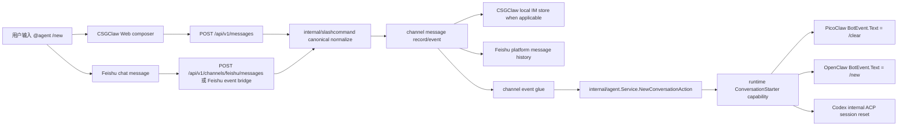
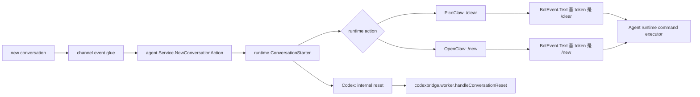
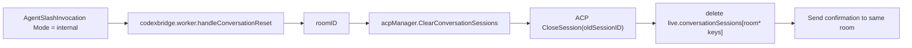
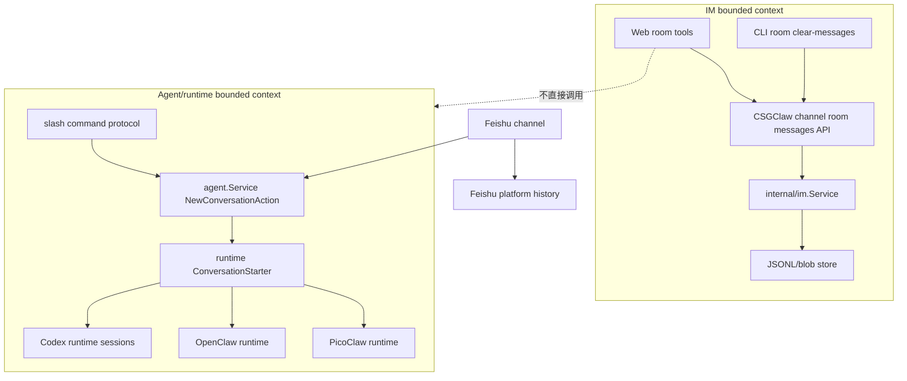

# CSGClaw IM Agent 历史清理方案

## 第二章节：各 Agent 的 slash 清理设计，以及 PicoClaw、OpenClaw、Codex 对接方案

### 2.1 Slash 清理的边界

Agent 的上下文历史是 runtime/agent 的私有状态，不属于 `internal/im` 的消息持久化。当前代码已经能看到多层状态：

- IM room 消息：`internal/im.Service` 管理，存放在 `~/.csgclaw/im/sessions`。
- Codex conversation session：`internal/channel/codexbridge` 按 room 生成 conversation key，再由 `internal/runtime/codex` 创建 ACP session。
- PicoClaw/OpenClaw sandbox：CSGClaw 通过 sandbox gateway 启动外部 runtime，并注入 CSGClaw channel 环境变量，runtime 内部历史由其自身维护。

slash 清理满足：

- 命令通过 IM 消息进入目标 Agent，保留可审计的用户意图。
- 清理范围由当前 room 和目标 Agent 决定，不按 thread 拆分。
- CSGClaw 不跨模块删除 sandbox 内部文件。
- Codex 是 CSGClaw 内置 runtime，可在 bridge/session manager 层实现精确 session reset。
- `new` 只会重置 Agent 会话上下文（runtime session），不会清理 IM 平台端的消息存储（例如 飞书/客服后台的历史聊天）。

### 2.2 统一 slash 命令协议

新增内置 slash 命令（用户语义为“当前会话上下文重置”）：

```text
/new
/new conversation
```

这是 CSGClaw 对用户暴露的统一命令。CSGClaw 内部保留 canonical form：

```xml
<slash-command name="new" arg="conversation"></slash-command>
```

带说明文本时：

```xml
<slash-command name="new" arg="conversation"></slash-command> reset before rebuild
```

命令字段：

| 字段 | 含义 |
|---|---|
| `name` | 固定为 `new` |
| `arg` | 清理范围，当前实现支持 `conversation` |
| `body` | 可选原因或备注，不参与权限判断 |

注意：

- `/new` 的目标是重置 Agent 会话上下文，并不对应“删除飞书/IM 历史消息”。
- 对外统一仅支持 `/new`。
- `/new` 与 runtime 内部重置命令（PicoClaw 为 `/clear`，OpenClaw 为 `/new`）是映射关系，不直接暴露给最终用户。

当前实现统一支持 `conversation`，并且不再区分主线/线程（即“当前 room 全量”）：

- 在当前 room 中：清理被提及 Agent 在该 room 的全部会话历史（包含 room 根消息和该 room 下所有 thread）。
- 在群聊里通过 @mention 命中某 Agent 时：只对该被提及 Agent 生效；未命中时不在多个 Agent 之间广播清理动作。

当前不支持：

- `agent`：清理某 Agent 在多个 room 的全部历史。
- `all`：清理所有 Agent 历史。

这些范围更危险，后续配合权限和确认机制单独设计。

runtime 适配关系：

| runtime | CSGClaw canonical command | runtime 原生命令/处理方式 |
|---|---|---|
| PicoClaw sandbox | `new conversation` | 映射为 PicoClaw 原生命令 `/clear`（清空当前 `opts.SessionKey` 的 context） |
| OpenClaw sandbox | `new conversation` | 映射为 OpenClaw 原生命令 `/new`（重置当前 `session`） |
| Codex | `new conversation` | CSGClaw 内部 bridge 直接清 `conversationKey` 对应 session；外部 Codex CLI harness 可配置成 `/clear` |

CSGClaw 不把 PicoClaw 的 `/clear`、Codex CLI harness 的 `/clear` 这类 runtime 原生命令作为用户侧统一协议。各 runtime 的原生命令只在 runtime adapter 内部使用，用户侧统一只看到 `/new`。

命令依据：

- PicoClaw 本地代码已经实现 `/clear`，会重置当前 `opts.SessionKey` 的会话上下文和摘要（不涉及 IM 平台聊天记录）。
- OpenClaw 官方 slash command 文档定义 `/new`，用于原地 reset 当前 session；当前实现使用 `/new`。参考：https://docs.openclaw.ai/tools/slash-commands
- Codex CLI 官方 slash command 文档定义 `/clear`；CSGClaw 内置 Codex runtime 不走 CLI 文本命令，直接清内部 ACP session。后续如果接外部 Codex CLI harness，再在 adapter 里配置 `/clear`。参考：https://developers.openai.com/codex/cli/slash-commands

### 2.3 前端 slash 归一化设计

现状：

- `internal/slashcommand` 支持解析 `<slash-command ...>`。
- Web composer 当前把 `/xxx` 简写归一化成 `use-skill`。
- MessageContent 当前主要把 `use-skill` 渲染成 slash command card。

前端增加内置命令 registry：

```ts
type SlashCommandDefinition = {
  name: string;
  defaultArg?: string;
};

const builtinSlashCommands = [
  { name: "new", defaultArg: "conversation" },
];
```

归一化规则：

1. 用户输入 `/new`：
   - 输出 `<slash-command name="new" arg="conversation"></slash-command>`。
2. 用户输入 `/skill-name ...`：
   - 继续输出 `<slash-command name="use-skill" arg="skill-name"></slash-command> ...`。
3. 非法 slash 保持普通文本或报现有 malformed slash 错误，不新增模糊行为。

UI 提示：

- slash picker 中区分展示 built-in commands 和 skill candidates。
- `new` 不依赖 agent workspace skills 列表，即使 skills 还没加载也可提示。

### 2.4 后端 slash parser 设计

`internal/slashcommand/command.go` 新增常量：

```go
const (
    UseSkillCommandName     = "use-skill"
    NewConversationCommandName = "new"
)
```

新增 helper：

```go
func IsNewConversationCommand(cmd Command) bool {
    return strings.EqualFold(strings.TrimSpace(cmd.Name), NewConversationCommandName)
}

func NormalizeNewConversationArg(arg string) (string, error) {
    switch strings.ToLower(strings.TrimSpace(arg)) {
    case "", "conversation":
        return "conversation", nil
    default:
        return "", fmt.Errorf("unsupported new scope %q", arg)
    }
}
```

`validate(cmd)` 已经允许不同 command name，不需要让 `new` 伪装成 `use-skill`。

### 2.5 IM channel 到各 runtime 的模块链路



CSGClaw 共同责任：

- 保留 slash command 原始语义。
- 把 canonical slash 作为用户意图传递给 agent dispatcher；审计/历史保留取决于 channel：CSGClaw 本地 channel 落在 `internal/im`，Feishu channel 的聊天历史以飞书平台记录为准。
- 不在 IM 层把 `new` 当作普通 skill。
- CSGClaw channel 与 Feishu channel 都只负责把用户输入归一化为 canonical slash，并把消息送入各自现有的 channel/event 链路。
- 在 channel event glue 中识别 canonical `/new`，调用 `internal/agent.Service.NewConversationAction` 获取目标 runtime action。
- 对 Codex runtime 输出内部 conversation reset invocation，在 CSGClaw bridge 内部直接执行会话重置。
- 对 PicoClaw/OpenClaw runtime 输出 BotEvent invocation，再走现有 BotEvent 协议投递。

新增 agent service use-case 数据结构：

```go
type NewConversationRequest struct {
    Channel     string
    BotID       string
    RoomID      string
    ThreadRootID string
    Reason      string
}

type NewConversationAction struct {
    Mode         NewConversationActionMode
    BotEventText string
    AckText      string
}

type NewConversationActionMode string

const (
    NewConversationActionBotEvent NewConversationActionMode = "bot_event"
    NewConversationActionInternal NewConversationActionMode = "internal"
)
```

`internal/agent.Service` 增加 use-case 方法：

```go
func (s *Service) NewConversationAction(ctx context.Context, req NewConversationRequest) (NewConversationAction, error)
```

该方法负责：

- 根据 `BotID` 查 agent snapshot。
- 根据 agent 的 `RuntimeKind` 从现有 `runtimeRegistry` 找 runtime 实现。
- 组装 `agentruntime.Handle{RuntimeID, HandleID}`。
- 调用 runtime 的 `ConversationStarter` capability。
- 若目标 runtime 未实现该 capability，返回明确 unsupported error。

为避免 API/channel glue 显式判断 `RuntimeKind`，在 `internal/runtime` 增加可选能力接口：

```go
type ConversationStartRequest struct {
    Channel      string
    BotID        string
    RoomID       string
    ThreadRootID string
    Reason       string
}

type ConversationStartAction struct {
    Mode         ConversationStartActionMode
    BotEventText string
    AckText      string
}

type ConversationStartActionMode string

const (
    ConversationStartActionBotEvent ConversationStartActionMode = "bot_event"
    ConversationStartActionInternal ConversationStartActionMode = "internal"
)

type ConversationStarter interface {
    NewConversation(ctx context.Context, h Handle, req ConversationStartRequest) (ConversationStartAction, error)
}
```

实现约定：

- PicoClaw sandbox runtime 实现 `ConversationStarter`，返回 `Mode=bot_event`、`BotEventText="/clear"`。
- OpenClaw sandbox runtime 实现 `ConversationStarter`，返回 `Mode=bot_event`、`BotEventText="/new"`。
- Codex runtime 实现 `ConversationStarter`，返回 `Mode=internal`，由 Codex bridge 调用 runtime 内部 ACP session reset。当前内置 Codex 不向模型发送 `/clear` 文本。
- `internal/agent.Service.NewConversationAction` 只面向 `runtime.ConversationStarter` 能力，不维护 `RuntimeKind -> 命令` 分支表。若目标 runtime 未实现该能力，则返回明确的 unsupported error。

模块边界：

- `internal/slashcommand`：只负责 CSGClaw canonical slash 的 parse/normalize/validate。
- `internal/channel/csgclaw`、`internal/channel/feishu`：只负责 channel 入站/出站适配、mention/room 解析、Feishu fallback 展示，不维护 runtime 命令映射。
- `internal/im`：只保存 CSGClaw 本地 channel 的消息、room、thread，不感知 runtime 原生命令；Feishu channel 不依赖 `internal/im` 作为权威历史存储。
- `internal/agent.Service`：负责根据 bot id 找 agent/runtime/handle，并调用 runtime `ConversationStarter` capability。
- `internal/api` 的 channel event glue：在 CSGClaw BotBridge、Feishu event stream 投递给 bot 前识别 canonical `/new`，并把 agent service 返回的 action 写回现有事件路径。
- PicoClaw/OpenClaw/Codex runtime：只执行自己的原生命令或内部清理接口。

CSGClaw 调用 Agent slash 的方式不是新增 RPC，而是复用现有 bot/event 协议：



为了让原生命令被 runtime 识别，投递给 Agent 的 `BotEvent.Text` 必须以原生 slash 命令作为第一个 token。不能把 `<at ...>` mention 放在命令前面，也不能把 canonical XML 直接投给 PicoClaw/OpenClaw 期待它识别原生命令。

#### 2.5.1 CSGClaw 本地 channel 落点

当前 CSGClaw 本地 channel 的消息链路是：

```text
internal/api.handleCreateMessage
-> internal/channel/csgclaw.Service.SendMessage
-> internal/im.Service.CreateMessage
-> internal/api.Handler.PublishBotEvent
-> internal/im.BotBridge.PublishMessageEvent
-> /api/bots/{botID}/events
```

实现 `/new` 时：

1. `internal/channel/csgclaw.Service.SendMessage` 继续只做 canonical normalize 与 `internal/im` 写入。
2. `internal/im.BotBridge` 继续只负责事件排队与 SSE 投递，不查询 runtime，也不维护 runtime 原生命令映射。
3. 在 `internal/api.Handler.PublishBotEvent` 附近识别 `evt.Message.Content` 是否为 canonical `new conversation`。
4. 命中后，对每个实际要通知的 bot 调用 `agent.Service.NewConversationAction`。
5. 对 PicoClaw/OpenClaw，把投递给 bot 的 `im.BotEvent.Text` 替换成 runtime 原生命令 `/clear` 或 `/new`，其余 room/thread/context 字段仍复用 `BotBridge` 构造逻辑。
6. 对 Codex，走 internal reset，不把 canonical XML 或 `/clear` 文本投给 Codex prompt。

注意：`BotBridge` 当前按 room member 通知 bot，且 `shouldNotifyBot` 不要求 mention。`/new` 的实现必须收紧路由语义：在直接对某个 agent 的 room 中可以不带 mention 生效；在群聊中必须 `@agent`，未 mention 不执行清理，且只对被 mention 的目标 agent 生效。API glue 层需要用 message mentions 过滤目标 bot，避免广播给所有 room member。

#### 2.5.2 Feishu channel 落点

当前 Feishu channel 的消息链路是：

```text
internal/api.handleFeishuMessages
-> internal/channel/feishu.Service.SendMessage
-> Feishu platform message
-> feishu.MessageBus
-> internal/api.handleFeishuEvents
-> /api/v1/channels/feishu/bots/{botID}/events
```

实现 `/new` 时：

1. `internal/channel/feishu.Service.SendMessage` 继续把用户输入归一化为 canonical slash，并负责飞书消息发送、mention open_id 解析和 Feishu fallback 展示。
2. Feishu 的权威聊天历史在飞书平台，CSGClaw 不把 `internal/im` 作为 Feishu 历史存储。
3. 在 `internal/api.handleFeishuEvents` 发送 SSE 给某个 bot 前，识别 `evt.Message.Content` 是否为 canonical `new conversation`。
4. 命中后，使用当前订阅的 `botID` 调用 `agent.Service.NewConversationAction`。
5. 对 PicoClaw/OpenClaw，把 SSE event 的 message content/text 替换成 runtime 原生命令 `/clear` 或 `/new`。
6. Feishu event glue 不维护 runtime kind 映射，也不删除飞书平台消息。

Feishu 路径天然是按 bot 订阅过滤的：`handleFeishuEvents` 已根据当前 bot 的 open_id 判断是否命中 mention。因此群聊 `/new` 必须 `@agent`，且只影响被提及并收到事件的目标 agent。未 mention 的 `/new` 只保留为普通飞书消息，不触发 agent 内部历史清理。

### 2.6 PicoClaw 对接方案

当前 CSGClaw 对 PicoClaw sandbox 注入的关键环境变量包括：

```text
CSGCLAW_BASE_URL
CSGCLAW_ACCESS_TOKEN
PICOCLAW_CHANNELS_CSGCLAW_BASE_URL
PICOCLAW_CHANNELS_CSGCLAW_ACCESS_TOKEN
PICOCLAW_CHANNELS_CSGCLAW_BOT_ID
```

PicoClaw 已有内部清理命令：

- 命令名：`/clear`
- 代码位置：PicoClaw `pkg/commands/cmd_clear.go`
- 执行链路：`commands.Executor` 在进入 LLM 前处理命令。
- 清理动作：重置 runtime 上 `opts.SessionKey` 的会话状态，最终执行 `agent.Sessions.SetHistory(opts.SessionKey, [])` 和 `agent.Sessions.SetSummary(opts.SessionKey, "")`。
- 作用范围：当前 `opts.SessionKey`，也就是当前 room 对应会话；清理时不按 thread 细分。

PicoClaw 对接方式：

1. CSGClaw Web/API 将 `/new` 归一化成 canonical slash。
2. CSGClaw runtime slash adapter 识别目标 bot 是 PicoClaw sandbox。
3. adapter 将 canonical command 映射成 PicoClaw 原生命令：

```text
/clear
```

4. `internal/im.BotBridge` 或专门的 agent slash dispatcher 向目标 PicoClaw bot 投递 BotEvent。
5. PicoClaw 通过 CSGClaw bot compatibility 协议订阅并收到 message event。
6. PicoClaw command executor 在进入 LLM 前识别 `/clear`。
7. PicoClaw 根据 event context 计算自身 session key：
   - `roomID`
8. PicoClaw 清理该 bot 当前 conversation 的内部历史。
9. PicoClaw 通过 CSGClaw bot compatibility 协议回一条确认消息。

CSGClaw 和 PicoClaw 的协议是 HTTP/SSE：

```http
GET /api/bots/{botID}/events
```

- PicoClaw 使用 `CSGCLAW_BASE_URL` 或 `PICOCLAW_CHANNELS_CSGCLAW_BASE_URL` 连接 CSGClaw。
- 请求带 `Authorization: Bearer <token>`。
- CSGClaw 返回 `text/event-stream`，事件名是 `message`。
- 事件 data 是 `im.BotEvent`，包含 `channel=csgclaw`、`room_id`、`chat_id`、`thread_root_id`、`text`、`context`、`thread_context`，其中线程相关字段仅用于透传，不参与清理范围判断。

PicoClaw 回消息使用：

```http
POST /api/bots/{botID}/messages/send
```

请求体：

```json
{
  "room_id": "room-123",
  "text": "已清理我在当前会话中的内部历史。IM 房间聊天记录未被清空。",
  "thread_root_id": "msg-root"
}
```

CSGClaw 投递给 PicoClaw 的 BotEvent 关键字段：

```text
text = "/clear"
channel = "csgclaw"
room_id = 当前 room
chat_id = 当前 room
thread_root_id = 当前 thread root，可为空（保留透传，不影响清理范围）
context.channel = "csgclaw"
context.account = bot_id
context.chat_id = 当前 room
context.topic_id = 当前 thread root，可为空（保留透传，不影响清理范围）
```

因此 PicoClaw 不需要新增独立清理命令才能完成当前能力。CSGClaw 要做的是把用户侧 `/new` 映射为 PicoClaw 原生 `/clear`，并确保 BotEvent 的上下文仍指向当前 room。

### 2.7 OpenClaw 对接方案

OpenClaw sandbox 注入的关键环境变量包括：

```text
CSGCLAW_BASE_URL
CSGCLAW_ACCESS_TOKEN
CSGCLAW_BOT_ID
```

OpenClaw 对接方式：

1. CSGClaw 解析用户侧 canonical slash。
2. runtime slash adapter 识别目标 bot 是 OpenClaw sandbox。
3. adapter 将 canonical command 映射成 OpenClaw 原生命令：

```text
/new
```

4. `internal/im.BotBridge` 或专门的 agent slash dispatcher 向目标 OpenClaw bot 投递 BotEvent。
5. OpenClaw 通过 CSGClaw bot compatibility HTTP/SSE 协议接收 message event。
6. OpenClaw gateway/channel adapter 将 event 交给 OpenClaw runtime。
7. OpenClaw command executor 在进入模型前识别 `/new`，原地 reset 当前 session。
8. OpenClaw 通过 `POST /api/bots/{botID}/messages/send` 回确认。

CSGClaw 投递给 OpenClaw 的 BotEvent 关键字段：

```text
text = "/new"
channel = "csgclaw"
room_id = 当前 room
chat_id = 当前 room
thread_root_id = 当前 thread root，可为空（保留透传，不影响清理范围）
context.channel = "csgclaw"
context.account = bot_id
context.chat_id = 当前 room
context.topic_id = 当前 thread root，可为空（保留透传，不影响清理范围）
```

OpenClaw 官方文档要求 slash command 是以 `/` 开头的 standalone message。CSGClaw 投递原生命令时只投递命令本身，不附加解释文本，不把 mention 放在命令前。IM 中保留用户原始的 `/new` 消息和 OpenClaw 回的确认消息，OpenClaw 内部 session 由 OpenClaw 自己 reset。

清理逻辑不通过 prompt 让模型“理解并手动清理”，也不由 CSGClaw 删除 OpenClaw 内部历史文件。

### 2.8 Codex 对接方案

Codex runtime 是 CSGClaw 内置 runtime，当前链路：

- `internal/channel/codexbridge.worker.sessionID()` 根据 bot event 计算 conversation key。
- `conversationKey(evt)` 规则：
  - 不区分主线/线程，按 `roomID` 为单位挂载会话上下文，`thread` 会话也归属同 room。
- `internal/runtime/codex.acpManager.EnsureSession()` 为每个 conversation key 创建 ACP session，并存到 `live.conversationSessions`。

Codex CLI 官方命令里已经有 `/clear`：

- `/clear`：清空终端可见对话并开始新的 chat。

CSGClaw 内置 Codex runtime 不是直接把文本投给 Codex CLI TUI，因此不把 `/new` 映射成 `BotEvent.Text = "/clear"`。在 CSGClaw 内部实现 reset，由 runtime slash adapter 输出 `Mode = "internal"`，再交给 Codex bridge 清理当前 room 的全部 ACP 会话（不区分 thread）。



新增接口：

```
type ConversationHistoryClearer interface {
    ResetConversationHistory(ctx context.Context, handle runtimecodex.SessionHandle, roomID string) error
}
```

`acpManager` 实现（不做版本探测）：

```go
func (m *acpManager) ResetConversationHistory(ctx context.Context, handle SessionHandle, roomID string) error
```

清理的目标是“当前 room 的全部 ACP 会话”，通过 room 前缀 sweep 清理，不再按 thread 细分。内部处理步骤如下：

1. 通过 runtime id 找到 runtime 运行时实例的 live session 状态。
2. trim `roomID`，为空则拒绝。
3. 加 `live.mu`。
4. 遍历 `live.conversationSessions`，找出以 `roomID` 为前缀的会话条目（含 `roomID` 与 `roomID:` 两类 key）。
5. 如果命中：
   - 调用 `live.conn.CloseSession(ctx, acp.CloseSessionRequest{SessionId: oldID})`，`oldID` 取自命中的映射值。
   - 删除对应的 `live.conversationSessions[key]`。
   - 可选：清理权限代理里的 pending session 句柄（如果 runtime 已绑定权限 broker）。
   - 调用 permission broker 取消该 session 的 pending 权限请求。
6. 如果不存在命中的会话：
   - 视为幂等成功，下一条消息仍会创建新 session。
7. 返回成功。

发送到 ACP 的清理请求本体是标准控制调用，而不是一段文本：

```go
err := conn.CloseSession(ctx, acp.CloseSessionRequest{
    SessionId: oldSessionID,
})
```

并不会向 Codex 模型发送 `/clear` 这类文本。`/clear` 只用于外部 Codex CLI harness 情况，当前内置 runtime 一律走内部分支。

agent dispatcher 收到 `AgentSlashInvocation{Mode: "internal"}` 后调用 `codexbridge.worker.handleConversationReset(ctx, evt)`。`codexbridge.worker.handleEvent()` 保留兜底拦截，避免 canonical new 被当成普通 prompt：

```go
cmd, ok, err := slashcommand.Parse(evt.Text)
if err == nil && ok && slashcommand.IsNewConversationCommand(cmd) {
    return w.handleConversationReset(ctx, evt)
}
```

`handleConversationReset`：

1. `scope=conversation` 表示“当前 room 全量”。
2. 从事件中取 `roomID`，调用 `ConversationHistoryClearer`。
3. 清理该 room 的上下文缓存（不按 thread 细分）。
4. 发送确认消息到同一 room。
5. 不调用 `Prompt()`，避免清理命令本身进入新上下文。
6. 下一条用户消息进来时会按 room 重新建会话，等价于会话重置后的首条交互。

确认消息可用：

确认消息：

```text
已清理我在当前会话中的内部历史。IM 房间聊天记录未被清空。
```

英文环境：

```text
Cleared my internal history for this conversation. The IM room messages were not cleared.
```

#### 2.8.1 Codex session 清理落地点（待实现项）

为避免“清理只删掉当前 prompt”的空操作，必须按以下顺序实现：

1. 在 `internal/channel/codexbridge` 的 worker 中识别 new 命令并提前分流。
   - `handleEvent` 在解析 `slashcommand.Parse(evt.Text)` 后先检查 `slashcommand.IsNewConversationCommand`。
   - 命中则走 `handleConversationReset`，不再进入 `Prompt`。
2. 在 `internal/slashcommand` 增加 `new` 的识别与 scope 校验。
   - 仅支持 `conversation` 或空参数（归一为 `conversation`），表示当前 room 全量。
3. 在 `internal/runtime/codex` 增加会话清理能力并挂接到 bridge。
- `ConversationHistoryClearer` 接口增加 `ResetConversationHistory(ctx, handle, roomID)`。
   - `acpManager` 按 room 前缀 sweep `live.conversationSessions`，清该 room 下所有会话。
   - 若存在 session：`CloseSession({SessionId: oldSessionID})` + `delete map[key]`。
   - 若不存在：幂等返回成功，等待下一条消息创建新 session。
4. 在 `codexbridge` 的清理处理里同步重置本地上下文缓存。
   - 清理该 room 的上下文缓存（不按 thread 细分）。
5. 固化反馈信息。
   - 给该 room 回一条确认文本，不要求用户二次确认。

ACP 清理动作不依赖 `/new`：

- 输入命令后不创建新 session，也不继续注入当前命令到模型。
- 下一次用户提问时，bridge 重算 conversation key，并通过 `EnsureSession()` 创建 fresh ACP session。

### 2.9 权限与防误清

当前触发范围约束：

- 基于现有 IM 分发链路和消息路由执行清理。
- 清理命令只影响收到该命令的 Agent，不影响同房间其他 Agent。

审计策略：

- IM 中保留用户发出的 slash 清理命令和 Agent 的确认消息。
- 不保存被清理的内部历史内容。
- 日志只记录 bot id、room id、scope、结果，不记录消息正文或历史内容。

### 2.10 端到端场景

UI 清空 IM：

```text
用户点击房间工具 -> 清空聊天记录 -> room messages/threads 清空 -> Agent 内部历史不变
```

Agent slash 清理：

```text
用户发送 @dev /new -> dev agent 清理自己的当前 conversation -> IM 消息仍可见
```

组合使用：

```text
1. 用户先发送 @dev /new
2. dev 回复清理成功
3. 用户再用 UI 清空房间聊天记录
4. IM 只剩空 room，dev 内部上下文也已清理
```

### 2.11 当前实现与补充

- 新增 CSGClaw channel-scoped room messages 清空 API。
- Web room tools 增加“清空聊天记录”。
- Web 前端调用 `/api/v1/channels/csgclaw/rooms/{id}/messages`，不调用无 channel URL。
- 增加 CLI：`csgclaw-cli room clear-messages <room-id> --channel csgclaw`。
- 新增 `room.messages_cleared` SSE，同步多窗口状态。
- 新增 `new` canonical slash 支持。
- 在 `internal/runtime` 增加 `ConversationStarter` optional capability。
- 在 `internal/agent.Service` 增加 `NewConversationAction` use-case 方法，集中完成 bot -> agent/runtime/handle 查找与 capability 调用。
- CSGClaw 本地 channel 与 Feishu channel 各自在现有 event glue 中识别 canonical `/new`，再调用同一个 agent service use-case；不新增 `internal/channel/agentslash` 包。
- Codex bridge 实现 `conversation` scope reset。
- runtime slash adapter 支持 PicoClaw：`new conversation` 映射为 PicoClaw 原生 `/clear`。
- runtime slash adapter 支持 OpenClaw：`new conversation` 映射为 OpenClaw 原生 `/new`。
- 后续可按需补充更大 scope 与失败策略，但当前范围仅保留 `conversation`。

## 架构边界总结



最终原则：

- IM 清理是 room 领域能力，归 `internal/im`。
- Agent 历史清理是 runtime 领域能力，归各 runtime。
- slash command 是两个领域之间的用户意图传递协议。
- UI 不跨层删除 runtime 状态，runtime 不反向修改 IM room 消息。
