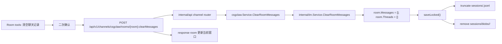
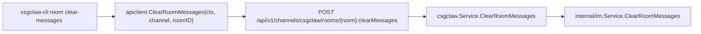

# Issue 2219：CSGClaw IM 房间聊天记录清空方案

## 背景与范围

Issue 2219 要求在 CSGClaw IM 的房间工具中支持清空聊天记录。关联 Issue 2080 关注的是“Agent 在重建过程中清空当前 Agent 历史聊天记录，避免影响大模型判断”。

本方案将两个需求边界拆开：

- UI 房间工具只清理 CSGClaw IM 中的 room 消息、thread 展示状态和本地消息落盘文件。
- 各 Agent 内部历史记录通过 slash 命令进入对应 Agent/runtime，由 Agent/runtime 自己清理其会话上下文。

非目标：

- UI 清空聊天记录不删除 room，不删除 members，不删除 users，不删除 bots。
- UI 清空聊天记录不直接删除 PicoClaw、OpenClaw、Codex 的内部记忆、会话、workspace memory 或文件。
- Agent slash 清理不反向清空 IM 房间消息，除非后续单独设计组合操作。

## 第一章节：当前 IM 消息记录存放位置和时机，以及 UI 工具清理房间聊天记录

### 1.1 当前 IM 状态与消息存放位置

默认 IM state 路径由 `config.DefaultIMStatePath()` 生成：

```text
~/.csgclaw/im/state.json
```

实际目录来自 `config.DefaultDir()` 和 `config.DefaultIMDir()`，默认是用户 home 下的 `.csgclaw/im`。

当前持久化结构：

```text
~/.csgclaw/im/
  state.json
  sessions/
    <roomID>.jsonl
    blobs/
      <roomID>/
        <messageID>.json
```

职责划分：

- `state.json`：由 `internal/im.Service` 维护，存放 current user、users、rooms、room members、room metadata、thread state，以及每个 room 的 messages 相对路径。
- `sessions/<roomID>.jsonl`：每个 room 的消息记录。每行是一个 `sessionMessageLine`。
- `sessions/blobs/<roomID>/<messageID>.json`：当单条消息过大时，正文、event、thread summary 会从 JSONL 行中挪到 blob 文件，JSONL 行只保留 `blob_ref`。

关键代码位置：

- `internal/config/config.go`：`DefaultIMStatePath()`、`DefaultIMDir()`。
- `cli/serve/serve.go`：服务启动时通过 `newIMService()` 加载默认 IM state。
- `internal/im/service.go`：`persistedBootstrap`、`persistedRoom`、room/message/thread 领域逻辑。
- `internal/im/session_store.go`：JSONL 与 blob 的读写、迁移和清理。

### 1.2 当前 IM 消息写入时机

`internal/im.Service` 以内存 map 管理 room，所有修改都先改内存，再调用 `saveLocked()` 落盘。

主要写入场景：

| 场景 | 当前行为 |
|---|---|
| `CreateRoom` | 创建 room，并追加 `room_created` event message |
| `AddRoomMembers` | 修改 members，并追加 `room_members_added` event message |
| `CreateMessage` | 用户或前端发送消息，追加到 `room.Messages` |
| `DeliverMessage` | Bot/runtime 回写消息，按 message id 幂等追加或覆盖 |
| `StartThread` | 给 root message 创建 `ThreadState`，并保存 thread context snapshot |
| `DeleteRoom` | 删除 room 后保存 state，`cleanupSessionFiles` 清理不再被引用的 JSONL 和 blob |

因此，“清空房间聊天记录”由 `internal/im.Service` 提供新的语义操作，集中处理 messages、threads、JSONL、blob 和事件通知。

### 1.3 UI 清理房间聊天记录的设计

新增 room 工具菜单项：

```text
房间工具
  显示/隐藏工具调用
  清空聊天记录
  删除房间
```

交互规则：

- “清空聊天记录”放在“删除房间”上方，使用危险样式，但文案和二次确认要与删除房间区分。
- 二次确认文案必须说明：只清空当前房间 IM 消息，不清空各 Agent 内部历史。
- 清理成功后，当前 room 仍然存在，成员不变，输入框可继续发送消息。
- 如果当前打开 thread panel，且 thread 属于该 room，则关闭 thread panel。
- 清理后消息列表显示 `noMessages` 空状态。

前端详细流程：

1. 用户点击 `ConversationPane` 的 room tools。
2. 用户点击“清空聊天记录”。
3. 弹出确认 Dialog，展示 room title 和清理范围。
4. 用户确认后调用 `clearRoomMessagesRequest({ channel: "csgclaw", roomID })`。
5. 请求成功后：
   - 更新 bootstrap cache 中目标 room 的 `messages=[]`、`threads=[]`。
   - 清理该 room 下的 thread drafts。
   - 如果当前 active thread 属于该 room，关闭 thread panel。
   - 关闭工具菜单和确认弹窗。
6. 请求失败后显示本地化错误，不改变前端状态。

### 1.4 新增接口 API

只新增 channel-scoped room custom method，Web UI 和 CLI 都走这条路径：

```http
POST /api/v1/channels/{channel}/rooms/{room}:clearMessages
```

具体到当前 CSGClaw channel：

```http
POST /api/v1/channels/csgclaw/rooms/{room}:clearMessages
```

不新增下面这些接口：

```http
DELETE /api/v1/channels/{channel}/rooms/{room}/messages
POST /api/v1/channels/{channel}/rooms/{room}/messages/clear
POST /api/v1/rooms/{room}:clearMessages
```

原因：

- “清空聊天记录”不是删除 room，也不是删除单条 message，而是对 room 执行一个有副作用的清空动作；按 Google AIP custom method 风格，应使用 `POST` 和 `:clearMessages`。
- `DELETE /rooms/{room}/messages` 容易被误解为删除 messages 集合资源或批量删除 message 资源，而不是明确的 room-level clear action。
- 当前前端的 CSGClaw IM 资源已经可以通过 `/api/v1/channels/{channel}/...` 表达，清理接口继续使用同一套 channel route。
- 不带 channel 的 URL 会让调用方产生两套入口的错觉，后续权限、审计、CLI 和 channel client 都容易分叉。
- HTTP handler 只负责 channel 分发，最终仍复用同一个 `internal/channel/csgclaw.Service.ClearRoomMessages` 和 `internal/im.Service.ClearRoomMessages`。

响应：

```json
{
  "id": "room-123",
  "title": "general",
  "members": ["u-admin", "u-manager"],
  "messages": [],
  "threads": []
}
```

错误码：

| 条件 | 状态码 |
|---|---:|
| channel 或 room 为空 / 格式非法 | 400 |
| room 不存在 | 404 |
| IM service 未配置 | 503 |
| 保存失败 | 500 |
| 其他业务校验失败 | 400 |

### 1.5 新增 Go 数据结构与接口

不新增专门的 response DTO。HTTP response 直接返回清空后的 `apitypes.Room`，与 `CreateRoom`、`AddRoomMembers` 这类 room 更新接口保持一致。

接口分层如下：

- HTTP 层从 URL 解析出 `channel=csgclaw`，把请求分发给 CSGClaw channel service。
- `internal/channel/csgclaw.Service` 持有 `*im.Service`，负责 CSGClaw 渠道适配，例如 bot id/user id 转换、slash 内容归一化、后续权限校验。
- `internal/im.Service` 只处理已经确定属于本地 CSGClaw IM 的 room/message 数据，入参只需要 `roomID`。到达这一层时 channel 已经在上一层完成选择，不再把 channel 作为领域参数继续下传。

当前消息发送链路也是这个模式：

```text
POST /api/v1/channels/csgclaw/messages
  -> api handler 选择 csgclaw channel
  -> internal/channel/csgclaw.Service.SendMessage
  -> internal/im.Service.CreateMessage
```

清理聊天记录沿用同样的链路：

```text
POST /api/v1/channels/csgclaw/rooms/{room}:clearMessages
  -> api handler 选择 csgclaw channel
  -> internal/channel/csgclaw.Service.ClearRoomMessages
  -> internal/im.Service.ClearRoomMessages(roomID)
```

所以 `internal/im.Service.ClearRoomMessages` 没有 channel 参数，不代表绕过渠道；它只是不重复处理已经由上层解析完成的 HTTP/channel 信息。

`internal/im/service.go`：

```go
func (s *Service) ClearRoomMessages(roomID string) (Room, error)
```

`internal/channel/csgclaw/service.go`：

```go
func (s *Service) ClearRoomMessages(roomID string) (im.Room, error)
```

`internal/apiclient/client.go`：

```go
func (c *Client) ClearRoomMessages(ctx context.Context, channel, roomID string) (apitypes.Room, error)
```

`apiclient` 必须要求 `channel` 和 `roomID` 非空，并通过 `roomClearMessagesPath(channel, roomID)` 生成 `POST /api/v1/channels/{channel}/rooms/{room}:clearMessages`。当前实现只支持 `channel == "csgclaw"`；传空 channel、空 roomID 或未实现清理语义的 channel，直接返回参数错误，不回退到 `/api/v1/rooms/...`。

### 1.6 后端清理流程

Thread 消息按 room 归一化存储：

- thread root message 存在 `room.Messages`。
- thread reply 也存在同一个 `room.Messages`，通过 `relates_to.rel_type = "m.thread"` 和 `relates_to.event_id = rootMessageID` 关联 root。
- `room.Threads` 存的是 thread 状态、上下文快照和摘要索引，不是另一份独立消息表。
- 默认展示 room messages 时会过滤 thread reply；带 `include_thread_replies=true` 或打开 thread panel 时再按 relation 取出 thread reply。

因此 IM 清理房间聊天记录时一次性清理整个 room 的消息集合：

```go
room.Messages = []RoomMessage{}
room.Threads = []RoomThread{}
```

这会同时清理主线消息、thread root、thread reply、thread 状态摘要和 thread context snapshot。落盘时统一截断 `sessions/<roomID>.jsonl`，删除 `sessions/blobs/<roomID>/`，不再为 thread 单独设计第二套清理流程。

清空语义以调用时刻已经落盘的 room 消息为边界：清空只删除调用时刻之前已落盘消息，之后到达的消息允许出现。例如清空前已经触发但尚未回写的 bot/runtime reply，如果在清空完成后才通过 `DeliverMessage` 到达，可以作为新的 room 消息继续出现；本接口不尝试取消或过滤这类 in-flight 回复。



`ClearRoomMessages` 内部步骤：

1. trim 并校验 `roomID`。
2. 加写锁。
3. 查找 room，不存在返回 `room not found`。
4. 设置 `room.Messages = []`，`room.Threads = []`。
5. 调用 `saveLocked()`。
6. 返回清空后的 `presentRoomLocked(*room)`。

`saveLocked()` 会调用现有 `SaveBootstrap()`，当目标 room 的 messages 为空时，`saveMessagesJSONL()` 会创建或截断 `sessions/<roomID>.jsonl`，并通过 `cleanupRoomSessionBlobs()` 删除该 room 的 stale blobs。为了避免空消息也保留空 blob 目录，在 `saveMessagesJSONL()` 中增加清空分支：

```go
if len(messages) == 0 {
    truncateSessionJSONL(path)
    return removeRoomSessionBlobs(sessionsRoot, roomID)
}
```

这样清空语义更直接，也避免先创建 blob dir 再清理。

### 1.7 前端状态更新

当前不做多窗口实时同步。API handler 不发布 `room.messages_cleared` SSE；其他窗口或标签页刷新/bootstrap reload 后再体现清空结果。

前端点击确认后调用 `clearRoomMessagesRequest(roomID)`，请求成功后使用 response 中返回的清空后 `room` 更新当前窗口 bootstrap data。

`useConversationController` 的请求成功回调中额外处理：

- 如果清空的 `roomID` 是当前打开 room，调用 `closeThread()`。
- 清理当前 room 的 thread drafts。
- 不清理普通 composer draft，用户可能正在输入下一条消息。

### 1.8 CLI 清理房间聊天记录

新增 CLI 子命令，和 Web UI 使用同一个 channel-scoped custom method API：

```bash
csgclaw-cli room clear-messages <room-id> --channel csgclaw
```

`room` 命令由 `csgclaw` 和 `csgclaw-cli` 两个入口复用，因此 full CLI 也自然支持：

```bash
csgclaw room clear-messages <room-id> --channel csgclaw
```

CLI 设计：

- 命令位置：`cli/room/room.go`，新增 `clear-messages` subcommand。
- 参数形态：沿用 `room delete <id>` 的 positional id 风格，避免同一个 room 命令下既有 `<id>` 又有 `--room-id`。
- `--channel` 默认 `csgclaw`，但传空值时报错；不提供无 channel fallback。
- 调用链路：`run.APIClient(globals).ClearRoomMessages(ctx, channel, roomID)`，客户端内部请求 `POST /api/v1/channels/{channel}/rooms/{roomID}:clearMessages`。
- 输出：复用 `command.RenderRooms` 返回清空后的 room；json 输出时可以直接看到 `messages: []`、`threads: []`。

CLI 链路：



### 1.9 测试覆盖

后端：

- `internal/im/service_test.go`
  - `ClearRoomMessages` 保留 room 和 members。
  - 清空 messages 和 threads。
  - 重新加载 state 后 messages/threads 仍为空。
- `internal/im/session_store_test.go`
  - 清空后 `sessions/<roomID>.jsonl` 为空或不存在但可加载为空。
  - 清空后 `sessions/blobs/<roomID>/` 被删除。
- `internal/api/handler_test.go`
	  - `POST /api/v1/channels/csgclaw/rooms/{room}:clearMessages` 返回清空后的 room。
  - 不存在 room 返回 404。
  - 不发布 `room.messages_cleared` SSE，其他窗口暂不实时同步。
- `internal/apiclient/client_test.go`
	  - `ClearRoomMessages(ctx, "csgclaw", roomID)` path 拼接为 `/api/v1/channels/csgclaw/rooms/{roomID}:clearMessages`。
  - 空 channel 不回退到 `/api/v1/rooms/...`。
- `cli/room/room_test.go`
  - `room clear-messages <id> --channel csgclaw` 调用 `ClearRoomMessages` 对应 HTTP path。
  - 缺少 `<id>` 时返回参数错误。

前端：

- `web/app/tests/models/conversations.test.ts`
  - `applyIMEvent(room.messages_cleared)` 清空目标 room messages/threads，不影响其他 room。
- `web/app/tests/hooks/useConversationController.test.ts`
  - 本地调用清空后 room 仍选中，thread panel 关闭。
- `web/app/tests/components/ConversationPane.test.tsx`
  - room tools 显示“清空聊天记录”。
  - 点击后需要确认，不直接调用删除。
	  - 确认后调用 `/api/v1/channels/csgclaw/rooms/{roomID}:clearMessages`，不调用 `/api/v1/rooms/{roomID}/messages`。
