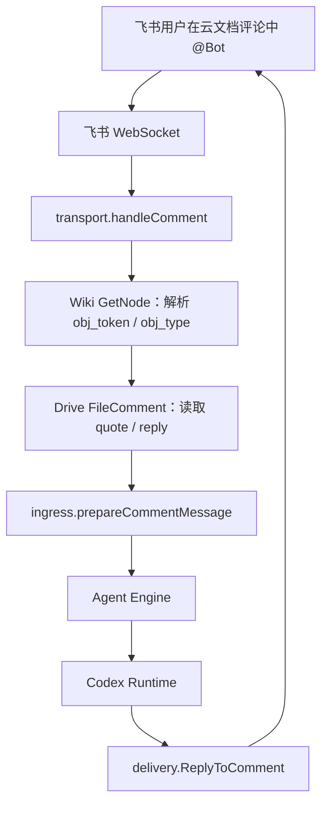
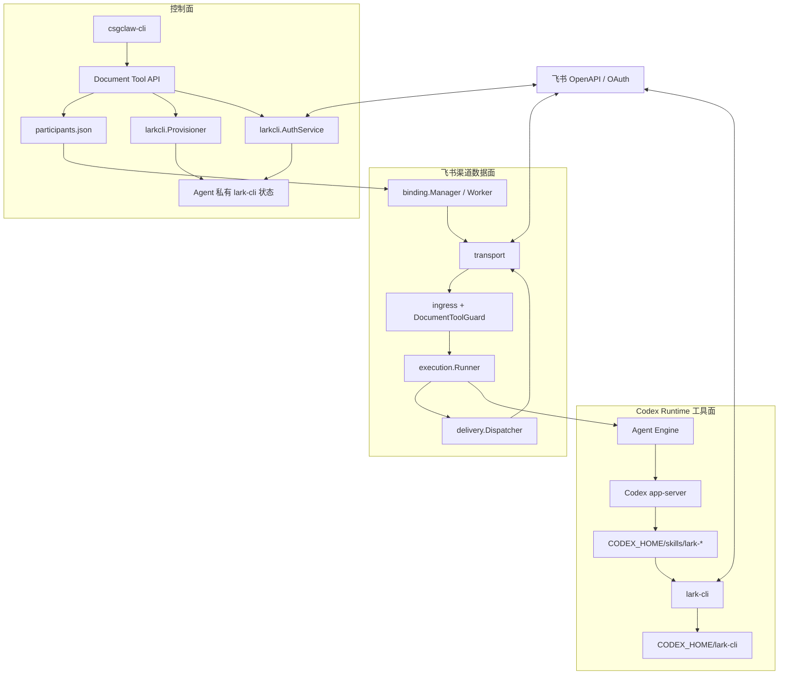
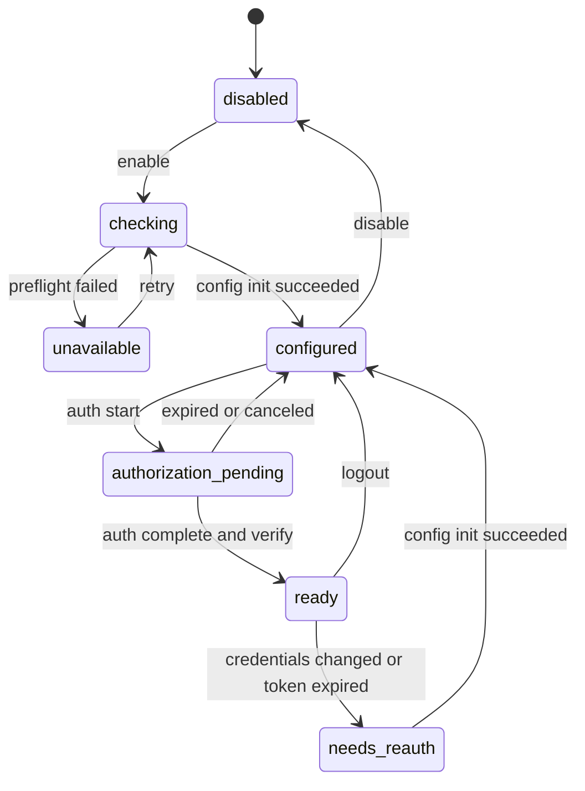
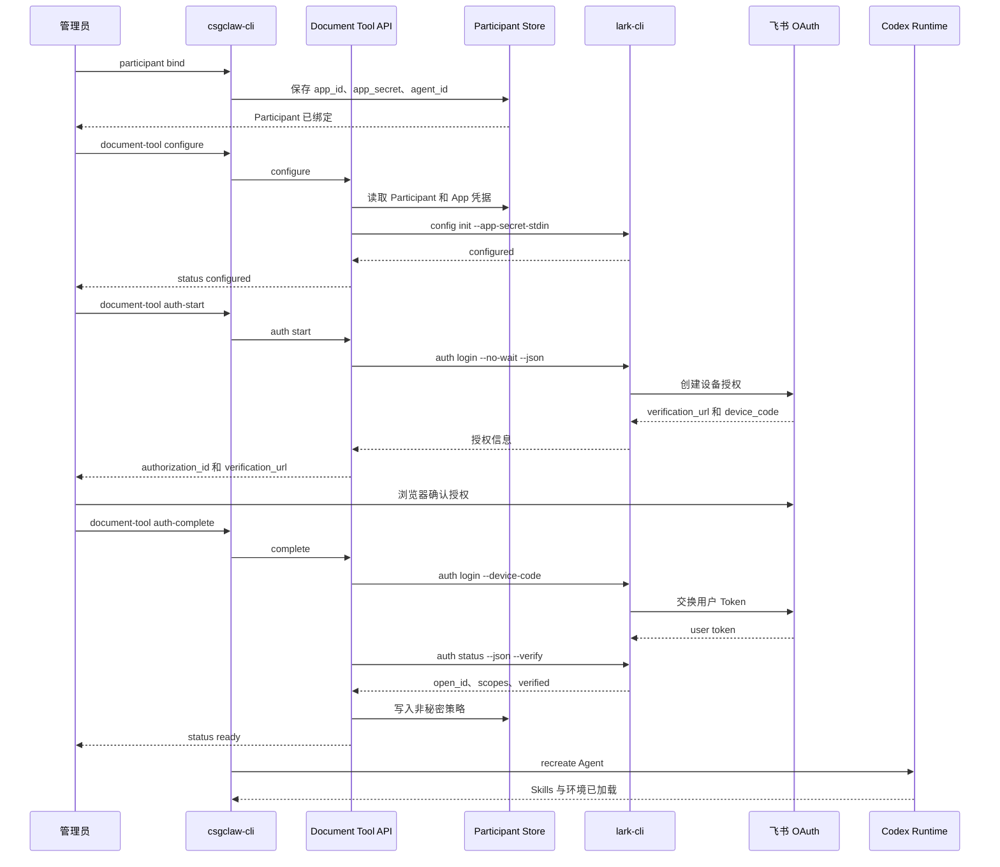
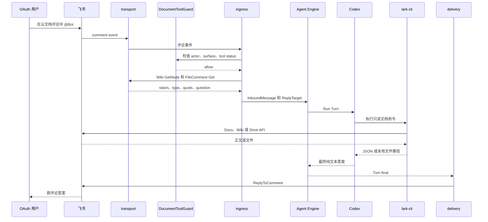

# 飞书直连渠道接入 lark-cli 文档能力方案

本文描述如何在当前 CSGClaw 托管飞书直连渠道中安装、配置并使用飞书官方
[`lark-cli`](https://github.com/larksuite/cli)，使非沙箱 Codex Agent 能在收到飞书
消息或云文档评论后，按需读取 Wiki/云文档正文以及下载文档资源。

本文是待实施方案，不表示当前版本已经自动安装或配置 `lark-cli`。当前实现仍然只负责
解析 Wiki 评论目标、读取评论上下文、调用 Agent Engine 并回复评论；读取正文依赖额外的
飞书文档工具。

## 1. 结论

首期方案采用以下边界：

- `lark-cli` 是 Codex Runtime 的工具，不是飞书 Channel Transport 的依赖；
- 飞书渠道继续负责事件接收、Wiki token 解包、评论上下文和最终回复，不直接执行
  `lark-cli`；
- `lark-cli` 可执行文件与官方 Skills 在部署阶段按固定版本安装，不在消息回调或每次
  Participant 对账时联网安装；
- 每个 Codex Agent 使用独立的 `LARKSUITE_CLI_CONFIG_DIR`，避免多个 Agent 共用
  `~/.lark-cli`；
- 首期复用该 Agent 的飞书 Channel App，通过用户 OAuth 获得只读文档权限；
- 首期只允许 OAuth 用户本人通过私聊或本人发起的文档评论使用这个 Agent，暂不允许普通
  群成员间接使用用户 OAuth 权限；
- 不修改 Agent Engine 的 Turn、Admission、Cancel 或 Reset 语义，只在飞书渠道和 Codex
  Runtime 边界增加工具配置；
- 当前飞书出站仍只回复文本，不把 Codex 下载到本地的文件重新上传到飞书。

这使现有评论实现形成完整闭环：渠道提供可信的文档目标和回复位置，Codex 决定是否读取
正文，`lark-cli` 负责飞书文档 API，渠道负责把最终结果回复到原评论。

## 2. 当前实现和能力缺口

### 2.1 当前评论链路

当前代码已经具备以下能力：

1. `transport` 通过飞书 WebSocket 接收文档评论事件；
2. `ResolveCommentTarget` 尝试把 Wiki node token 解包为底层 `obj_token` 和
   `obj_type`；
3. `FetchComment` 读取评论引用、评论回复列表以及用户问题；
4. `ingress` 生成 `InboundMessage`，其中包含底层文件 token、文件类型、选中原文和问题；
5. `execution.Runner` 调用共享 Agent Engine；
6. Turn 结束后，`delivery` 使用 Drive Comment API 回复原评论。

当前数据流如下：



### 2.2 当前能做什么

即使没有 `lark-cli`，现有评论代码仍可回答只依赖以下内容的问题：

- 用户在文档中选中的原文；
- 当前评论回复中的文本和文档链接；
- 用户提出的问题。

因此这段代码不是不可达代码，但能力只覆盖评论片段，无法保证理解完整上下文。

### 2.3 当前不能做什么

当前飞书渠道没有实现以下 API：

- 获取 Doc/Docx 正文 block；
- 搜索 Wiki 空间和节点；
- 下载以 Wiki file node 表示的普通文件；
- 下载 Docx 正文中的图片或附件；
- 导出 Sheet、Slides 等在线文档；
- 把 Runtime 生成或下载的本地文件上传回飞书。

聊天附件下载不等于 Wiki 文件下载。当前 `transport.DownloadResource` 调用的是
`/im/v1/messages/{message_id}/resources/{file_key}`，只能下载用户直接发送到聊天消息中的
图片或文件。

## 3. 目标和非目标

### 3.1 首期目标

1. 支持 Codex 根据当前评论提供的 token 读取 Doc/Docx/Wiki 正文；
2. 支持下载 Wiki 底层类型为 `file` 的普通文件；
3. 支持下载 Docx 正文中已经解析出的图片或附件 token；
4. 使用飞书用户 OAuth 权限，不扩大 Channel Bot 的默认可见范围；
5. 每个 Agent 独立保存 `lark-cli` 配置和用户授权状态；
6. App Secret 不出现在命令参数、日志、API 响应或 Prompt 中；
7. App 凭据轮换后能识别配置失效并要求重新授权；
8. 安装、配置、授权和运行时失败均能通过状态接口明确定位。

### 3.2 非目标

- 不让飞书 Transport 直接调用 `lark-cli`；
- 不在 Channel 中实现第二套文档 SDK；
- 不改变 Agent Engine 接口或 Conversation admission；
- 不支持一个 Agent 同时代表多个飞书用户；
- 不允许共享群中的任意成员使用某个用户的 OAuth Token；
- 不开放创建、编辑、删除、移动或分享文档等写权限；
- 不实现 Runtime 本地文件到飞书的出站上传；
- 不在沙箱 Codex 或 `execution_mode=read_only` 中运行本地 `lark-cli`；
- 不替代 PicoClaw、OpenClaw Runtime 自己的飞书工具或渠道实现。

## 4. 核心架构

### 4.1 组件关系



### 4.2 组件职责

| 组件 | 职责 | 明确不负责 |
| --- | --- | --- |
| `binding.Manager` | 继续根据 Participant 与 Agent 解析稳定飞书 Binding | 不安装 CLI，不执行 OAuth |
| `transport` | WebSocket、评论、消息和附件单次 OpenAPI 调用 | 不读取完整文档正文 |
| `DocumentToolGuard` | 对启用用户 OAuth 的 Binding 检查 actor 和交互面 | 不解析文档、不调用 Agent |
| `execution.Runner` | 把规范化输入交给 Agent Engine，并收集最终结果 | 不感知 `lark-cli` |
| `larkcli.Provisioner` | 检查 CLI/Skills、初始化 Agent 私有配置、检测 App 凭据变更 | 不参与消息处理 |
| `larkcli.AuthService` | 发起/完成用户 OAuth、查询授权状态 | 不保存 Channel Binding |
| Codex Runtime | 注入 Agent 私有配置目录并加载 Skills | 不持有飞书 Channel 状态 |
| `lark-doc/lark-drive/lark-wiki` Skills | 指导 Codex 选择只读命令和正确 token | 不负责评论回复 |
| `delivery` | 把最终纯文本回复到原评论或聊天 | 不上传本地下载文件 |

### 4.3 依赖方向

依赖方向保持为：

```text
Feishu Channel -> Agent Engine Interface -> Codex Runtime -> lark-cli -> Feishu OpenAPI
```

Agent Engine 不依赖 `lark-cli`、飞书 SDK、Participant 或 OAuth 状态。飞书 Channel 也不依赖
`lark-cli` 的命令输出协议。两侧仅通过现有 `InboundMessage`、Turn Event 和最终文本交互。

## 5. 配置和字段含义

### 5.1 现有 Participant 字段

飞书 Bot Participant 继续作为 Channel Binding 和 Channel App 凭据的事实源：

```json
{
  "id": "dev",
  "channel": "feishu",
  "type": "agent",
  "channel_user_kind": "app_id",
  "channel_app_config": {
    "app_id": "cli_xxxxxxxxxxxxxxxx",
    "app_secret": "[secret]"
  },
  "agent_id": "u-dev"
}
```

| 字段 | 含义 | 约束 |
| --- | --- | --- |
| `id` | 飞书 Participant 的稳定标识 | 用于生成 `binding_id=feishu:<id>` |
| `channel` | 外部渠道 | 固定为 `feishu` |
| `type` | Participant 类型 | Bot Binding 固定为 `agent` |
| `channel_user_kind` | 渠道身份类型 | Bot Binding 固定为 `app_id` |
| `channel_app_config.app_id` | 飞书自建应用 App ID | 同一个 App ID 不能同时归属多个托管 Agent |
| `channel_app_config.app_secret` | 飞书自建应用 App Secret | 真实落盘，API/CLI 输出必须脱敏 |
| `agent_id` | 绑定的 CSGClaw Agent | 首期必须是非沙箱 Codex Agent |

### 5.2 新增 Participant 工具策略

是否启用 `lark-cli` 以及访问边界属于 Binding 的非秘密策略，建议放在 Participant
`metadata.lark_cli`，不要放入 `channel_app_config`。后者在重新绑定 App 时会整体更新，且只应
表达 Channel App 凭据。

```json
{
  "metadata": {
    "lark_cli": {
      "version": 1,
      "enabled": true,
      "app_source": "channel",
      "identity": "user",
      "scope_profile": "wiki_readonly",
      "actor_policy": "oauth_subject_only",
      "surface_policy": "p2p_and_comment"
    }
  }
}
```

| 字段 | 类型 | 首期值 | 含义 |
| --- | --- | --- | --- |
| `version` | integer | `1` | 策略结构版本，用于后续兼容迁移 |
| `enabled` | boolean | `true/false` | 是否为该 Binding 启用 Codex 飞书文档工具 |
| `app_source` | string | `channel` | 复用 `channel_app_config` 中同一个 App；保证 Open ID 可直接比较 |
| `identity` | string | `user` | `lark-cli` 文档调用固定使用用户 OAuth 身份 |
| `scope_profile` | string | `wiki_readonly` | 使用内置只读 scope 集合，不接受任意自定义写 scope |
| `actor_policy` | string | `oauth_subject_only` | 仅 OAuth Token 对应的同一个用户可以触发该 Agent |
| `surface_policy` | string | `p2p_and_comment` | 允许用户私聊和本人文档评论；拒绝群聊消息 |

首期不支持 `app_source=dedicated`、`actor_policy=anyone` 或自定义 scope。未知值必须拒绝，不能
静默回退到宽松策略。

### 5.3 Agent 私有目录与环境字段

当前 Codex Runtime 已为每个 Agent 创建独立的 `HOME` 和 `CODEX_HOME`，因此默认的
`~/.lark-cli` 已具备 Agent 级目录隔离。方案仍显式注入以下变量，把工具配置统一纳入
`CODEX_HOME` 生命周期，并避免后续 Runtime 调整 `HOME` 时改变配置位置：

```text
LARKSUITE_CLI_CONFIG_DIR=<agent CODEX_HOME>/lark-cli
```

| 字段 | 产生方 | 含义 | 安全要求 |
| --- | --- | --- | --- |
| `CODEX_HOME` | Codex Runtime | 当前 Agent 独立的 Codex 配置根目录 | 已有字段，不允许 Agent Profile 覆盖 |
| `LARKSUITE_CLI_CONFIG_DIR` | Codex Runtime | 当前 Agent 独立的 `lark-cli` 配置目录 | 固定由 `CODEX_HOME` 派生并设为保留环境变量 |
| `PATH` | CSGClaw 服务环境 | 查找固定版本的 `lark-cli` 可执行文件 | 启动前必须通过绝对路径和版本检查 |

建议目录结构：

```text
<agent-runtime>/
├── workspace/
└── home/                         # CODEX_HOME
    ├── config.toml
    ├── skills/
    │   ├── lark-shared/
    │   ├── lark-doc/
    │   ├── lark-drive/
    │   ├── lark-wiki/
    │   └── lark-sheets/          # 已随官方 Skills 安装，首期不启用全文读取
    └── lark-cli/                 # LARKSUITE_CLI_CONFIG_DIR, mode 0700
        ├── config.json           # lark-cli 管理，mode 0600
        └── csgclaw-state.json    # CSGClaw 管理，mode 0600
```

`CODEX_HOME` 隔离主要防止不同 Agent 意外选择错误账号。当前托管 Codex 是非沙箱 Runtime，
这不是针对恶意本地进程的强安全隔离。

### 5.4 CSGClaw 工具状态字段

`csgclaw-state.json` 只保存对账和非秘密身份信息，不保存 App Secret、access token、refresh
token 或 device code：

```json
{
  "version": 1,
  "participant_id": "dev",
  "agent_id": "u-dev",
  "app_id": "cli_xxxxxxxxxxxxxxxx",
  "credential_fingerprint": "sha256-internal-value",
  "cli_version": "pinned-version",
  "scope_profile": "wiki_readonly",
  "auth_subject_open_id": "ou_xxxxxxxxxxxxxxxxx",
  "configured_at": "2026-08-20T12:00:00Z",
  "authorized_at": "2026-08-20T12:05:00Z"
}
```

| 字段 | 含义 | 是否可通过 API 返回 |
| --- | --- | --- |
| `version` | 状态文件版本 | 是 |
| `participant_id` | 所属飞书 Participant | 是 |
| `agent_id` | 所属 Agent | 是 |
| `app_id` | 已写入 `lark-cli` 的 App ID | 可返回脱敏或完整非秘密值 |
| `credential_fingerprint` | `app_id + app_secret` 的内部 SHA-256，用于检测轮换 | 否 |
| `cli_version` | 完成配置时验证过的 `lark-cli` 版本 | 是 |
| `scope_profile` | 已申请的内置 scope profile | 是 |
| `auth_subject_open_id` | OAuth 用户在当前 App 下的 Open ID | 是，用于渠道 actor 校验 |
| `configured_at` | App 配置完成时间 | 是 |
| `authorized_at` | 用户 OAuth 校验成功时间 | 是 |

实际 Token 及 App Secret 的存储格式由 `lark-cli` 管理。CSGClaw 只通过
`lark-cli config init --app-secret-stdin` 写入，不解析或复制 Token。

### 5.5 `wiki_readonly` 权限集合

首期固定请求完成当前评论目标读取所需的最小权限：

| Scope | 用途 |
| --- | --- |
| `wiki:node:retrieve` | 把 Wiki node token 解析为底层对象 token/type |
| `docx:document:readonly` | 读取 Docx 正文 |
| `drive:file:download` | 下载底层类型为 `file` 的 Wiki/Drive 文件 |
| `docs:document.media:download` | 下载 Docx 正文中的图片或附件素材 |

如后续需要搜索整个 Wiki，再单独增加 `wiki:space:retrieve` 或搜索相关只读 scope。首期不因
“可能有用”申请 Docs、Drive 或 Wiki 整个业务域的全部权限。

### 5.6 OAuth 流程字段

CSGClaw 对 `lark-cli auth login --no-wait --json` 的输出做限长解析，并向 API 调用者返回稳定
协议：

```json
{
  "status": "authorization_pending",
  "authorization_id": "opaque-csgclaw-id",
  "participant_id": "dev",
  "agent_id": "u-dev",
  "verification_url": "https://accounts.feishu.cn/...",
  "expires_at": "2026-08-20T12:15:00Z",
  "scopes": [
    "wiki:node:retrieve",
    "docx:document:readonly",
    "drive:file:download",
    "docs:document.media:download"
  ]
}
```

| 字段 | 含义 |
| --- | --- |
| `status` | 当前状态；见后文状态机 |
| `authorization_id` | CSGClaw 生成的短期不透明 ID，用于关联内存中的 device code |
| `participant_id` | 正在授权的飞书 Participant |
| `agent_id` | 最终使用该授权的 Codex Agent |
| `verification_url` | 用户必须原样打开的飞书授权 URL |
| `expires_at` | 当前 device flow 的过期时间 |
| `scopes` | 本次实际申请的只读权限集合 |

`device_code` 不写日志、不写 Participant、不直接返回给 Agent，并只在进程内保存到过期。服务
重启后待完成授权失效，用户重新执行 auth start 即可。

### 5.7 评论运行时字段映射

| 阶段 | 字段 | 含义 |
| --- | --- | --- |
| 飞书事件 | `event_id` | 飞书事件唯一 ID，用于当前 Worker 内去重 |
| 飞书事件 | `file_token` | 可能是 Wiki node token，也可能已经是 Drive 对象 token |
| 飞书事件 | `file_type` | 事件声明的对象类型 |
| 飞书事件 | `comment_id` | 顶层评论 ID，也是最终回复的父目标 |
| 飞书事件 | `reply_id` | 本次 @Bot 的回复 ID，同时作为 Source Message ID |
| 飞书事件 | `operator.open_id` | 触发评论的用户，必须通过工具访问策略 |
| 解析后 | `target.file_token` | Wiki 解包后的底层 `obj_token` |
| 解析后 | `target.file_type` | Wiki 解包后的 `obj_type` |
| Channel | `conversation_key` | Binding + 文档类型/token/comment ID 的稳定会话范围 |
| Channel | `turn_id` | Binding + event ID + reply ID 派生的 Turn 标识 |
| Channel | `ReplyTarget.ResourceID` | 最终评论回复使用的底层 file token |
| Channel | `ReplyTarget.ResourceType` | 最终评论回复使用的 file type |
| Channel | `ReplyTarget.ParentID` | 最终评论回复使用的 comment ID |

当前评论支持类型为 `doc`、`docx`、`sheet` 和 `file`。即使 `lark-cli` 支持 Slides、Base 等
更多类型，当前 Channel 仍会拒绝其他评论类型；首期不扩大该范围。其中 `sheet` 仅保持现有
评论片段回答能力，不纳入首期全文读取。

## 6. 安装和启动方案

### 6.1 部署阶段安装

生产环境必须固定经过验证的 `lark-cli` 版本。安装命令由构建或部署脚本执行一次：

```bash
npx @larksuite/cli@<PINNED_VERSION> install
```

如果二进制和 Skills 分开安装，则使用：

```bash
npm install -g @larksuite/cli@<PINNED_VERSION>
npx skills add larksuite/cli -y -g
```

部署检查必须验证：

```text
lark-cli --version == PINNED_VERSION
host CODEX_HOME/skills/lark-shared/SKILL.md exists
host CODEX_HOME/skills/lark-doc/SKILL.md exists
host CODEX_HOME/skills/lark-drive/SKILL.md exists
host CODEX_HOME/skills/lark-wiki/SKILL.md exists
```

当前 Codex Runtime 启动时会把宿主机 Codex Skills 复制到 Agent 的独立
`CODEX_HOME/skills`。因此安装 Skills 后需要重建或重启对应 Agent，不能假设已经运行的
Codex 会话会热加载新 Skill。

不建议在以下位置执行安装：

- 飞书 WebSocket callback；
- `ingress.Intake` handler；
- Binding Manager 的 30 秒对账循环；
- 每个 Agent Turn；
- App Secret 或 OAuth API 请求处理期间。

### 6.2 启动前检查

工具启用 API 必须执行以下检查，并一次性返回全部问题：

1. Participant 存在且为 `feishu/agent/app_id`；
2. Participant 绑定的 Agent 存在；
3. Agent Runtime Adapter 为 Codex；
4. Agent 不是 sandboxed；
5. Codex `execution_mode` 为 `standard`；
6. `lark-cli` 存在且版本匹配；
7. 必需的 `lark-*` Skills 已安装；
8. `app_id/app_secret` 均存在；
9. Participant App ID 不存在所有权冲突；
10. Agent 私有配置目录可以用 `0700` 创建。

失败时不影响原有飞书 Worker 收发消息，但工具状态为 `unavailable`，不能把部分配置标记为
成功。

### 6.3 Runtime 环境注入

Codex `buildSessionEnv` 应无条件为每个标准模式 Agent 注入由 `CODEX_HOME` 派生的
`LARKSUITE_CLI_CONFIG_DIR`，并将该变量加入保留环境变量集合，防止 Agent Profile 覆盖到其他
Agent 的目录。

只读执行模式当前会移除本地 Skills，而且只继承受限环境，因此首期直接拒绝为该模式启用
本地 `lark-cli`，不做隐式降级。

## 7. 配置与授权流程

### 7.1 状态机



| 状态 | 含义 |
| --- | --- |
| `disabled` | Participant 没有启用 `metadata.lark_cli.enabled` |
| `checking` | 正在检查 Runtime、CLI、Skills 和目录 |
| `unavailable` | 环境缺失或 Runtime 不支持；Channel 本身仍可工作 |
| `configured` | App 已写入 Agent 私有 `lark-cli` 配置，但没有有效用户 Token |
| `authorization_pending` | 已生成飞书用户授权 URL，等待用户确认 |
| `ready` | App、用户 Token、scope 和 OAuth subject 均验证成功 |
| `needs_reauth` | App 凭据变更或 Token 失效，需要重新配置/授权 |

该状态机描述工具的配置过程，不等同于 Participant 策略已经生效。首次授权进入 `ready` 后才写入
`metadata.lark_cli.enabled=true` 和 OAuth subject；`configured`、`authorization_pending` 阶段不
改变原有渠道行为。曾经进入 `ready` 后即使 Token 过期，也必须保留 subject 和访问限制，不能
因为工具暂时不可用而重新放开给其他用户。

### 7.2 完整时序



### 7.3 配置命令的安全执行规则

`larkcli.Provisioner` 必须使用 `exec.CommandContext` 直接传递参数，禁止通过 shell 拼接命令。

App Secret 只通过 stdin 传入：

```text
lark-cli config init
  --app-id <participant app_id>
  --app-secret-stdin
  --brand feishu
  --lang zh
```

执行要求：

- stdin 在命令退出后立即释放；
- stdout/stderr 分别限长，例如最多 64 KiB；
- 错误信息经过清洗，禁止包含 stdin、完整 Token 或配置文件正文；
- 同一 Agent 配置目录使用互斥锁，避免并发写坏 `config.json`；
- App ID、Agent ID、Participant ID 只作为参数值，不参与路径拼接；
- 配置目录必须由服务端根据规范化 Agent ID 解析；
- 默认超时 30 秒，OAuth complete 使用 device flow 剩余有效期作为上限；
- 只有凭据指纹变化时才重新执行 `config init`，避免无故清除已有用户授权。

### 7.4 API 与 CLI 建议

保持 `participant bind` 只负责 Channel Binding。用户 OAuth 是多阶段流程，使用独立命令：

```text
csgclaw-cli participant document-tool configure
  --channel feishu
  --participant dev
  --provider lark-cli

csgclaw-cli participant document-tool auth-start
  --channel feishu
  --participant dev

csgclaw-cli participant document-tool auth-complete
  --channel feishu
  --participant dev
  --authorization-id <opaque-id>

csgclaw-cli participant document-tool status
  --channel feishu
  --participant dev
```

对应 API：

| 方法 | 路径 | 用途 |
| --- | --- | --- |
| `POST` | `/api/v1/channels/feishu/participants/{id}/document-tools/lark-cli/configure` | 环境检查并写入 App 配置 |
| `POST` | `/api/v1/channels/feishu/participants/{id}/document-tools/lark-cli/auth/start` | 发起用户 OAuth |
| `POST` | `/api/v1/channels/feishu/participants/{id}/document-tools/lark-cli/auth/complete` | 完成用户 OAuth |
| `GET` | `/api/v1/channels/feishu/participants/{id}/document-tools/lark-cli/status` | 查询安装、配置和授权状态 |
| `DELETE` | `/api/v1/channels/feishu/participants/{id}/document-tools/lark-cli/auth` | 明确退出并撤销本地授权 |

所有响应中的 App Secret、Token、device code 和 credential fingerprint 必须脱敏或完全省略。

## 8. 运行时读取流程

### 8.1 评论触发时序



### 8.2 Prompt 与工具的边界

当前评论 Prompt 已包含：

```text
文档类型：<file_type>
file_token：<resolved file_token>
用户选中的原文：<quote>
用户的问题：<question>
```

其中 token 已由 Channel 尝试解包为底层对象 token。Codex 应按类型选择工具：

| `file_type` | 首选 Skill/命令 | 结果 |
| --- | --- | --- |
| `doc` / `docx` | `lark-cli docs +fetch --doc <token> --as user` | 返回正文结构化内容 |
| `sheet` | 首期不执行全文读取命令 | 仅基于评论片段回答，并说明未读取表格全文 |
| `file` | `lark-cli drive +download --file-token <token> --output <workspace-path> --as user` | 下载普通文件到 Workspace |

Wiki URL 也可以直接交给 `docs +fetch` 或 `drive +download`，但当前评论链路通常已经提供底层
token，所以不要求 Codex 再次搜索 Wiki。

### 8.3 文档内附件

读取 Docx 正文后，`docs +fetch` 可能返回资源引用：

| 正文引用 | 后续动作 |
| --- | --- |
| `` | `docs +media-preview` 或 `docs +media-download` |
| `<source token="...">` | `docs +media-download` |
| `<whiteboard token="...">` | 使用对应白板/媒体只读命令 |
| `<sheet ...>` | 首期只报告发现嵌入表格；后续增加 Sheet 只读 scope 后再转到 `lark-sheets` |

所有下载都应落在当前 Codex Workspace 内的相对目录，例如 `./downloads/`。下载结果仅作为本次
Turn 的本地输入，不会自动变成飞书出站附件。

### 8.4 在线文档和普通文件的区别

- Wiki 底层 `obj_type=file`：可以直接通过 Drive 下载；
- Wiki 底层 `obj_type=docx`：使用 `docs +fetch` 读取，不能当普通二进制文件下载；
- Sheet/Slides 等在线文档：需要对应读取或导出命令；
- Docx 内嵌图片/附件：先读取正文得到 media token，再调用文档媒体下载命令。

## 9. 访问控制与安全边界

### 9.1 为什么不能直接对群成员开放

当前飞书渠道在群聊中只检查是否明确 @Bot，没有用户 allowlist。用户 OAuth Token 代表的是
完成授权的用户，而不是当前发消息的人。如果把 `lark-cli` 直接装给群 Bot，任意群成员都可能
通过 Prompt 诱导 Agent 读取 OAuth 用户可见的其他文档。

因此首期必须同时满足：

1. `app_source=channel`，确保评论事件 Open ID 与 OAuth Open ID 属于同一个 App；
2. `actor_policy=oauth_subject_only`；
3. 聊天只允许 `chat_type=p2p`；
4. 文档评论只允许 `operator.open_id == auth_subject_open_id`；
5. 不为该 Agent 申请写权限；
6. 需要共享群 Bot 时，使用另一个未启用用户 OAuth 文档工具的 Agent。

`DocumentToolGuard` 必须在调用 Agent Engine 前执行。仅在 Prompt 中要求 Codex“不要读取”不构成
权限控制。

### 9.2 Guard 规则

| 输入 | 工具为 `ready` 时的首期行为 |
| --- | --- |
| OAuth 用户私聊 Bot | 允许进入 Agent Engine |
| OAuth 用户在文档评论中 @Bot | 允许进入 Agent Engine |
| OAuth 用户在群聊中 @Bot | 拒绝，提示改用私聊 |
| 其他用户私聊 Bot | 拒绝，提示该 Agent 仅供授权账号使用 |
| 其他用户在文档评论中 @Bot | 拒绝并回复简短权限提示 |
| 无法取得 actor Open ID | 拒绝，不回退到宽松策略 |
| 已授权用户但 Token 已过期 | 保留原有片段回答能力，明确提示正文工具不可用；仍执行 subject 限制 |

当状态为 `ready` 时，评论 Prompt 保留“可按需调用飞书文档工具”的提示；状态变为
`needs_reauth` 时，`ingress` 应改为明确提示“正文工具当前不可用，仅根据选中原文回答”。这样
Codex 不会反复执行已知不可用的命令，且无需修改 Agent Engine。

如果未来要支持多用户，必须引入按 `operator.open_id` 隔离的 OAuth Token 映射或受控 Auth
Sidecar，不能把首个用户 Token 共享给其他用户。

以上 Guard 只覆盖飞书 Channel 入口，不是 Agent 级强制授权层。同一个非沙箱 Codex Agent
如果还能被本地 Web UI、HTTP API 或其他渠道调用，这些入口同样可能使用已经配置的
`lark-cli`。首期部署必须把该 Agent 视为 OAuth 用户的私有 Agent，并只向可信的 CSGClaw
控制面用户开放；需要跨租户隔离时必须使用独立 Agent 或后续 Auth Sidecar。

### 9.3 Secret 与日志

禁止记录：

- `app_secret`；
- user access token、refresh token；
- OAuth device code；
- `lark-cli config.json` 正文；
- 下载文件正文；
- 未清洗的 `lark-cli` stderr。

可以记录：

- Participant ID、Agent ID、Binding ID；
- 脱敏 App ID；
- `lark-cli` 版本；
- 工具状态和错误分类；
- scope 名称；
- OAuth subject Open ID 的脱敏值；
- 文档类型以及哈希后的 token。

## 10. 失败与恢复语义

| 场景 | 行为 |
| --- | --- |
| `lark-cli` 未安装或版本错误 | 工具状态为 `unavailable`；飞书 Channel 继续运行 |
| Skills 缺失 | 配置失败并提示重建 Agent；不假装 Codex 会自动发现命令 |
| App 配置失败 | 保留 Participant Channel Binding，工具状态为 `unavailable` |
| OAuth URL 过期 | 删除内存 authorization session，回到 `configured` |
| OAuth Token 过期且刷新失败 | 状态变为 `needs_reauth`，不自动扩大 scope |
| App Secret 轮换 | 指纹不一致，重新 `config init` 并要求用户重新 OAuth |
| CSGClaw 在 OAuth pending 时重启 | pending 状态丢失，重新 auth start |
| `docs +fetch` 返回 permission denied | Codex 明确说明无权读取，不尝试其他用户/profile |
| `drive +download` 目标是在线文档 | 改用读取/导出命令，不把错误当普通文件重试 |
| 飞书限流 | 遵循 `lark-cli` 错误提示和退避，不在 Channel 中重复 Turn |
| 评论回复失败 | 沿用当前不自动重试不具备幂等键的评论回复语义 |
| 本地下载成功但 Turn 失败 | 文件留在 Agent Workspace，由现有 Workspace 生命周期管理 |

工具配置状态是持久化的，但正在执行的 OAuth device flow 和当前 Turn 仍是进程内状态。

## 11. 代码落点

### 11.1 新增包

建议新增：

```text
internal/larkcli/
├── binary.go          # 绝对路径、版本和 Skills preflight
├── config.go          # Participant metadata 策略解析与校验
├── paths.go           # Agent 私有配置目录解析
├── provision.go       # config init、凭据指纹和互斥
├── auth.go            # auth start/complete/status/logout
├── state.go           # csgclaw-state.json 原子读写
├── session.go         # 短期 authorization_id -> device code
└── errors.go          # 稳定错误码与输出清洗
```

该包属于独立工具控制面，不导入 Agent Engine、飞书 `transport` 或 `execution.Runner` 实现。

### 11.2 修改现有模块

| 模块 | 修改 |
| --- | --- |
| `internal/runtime/codex/session_manager.go` | 注入并保护 `LARKSUITE_CLI_CONFIG_DIR` |
| `internal/runtime/codex/runtime.go` | 确保 Agent 私有目录并沿用现有 Skills 同步 |
| `internal/channel/feishu/participantprovider` | 读取和校验 `metadata.lark_cli` 非秘密策略 |
| `internal/channel/feishu/binding` | 将工具策略和授权主体纳入 Worker 配置指纹 |
| `internal/channel/feishu/ingress` | 在消息/评论进入 Runner 前执行 `DocumentToolGuard` |
| `internal/api` | 增加 configure/auth/status 路由，统一脱敏和限长 |
| `cli/participant` | 增加 document-tool 多阶段命令 |
| `docs/tech/channel/feishu.zh.md` | 补充用户操作入口和安全约束 |

### 11.3 明确不修改

- `internal/agentengine` 的接口和状态机；
- `execution.Runner` 的 Admission、Continuation 和 Interaction；
- 飞书评论 `ReplyTarget` 协议；
- 当前 Markdown 展示模式；
- PicoClaw/OpenClaw 的 Runtime 原生渠道；
- 飞书消息附件现有下载接口。

## 12. 分阶段实施

### 阶段一：安装和隔离

1. 固定 `lark-cli` 版本并加入部署说明；
2. 安装官方 `lark-*` Skills；
3. Codex Runtime 注入 Agent 私有 `LARKSUITE_CLI_CONFIG_DIR`；
4. 增加 CLI/Skills/version preflight；
5. 验证两个 Agent 不会读取同一个 `lark-cli` 配置。

### 阶段二：配置和 OAuth

1. 新增 Participant 工具策略；
2. 实现 `Provisioner` 和私有状态文件；
3. 实现 auth start/complete/status/logout；
4. App Secret 仅通过 stdin；
5. OAuth 成功后验证 subject Open ID 和所有只读 scope。

### 阶段三：渠道保护与运行时闭环

1. 增加 `DocumentToolGuard`；
2. 私聊和评论分别增加 actor/surface 测试；
3. 验证 `docx` 正文读取；
4. 验证 Wiki `file` node 下载；
5. 验证正文 media token 下载；
6. 验证最终答案仍由 Channel 回复评论。

### 阶段四：生产强化

1. 增加安装产物校验和升级兼容测试；
2. 增加 OAuth Token 失效诊断；
3. 增加审计事件但不记录文档正文；
4. 评估官方 Auth Sidecar，使 App Secret 和用户 Token 不进入 Agent 进程；
5. 如需多人使用，设计每 actor 独立授权和工具调用策略。

## 13. 验收标准

### 13.1 安装与隔离

- 固定版本 `lark-cli --version` 校验通过；
- 必需 Skills 在新建/重建 Codex Agent 后可见；
- Agent A 与 Agent B 的 `LARKSUITE_CLI_CONFIG_DIR` 不同；
- Runtime Profile 不能覆盖该环境变量；
- 沙箱或只读 Codex 启用工具时返回明确错误。

### 13.2 凭据与授权

- App Secret 不出现在进程参数、日志和 API 响应；
- `config.json`、`csgclaw-state.json` 权限为 `0600`，目录为 `0700`；
- OAuth pending 不跨进程伪恢复；
- `auth status --verify` 返回的用户 Open ID 与 Guard 使用的主体一致；
- 缺少任一 scope 时状态不能进入 `ready`；
- App Secret 轮换后必须重新配置并重新授权。

### 13.3 访问控制

- OAuth 用户私聊可以读取明确给出的 Wiki/Docx；
- OAuth 用户评论可以读取当前评论文档并回复；
- 群聊即使由 OAuth 用户 @Bot 也不能调用该 Agent；
- 其他用户私聊或评论会在进入 Agent Engine 前被拒绝；
- actor Open ID 缺失时默认拒绝。

### 13.4 功能

- Wiki comment node 能解析为 `obj_token/obj_type`；
- `doc/docx` 能通过 `docs +fetch` 获取正文；
- `file` 能通过 `drive +download` 保存到 Workspace；
- Docx media 能按 token 下载；
- 在线文档不会被误当作普通二进制文件；
- 最终回复仍写入原 `comment_id`，最多 2000 个字符；
- 下载文件不会被飞书 Channel 自动回传。

### 13.5 回归

- 未启用 `lark-cli` 的飞书 Binding 行为完全不变；
- 聊天附件继续使用 IM Message Resource API；
- Agent Engine latest-wins、Cancel、Reset 行为不变；
- Worker 对账和 App ID 所有权冲突检测不变；
- PicoClaw/OpenClaw Runtime 不受影响。

## 14. 后续演进

首期方案适用于单用户私有助手。若需要企业多用户或沙箱 Agent，建议演进为官方
`lark-cli` Auth Sidecar 模式：App Secret 和用户 Token 留在可信宿主服务，Agent 只持有
`LARKSUITE_CLI_AUTH_PROXY`、App ID 和每客户端 HMAC key。该模式需要独立的多租户身份、审计
和授权生命周期设计，不应在首期以共享 Token 方式模拟。

## 15. 参考

- [lark-cli 官方仓库与安装说明](https://github.com/larksuite/cli)
- [lark-doc Skill](https://github.com/larksuite/cli/blob/main/skills/lark-doc/SKILL.md)
- [docs +fetch](https://github.com/larksuite/cli/blob/main/skills/lark-doc/references/lark-doc-fetch.md)
- [drive +download](https://github.com/larksuite/cli/blob/main/skills/lark-drive/references/lark-drive-download.md)
- [lark-cli Auth Sidecar 示例](https://github.com/larksuite/cli/blob/main/sidecar/server-multi-tenant-demo/README.md)
- [飞书直连渠道与 Agent Engine 当前架构](agent-engine-channel-integration.zh.md)
- [飞书 Channel 配置](feishu.zh.md)
